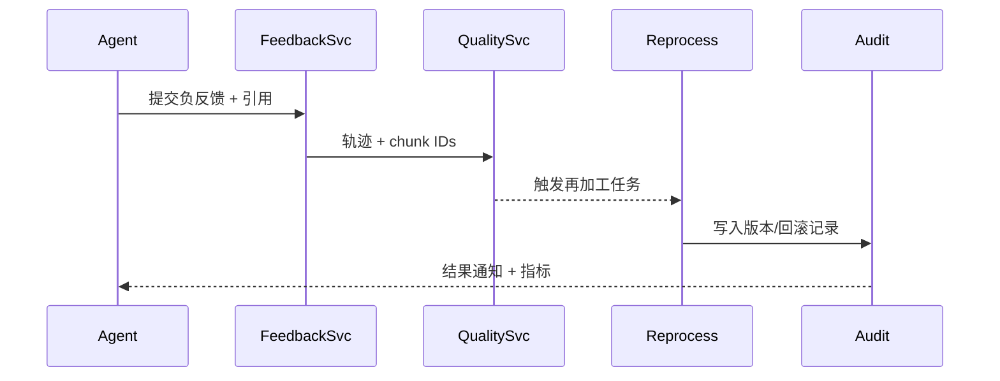

scn_id: SCN-KNOWLEDGE-RAG-FEEDBACK-001
title: RAG 反馈闭环与知识图谱协同
status: Draft
version: v0.1.0
owners:
  - name: Michael Hu
    role: Product Manager
    contact: matrix-x@artisan-cloud.com
domains: [knowledge]
layers: [service]
repos:
  - key: powerx-core
    scope: feedback-loop
    responsibility: 反馈采集、质量评估、再加工与回滚
related_usecases:
  - doc_id: SCN-KNOWLEDGE-SPACE-001
    layer: service
    domain: knowledge
last_reviewed_at: 2025-11-12

---

# Executive Summary

该子场景描述用户或 Agent 在问答过程中提交“答案不准确/引用过时”等反馈后，系统如何回溯引用 chunk、检索轨迹与工具调用，触发再加工任务（重新切分、补充摘要、替换来源），并同步更新向量/倒排/图谱关系。目标是反馈处理 SLA ≤24 小时，相同问题准确率提升 ≥30%，并在失败时可自动回滚到上一版本。参与角色包括 Agent、反馈分析服务、质量评估、再加工流水线、审计/告警。 

# Scope & Guardrails

- **In Scope**：反馈采集、引用回溯、质量评分、再加工任务编排、索引/图谱更新、回滚、告警、审计。
- **Out of Scope**：前端评分 UI、知识空间初次构建、Agent 推理细节。
- **Environment & Flags**：要求开启 `feedback.loop`, `quality.scoring`, `hot-index-update`, `graph.delta-sync`，并接入事件总线。

# Participants & Responsibilities

| Scope | Repository | Layer | 责任与交付物 | Owners |
|-------|------------|-------|--------------|--------|
| Feedback Collector | powerx-core | service | 收集评分/备注、关联对话/引用 | Agent Platform Team |
| Quality Evaluator | powerx-core | service | 计算引用准确率、覆盖度、冗余度，决定再加工策略 | AI Infra Team |
| Reprocessing Pipeline | powerx-core | data | 重新切分/嵌入/图谱更新、触发回滚或灰度发布 | Knowledge Platform Team |

# End-to-End Flow

1. **Stage 1 – Feedback Intake**：Agent 或用户提交反馈，Collector 记录上下文、引用 chunk ID、工具调用、用户身份。
2. **Stage 2 – Quality Assessment**：Evaluator 计算质量分（准确率、覆盖、冗余），决定是否自动再加工或指派人工。
3. **Stage 3 – Reprocessing & Update**：重新切分/摘要/替换来源，更新向量、倒排、图谱关系，必要时训练重排序模型；失败则回滚。
4. **Stage 4 – Publish & Notify**：热更新索引，通知触发者；反馈状态从 `Pending` → `Resolved`，并写入审计/指标。

# Key Interactions & Contracts

- **APIs / Events**：`POST /feedback`, `POST /feedback/{id}/resolve`, Event `knowledge.feedback.created`, `knowledge.reprocess.completed`, `knowledge.reprocess.failed`。
- **Configs / Schemas**：反馈 schema（score, reason, references, agent_session_id）、再加工任务 manifest（strategy, chunk_ids, pipelines）。
- **Security / Compliance**：反馈记录含用户身份需脱敏/加密；回滚操作需两人审批；审计记录任务输入/输出版本。

# Usecase Links

- `SCN-KNOWLEDGE-SPACE-001` — 主链路。

# Acceptance Criteria

1. 反馈处理 SLA ≤ 24 小时，异常量激增（>50/小时）触发高优先级告警。
2. 再加工完成后，同类问题准确率提升 ≥30%，引用指向最新 chunk；失败自动回滚并记录原因。
3. 审计链条完整：反馈 → 任务 → 索引/图谱版本 → 通知。

# Telemetry & Ops

- 指标：反馈量、反馈闭环率、再加工成功率、准确率提升值、告警次数。
- 告警阈值：反馈积压 > 30 条、再加工失败率 >5%、热更新失败 > 0。
- 观测来源：`feedback-loop` dashboard、`reports/_state/feedback.json`。

# Open Issues & Follow-ups

| 风险/事项 | 影响范围 | 负责人 | ETA |
|-----------|----------|--------|-----|
| 质量评分算法需支持多语言 chunk | 全球化租户 | AI Infra Team | 2026-03-10 |

# Appendix

- 事件脚本：`scripts/qa/workflow-metrics.mjs`
- 参考工单模板：`docs/ops/templates/feedback-incident.md`
