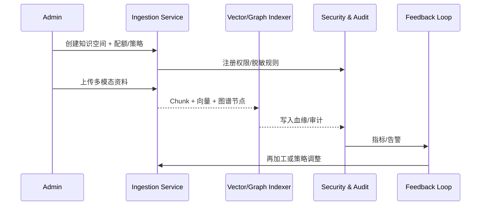

# Positioning & Goals

- **定位**：为企业提供统一的知识空间构建链路，让 RAG、图谱推理与 Agent 工作流可以在可信、合规、可追溯的知识资产上运行。
- **业务目标**：空间创建 SLA ≤ 2 分钟、首轮多模态入库 ≤ 4 小时、chunk 覆盖率 ≥ 95%、嵌入/索引成功率 100%、脱敏/权限策略默认启用。
- **核心价值**：以单一入口连接空间治理、数据入库、策略编排与反馈闭环，降低多租户知识运营成本。

# Core Capabilities

## Provision & Governance
- `POST /knowledge-spaces` 写入租户/部门范围、配额、日志策略，并加载默认 RAG/图谱/安全模板。
- `knowledge_space_role_sync` 将知识工程师、业务专家、审计员同步至 IAM，配合租户隔离与越权拦截。
- 审计服务记录创建、策略变更、审批事件，提供血缘追溯。

## Multi-format Acquisition
- `pipeline_orchestrator` 驱动 PDF/Markdown/Excel/API 的 OCR、分层切分、嵌入、脱敏、图谱写入。
- 失败任务自动重试 3 次并生成工单；chunk、向量、图谱节点关联原始文档与页码。

## Fusion & Index Build
- Fusion Orchestrator 将长文、表格、实时 API 组合成“条款→费用项→额度”链路，配置混合检索策略（BM25 + 向量 + 图谱约束）和 cross-encoder 重排序。
- 策略版本可记录、回滚，API 失败触发降级或告警。

## Feedback & Governance Loop
- 反馈 Collector 记录“引用过时/答案不准”并回溯 chunk、工具轨迹；Quality Scorer 计算准确率/覆盖度/冗余度。
- 再加工流水线重新切分/嵌入/图谱更新，完成后热更新索引并回写审计；失败自动回滚并告警。

# Acceptance Criteria

1. 空间创建与策略写入 ≤ 2 分钟，失败即回滚并保留审计记录。
2. 首轮入库 chunk 覆盖率 ≥ 95%、嵌入/索引成功率 100%、字段识别准确率 ≥ 95%、脱敏覆盖率 100%。
3. 多源融合召回准确率提升 ≥ 15%，反馈处理 SLA ≤ 24 小时且审计链路完整。

# Validation Workflow

1. **配置校验**：`npm run lint` + `npm run docs:build` 确认场景与 Seed 链接无缺失。
2. **沙箱演练**：创建空间→上传 PDF/Excel/API→检查 chunk/图谱/脱敏/策略权重。
3. **Fusion & Feedback 回放**：执行示例问题“供应商是否超限”，随后注入负反馈并验证再加工与热更新。
4. **指标核查**：查看 Grafana `Knowledge Space`、`fusion-pipeline` 仪表盘及 `reports/_state/knowledge-spaces.json` 输出。

# Related Links

- `UC-KNOWLEDGE-SPACE-BUILD-001` — 主链路实现
- `UC-KNOWLEDGE-SPACE-GOV-001` — 空间初始化与策略治理
- `UC-KNOWLEDGE-LONGDOC-001` — 长文档切分与嵌入
- `UC-KNOWLEDGE-TABLE-001` — 表格语义建模与实体映射
- `UC-KNOWLEDGE-MULTISRC-001` — 多源融合与混合检索策略
- `UC-KNOWLEDGE-RAG-FEEDBACK-001` — 反馈闭环与再加工
- 背景：`docs/meta/scenarios/powerx/agent-and-automation/knowledge-and-reasoning/knowledge-space-build/primary.md`

# Architecture Diagram

