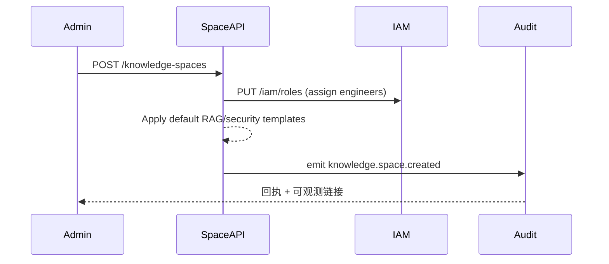

scn_id: SCN-KNOWLEDGE-SPACE-GOV-001
title: 知识空间初始化与治理策略
status: Draft
version: v0.1.0
owners:
  - name: Michael Hu
    role: Product Manager
    contact: matrix-x@artisan-cloud.com
domains: [knowledge]
layers: [service]
repos:
  - key: powerx-core
    scope: knowledge-space
    responsibility: 知识空间元数据、配额、策略、权限与审计
related_usecases:
  - doc_id: SCN-KNOWLEDGE-SPACE-001
    layer: service
    domain: knowledge
last_reviewed_at: 2025-11-12

---

# Executive Summary

该子场景描述管理员为业务部门创建新的知识空间、配置租户/部门可见性、配额、索引刷新周期与默认 RAG/图谱/安全策略，并将角色映射到 IAM。目标是在 2 分钟内完成空间就绪，同时把权限、审计与治理策略一次性固化，避免后续入库时反复修改。关键角色包含平台管理员、知识工程师、IAM 服务与审计/安全服务。

# Scope & Guardrails

- **In Scope**：空间元数据建模、配额/版本/日志策略、RAG 管线模板、默认图谱/脱敏开关、角色授权同步。
- **Out of Scope**：文档上传、切分、索引构建；Agent 端消费；UI 渲染。
- **Environment & Flags**：需启用 `knowledgeSpace.create`, `knowledgeSpace.audit`, `iam.sync` Feature Flag，并具备租户/部门元数据。

# Participants & Responsibilities

| Scope | Repository | Layer | 责任与交付物 | Owners |
|-------|------------|-------|--------------|--------|
| Admin Console API | powerx-core | service | 提供创建/更新空间 API、策略模板管理 | Knowledge Platform Team |
| IAM Sync Service | powerx-core | service | 将角色/权限映射写入 IAM、检测冲突 | Identity Platform Team |
| Audit & Logging | powerx-core | service | 记录创建、策略更新、审批事件 | Security Ops Team |

# End-to-End Flow

1. **Stage 1 – Request Intake**：管理员提交空间名称、租户/部门、存储配额、索引刷新周期、版本保留策略。
2. **Stage 2 – Strategy Binding**：系统加载默认的 RAG 管线（向量模型、倒排、图谱同步）和安全策略（脱敏、审计、越权检测），允许管理员微调。
3. **Stage 3 – Role Assignment**：将知识工程师、业务专家、审计员写入 IAM，并创建空间级权限组；若审批/配额冲突则阻断并提示。
4. **Stage 4 – Activation & Telemetry**：写入审计日志、生成空间状态（`Pending -> Active`），同步监控指标与 Webhook 通知。

# Key Interactions & Contracts

- **APIs / Events**：`POST /knowledge-spaces`, `PATCH /knowledge-spaces/{id}`, `POST /knowledge-spaces/{id}/owners`, Event `knowledge.space.created`。
- **Configs / Schemas**：空间 schema（name, tenant_uuid, dept_scope, storage_quota_gb, refresh_interval, rag_pipeline, audit_policy）。
- **Security / Compliance**：租户隔离校验、角色审批流、审计日志不可篡改、默认脱敏策略必须启用。

# Usecase Links

- `SCN-KNOWLEDGE-SPACE-001` — 主链路（构建 + 入库）。

# Acceptance Criteria

1. 创建与策略写入 ≤ 2 分钟，失败自动回滚，无部分成功状态。
2. 默认策略覆盖率 100%，若关闭策略需显式确认；审计日志记录空间 ID、操作者、策略哈希。
3. IAM 同步成功率 ≥ 99.5%，冲突需在 30 秒内反馈并生成修复指引。

# Telemetry & Ops

- 指标：创建耗时、策略应用成功率、IAM 同步失败率、审计写入延迟。
- 告警阈值：创建 SLA > 2 分钟、策略应用失败 > 0.5%、IAM 同步失败 > 3 次/10 分钟。
- 观测来源：`knowledge-space-admin` dashboard、`reports/_state/knowledge-spaces.json`。

# Open Issues & Follow-ups

| 风险/事项 | 影响范围 | 负责人 | ETA |
|-----------|----------|--------|-----|
| 交互流程尚未在 Web Admin 中曝光 | Admin 前端 | Product Design | 2025-12-01 |

# Appendix

- 场景来源：docs/meta/scenarios/powerx/agent-and-automation/knowledge-and-reasoning/knowledge-space-build/primary.md
- IAM Schema：`src/services/iam/schemas/knowledge-space-role.yaml`
