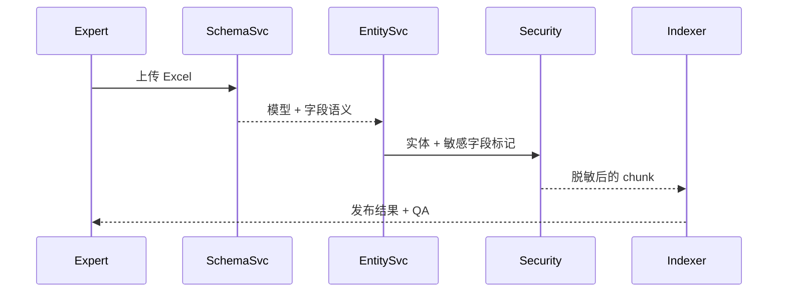

scn_id: SCN-KNOWLEDGE-TABLE-001
title: 表格主题建模与实体映射
status: Draft
version: v0.1.0
owners:
  - name: Michael Hu
    role: Product Manager
    contact: matrix-x@artisan-cloud.com
domains: [knowledge]
layers: [data]
repos:
  - key: powerx-core
    scope: structured-data
    responsibility: Excel/CSV 解析、实体建模、脱敏与索引
related_usecases:
  - doc_id: SCN-KNOWLEDGE-SPACE-001
    layer: service
    domain: knowledge
last_reviewed_at: 2025-11-12

---

# Executive Summary

此场景覆盖 Excel/CSV 等结构化表格的解析、语义建模与实体映射。系统需要识别主键、时间字段、枚举值，自动生成实体（供应商、合同、费用项等）及属性，同时对敏感字段（金额、身份证号）执行脱敏，再将“记录摘要 + 字段组合”写入向量与关键词索引，并与知识图谱建立关系链。目标是字段识别准确率≥95%、脱敏覆盖率100%、检索既支持自然语言也支持结构化过滤。

# Scope & Guardrails

- **In Scope**：表头推断、数据类型识别、语义模板映射、实体/关系生成、脱敏、索引写入、错误阻断与提示。
- **Out of Scope**：长文 OCR、API 数据同步、Agent UI 交互。
- **Environment & Flags**：需要 `structured.ingestion`, `masking.enforced`, `graph.sync` flags，且已配置模板库与敏感字段字典。

# Participants & Responsibilities

| Scope | Repository | Layer | 责任与交付物 | Owners |
|-------|------------|-------|--------------|--------|
| Schema Analyzer | powerx-core | data | 自动检测主键/类型/枚举并映射模板 | Data Modeling Team |
| Entity Builder | powerx-core | data | 生成实体、属性、关系链并写入图谱 | Knowledge Platform Team |
| Security Masking | powerx-core | service | 执行字段脱敏、合规校验、阻断未脱敏数据 | Security Ops Team |

# End-to-End Flow

1. **Stage 1 – Schema Detection**：上传 Excel/CSV → 解析多工作表，识别主键/时间/枚举/货币字段，匹配语义模板。
2. **Stage 2 – Entity & Chunk Build**：依据模板生成实体（供应商/合同/费用项）、属性列表；构造“记录摘要 + 字段组合”chunk，附字段权重。
3. **Stage 3 – Security & Index**：执行脱敏（金额区间化、PII 掩码），将数据写入向量/关键词索引，并生成图谱关系（供应商-合同-金额）。
4. **Stage 4 – QA & Publish**：校验字段覆盖率、脱敏结果，失败阻断发布并生成工单；成功则更新搜索策略与审计日志。

# Key Interactions & Contracts

- **APIs / Events**：`POST /ingestion/structured`, `POST /structured/templates/{id}/apply`, Event `knowledge.ingestion.blocked`（reason=masking_failed）。
- **Configs / Schemas**：字段模板（name, regex, semantic_tag, sensitivity_level）、实体 schema（entity, attributes, relations）。
- **Security / Compliance**：敏感字段（金额/身份证/账号）必须脱敏；阻断时提供修复指引；写入完整审计（原字段哈希 + 脱敏策略 ID）。

# Usecase Links

- `SCN-KNOWLEDGE-SPACE-001` — 主链路。

# Acceptance Criteria

1. 字段识别准确率 ≥95%，模板匹配成功率 ≥90%，脱敏覆盖率 100%。
2. 发布前必须通过敏感字段校验，否则状态为“阻断”并写入审计；业务专家可复核冲突记录。
3. 向量与关键词检索均能召回同一记录摘要；结构化查询响应 ≤ 1 秒。

# Telemetry & Ops

- 指标：字段匹配率、脱敏失败次数、阻断工单数、索引写入延迟。
- 告警阈值：脱敏失败 >0、阻断连续 3 次、索引延迟 > 10s。
- 观测来源：`structured-ingestion` dashboard、`reports/_state/ingestion-structured.json`。

# Open Issues & Follow-ups

| 风险/事项 | 影响范围 | 负责人 | ETA |
|-----------|----------|--------|-----|
| 需扩展更多行业模板（医疗、制造） | 模板匹配 | Data Modeling Team | 2026-02-15 |

# Appendix

- 示例文件：`expense-2024.xlsx`, `expense-sensitive.xlsx`
- 语义模板库：`docs/knowledge/templates/structured-fields.md`
