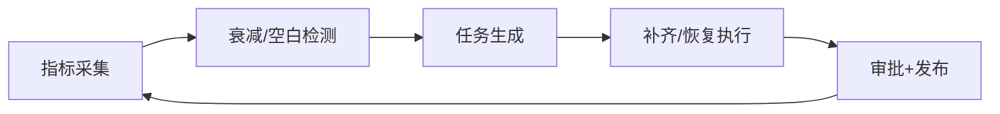

# Executive Summary

> 该子场景通过定期巡检引用频次、反馈评分、检索失败率，识别低质量或过期内容以及知识空白，触发补齐/恢复任务，要求衰减识别准确率 ≥ 90%、空白补齐 SLA ≤ 7 天。

目标是持续发现并治理“沉默”知识：长时间未更新、被频繁投诉或缺少覆盖的领域。系统应支持自动化提醒、审批恢复、审计追踪与指标可视化。

# Scope & Guardrails

- **In Scope**：指标采集、衰减检测、空白识别、任务生成、恢复流程、审批、审计与指标回写。
- **Out of Scope**：实时事件热修、增量同步、租户灰度策略、模型微调。
- **Environment & Flags**：`PX_KNOWLEDGE_DECAY_GUARD`, `PX_KNOWLEDGE_GAP_ALERT`, `PX_KNOWLEDGE_RESTORE_FLOW`。依赖 `quality-eval`, `reports/_state/**`, `task-center`, `audit-ledger`。

# Participants & Responsibilities

| Scope | Repository | Layer | 责任与交付物 | Owners |
|-------|------------|-------|--------------|--------|
| Quality Monitor | powerx-core | data | 采集引用率/评分/失败率，运行巡检脚本 | Reliability Squad |
| Decay Analyzer | powerx-core | ops | 设定阈值、生成衰减/空白列表、推送告警 | Knowledge Ops Squad |
| Gap Task Board | powerx-core | ops | 创建补齐/恢复任务、跟踪 SLA、闭环审计 | Governance Squad |

# End-to-End Flow

1. **Stage 1 – Observe & Score**：定期执行 `workflow-metrics`/自定义脚本，收集引用频次、反馈评分、失败率、未更新天数。
2. **Stage 2 – Detect & Classify**：根据阈值和趋势识别衰减内容与知识空白，打上严重度、原因与建议处理方式。
3. **Stage 3 – Task & Execute**：自动在任务看板中创建补齐/恢复任务，指定业务专家或内容供应方，并要求审批。
4. **Stage 4 – Validate & Restore**：补齐后进入审批与发布；若误判，可一键恢复旧版本并记录恢复理由，指标回写。

# Key Interactions & Contracts

- **APIs / Jobs**：`node scripts/qa/workflow-metrics.mjs`, `POST /knowledge/decay/tasks`, `POST /knowledge/decay/restore`, `POST /audit/logs`, `GET /reports/knowledge-decay`.
- **Configs / Schemas**：`decay_thresholds.yaml`, `gap_task_template.md`, `restore_playbook.md`。
- **Security / Compliance**：误判恢复必须记录审批人与原因；高风险内容（法规、财务）需要双人确认；任务看板需控制租户可见性。

# Usecase Links

- `UC-KNOWLEDGE-UPDATE-DECAY-001` — 巡检→任务→补齐/恢复（Ops 层，powerx）。

# Acceptance Criteria

1. 巡检覆盖率 100%，衰减识别准确率 ≥ 90%，误判可在 10 分钟内恢复。
2. 空白补齐任务在 7 天 SLA 内完成，自动统计完成率与超时记录。
3. 生成的任务、恢复动作和指标变化全部写入审计与报表，支持追溯。

# Telemetry & Ops

- 指标：`knowledge.decay.detected`, `knowledge.decay.false_positive`, `knowledge.gap.backlog`, `knowledge.gap.fill_time`.
- 告警阈值：衰减检测失败、误判率 > 10%、空白积压 > 20、恢复 SLA > 10m。
- 观测来源：`Knowledge Decay Monitor` 看板、`reports/_state/knowledge-decay.json`、任务看板导出。

# Open Issues & Follow-ups

| 风险/事项 | 影响范围 | 负责人 | ETA |
|-----------|----------|--------|-----|
| `decay_thresholds.yaml` 尚未按领域细化 | 检测准确率 | Reliability Squad | 2025-02-23 |
| Gap Task 看板缺少与审批中心的联动 | 闭环效率 | Governance Squad | 2025-02-27 |

# Appendix

- Meta 参考：`docs/meta/scenarios/powerx/agent-and-automation/knowledge-and-reasoning/knowledge-update-and-feedback/primary.md`（子场景 D）。
- Usecase Seed：`docs/usecases-seeds/SCN-KNOWLEDGE-UPDATE-001/UC-KNOWLEDGE-UPDATE-DECAY-001.md`（待生成）。
