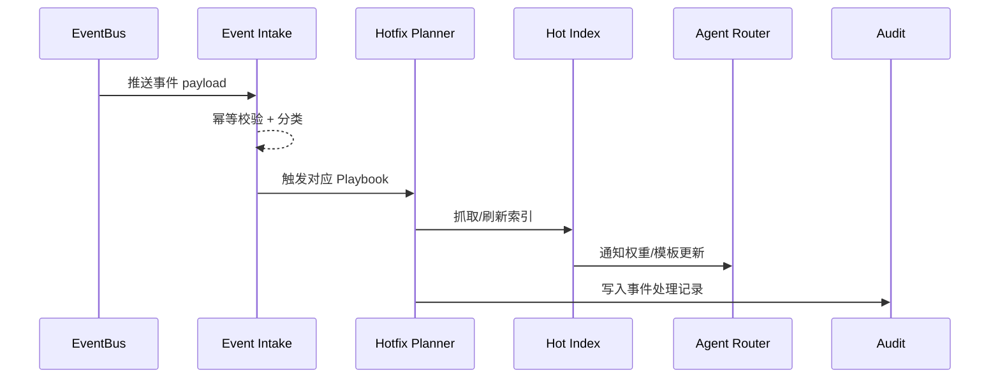

# Executive Summary

> 该子场景响应法规变更、价格策略、API 推送等关键事件，在 5 分钟内完成知识刷新、索引热更新与 Agent 通知，并具备幂等控制与失败自动重试。

事件驱动链路以事件总线为入口，对不同事件类型选择更新工作流（重新抓取、字段补丁、索引热更新），确保敏感或实时信息第一时间同步，避免旧内容继续被引用。

# Scope & Guardrails

- **In Scope**：事件订阅、类型识别、策略匹配、轻量更新/重抓取、索引热更新、Agent 权重刷新、审计记录、幂等控制。
- **Out of Scope**：批量增量同步（由 `SCN-KNOWLEDGE-UPDATE-SYNC-001` 负责）、反馈再加工、租户灰度策略。
- **Environment & Flags**：`PX_KNOWLEDGE_EVENT_HOTFIX`, `PX_KNOWLEDGE_EVENT_IDEMPOTENT`, `PX_AGENT_WEIGHT_REFRESH`。依赖 `event-bus`, `hotfix-runner`, `index-builder`, `agent-notify`, `audit-ledger`。

# Participants & Responsibilities

| Scope | Repository | Layer | 责任与交付物 | Owners |
|-------|------------|-------|--------------|--------|
| Event Intake | powerx-core | service | 订阅 `knowledge.*` 事件、解析 payload、做去重签名 | Platform Event Squad |
| Hotfix Orchestrator | powerx-core | service | 根据策略调用抓取/补丁/索引热更新，管理重试 | Core Platform Squad |
| Agent Sync | powerx-core | service | 刷新在线索引、通知 Agent 调整检索权重/回答模版 | Agent Experience Squad |

# End-to-End Flow

1. **Stage 1 – Receive & Classify**：事件总线推送 `policy-update-event` 等消息，事件接入层解析租户/空间/严重度并生成幂等键。
2. **Stage 2 – Plan & Execute**：根据事件类型匹配对应的更新 Playbook（重抓取文档、更新表格、补丁字段等），触发热修流程并记录状态。
3. **Stage 3 – Hot Update & Notify**：刷新向量/倒排索引，必要时更新 Agent 检索权重和回答模板，确保下一次回答引用最新内容。
4. **Stage 4 – Audit & Recover**：写入审计日志，若处理失败则自动重试并在多次失败后升级；重复事件被幂等策略忽略。

# Key Interactions & Contracts

- **APIs / Events**：`knowledge.event.received`, `POST /knowledge/events/apply`, `POST /knowledge/events/retry`, `POST /knowledge/index/hot-update`, `POST /agent/weights/refresh`, `POST /audit/logs`.
- **Configs / Schemas**：`event_hotfix_policies.yaml`, `event_payload_schema.json`, `agent_weight_matrix.yaml`。
- **Security / Compliance**：事件来源需签名验证；敏感事件需要双通道告警；所有热修需记录幂等键与影响范围以便追溯。

# Usecase Links

- `UC-KNOWLEDGE-UPDATE-EVENT-001` — 实时事件 → 热更新 → Agent 通知（Service 层，powerx）。

# Acceptance Criteria

1. 关键事件处理延迟 ≤ 5 分钟，失败自动重试 ≤ 3 次并升级告警。
2. 幂等策略能识别重复事件，仅首次执行，其余记录为“已忽略”。
3. Agent 下一次回答必须引用最新内容，审计日志包含事件 ID、版本号、影响租户。

# Telemetry & Ops

- 指标：`knowledge.event.latency`, `knowledge.event.retry_count`, `knowledge.event.idempotent_skips`, `agent.refresh.success_rate`。
- 告警阈值：事件延迟 > 5m、重试次数 > 3、幂等失效、Agent 更新失败率 > 5%。
- 观测来源：`Event Hotfix` Grafana 面板、`reports/_state/knowledge-event.json`、Audit 查询。

# Open Issues & Follow-ups

| 风险/事项 | 影响范围 | 负责人 | ETA |
|-----------|----------|--------|-----|
| `event_hotfix_policies.yaml` 未覆盖“价格策略”事件 | 策略匹配 | Core Platform Squad | 2025-02-24 |
| Agent 权重刷新 API 缺少回归测试 | Agent 同步 | Agent Experience Squad | 2025-02-25 |

# Appendix

- Meta 参考：`docs/meta/scenarios/powerx/agent-and-automation/knowledge-and-reasoning/knowledge-update-and-feedback/primary.md`（子场景 C）。
- Usecase Seed：`docs/usecases-seeds/SCN-KNOWLEDGE-UPDATE-001/UC-KNOWLEDGE-UPDATE-EVENT-001.md`（待生成）。
