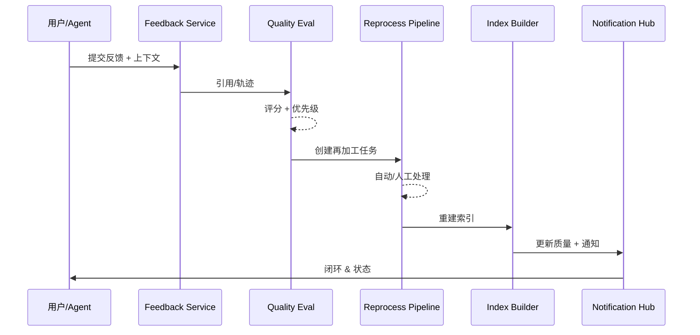

# Executive Summary

> 该子场景将用户/Agent 的评分、纠错、缺少引用等反馈转化为结构化信号，24 小时内完成再加工与重索引，使修复后的回答准确率提升至少 25%，并对提交者闭环通知。

反馈驱动链路覆盖反馈采集、上下文血缘追踪、质量评估、再加工任务、自动脚本与人工协作。它确保知识缺陷被快速感知与修复，形成数据驱动的迭代闭环。

# Scope & Guardrails

- **In Scope**：反馈采集、上下文/引用关联、质量评分、任务分派、自动/人工再加工、索引重建、通知与 SLA 追踪。
- **Out of Scope**：增量同步、事件驱动刷新、租户灰度策略、终端聊天 UI。
- **Environment & Flags**：`PX_KNOWLEDGE_FEEDBACK_LOOP`, `PX_KNOWLEDGE_REPROCESS_AUTOMATION`, `PX_KNOWLEDGE_FEEDBACK_ALERT`. 依赖 `agent-dialogue`, `feedback-service`, `quality-eval`, `index-builder`, `notifications`.

# Participants & Responsibilities

| Scope | Repository | Layer | 责任与交付物 | Owners |
|-------|------------|-------|--------------|--------|
| Feedback Intake | powerx-core | service | 采集评分/纠错，绑定对话上下文、检索轨迹、引用 chunk | Agent Experience Squad |
| Quality Evaluation | powerx-core | data | 计算质量分、判断再加工策略、生成 SLA 告警 | Knowledge Ops Squad |
| Reprocess Pipeline | powerx-core | service | 创建任务、触发自动脚本、重切片/重索引并更新状态 | Core Platform Squad |

# End-to-End Flow

1. **Stage 1 – Capture & Enrich**：Agent/前端把反馈写入 `feedback-service`，记录评分、意图、引用、对话 ID。
2. **Stage 2 – Score & Triage**：质量评估服务分析相关 chunk，决定是否自动修复、人工处理或归档，生成优先级与 SLA。
3. **Stage 3 – Reprocess & Validate**：触发再加工任务（脚本或人工），执行重切片、补充来源、敏感校验，并运行快速验证脚本。
4. **Stage 4 – Reindex & Notify**：新的向量/倒排/图谱索引上线，写入质量指标，通知反馈提交者与相关 Agent，并关闭工单。

# Key Interactions & Contracts

- **APIs / Events**：`POST /feedback/events`, `GET /feedback/issues/:id`, `POST /knowledge/reprocess/tasks`, `POST /knowledge/index/rebuild`, `POST /notifications/send`.
- **Configs / Schemas**：`feedback_playbook.yaml`（打分与 SLA）、`reprocess_pipeline.yaml`（脚本/人工路线）、`quality_metrics_schema.json`。
- **Security / Compliance**：反馈数据需脱敏存储，任务必须记录操作者与处理日志；自动脚本执行需要服务账号并写入审计。

# Usecase Links

- `UC-KNOWLEDGE-UPDATE-FEEDBACK-001` — 反馈收集→再加工→索引更新→闭环（Data 层，powerx）。

# Acceptance Criteria

1. 反馈从创建到关闭 ≤ 24 小时，严重等级反馈触发 P1 告警并强制人工确认。
2. 再加工后同类问题准确率提升 ≥ 25%，质量评分有量化记录，可回滚。
3. 反馈状态可追踪，提交者收到成功/失败通知，失败会自动回滚旧版本并标记“需人工复核”。

# Telemetry & Ops

- 指标：`knowledge.feedback.loop_time`, `knowledge.feedback.backlog`, `knowledge.feedback.fix_accuracy`, `knowledge.feedback.auto_rate`.
- 告警阈值：SLA > 24h、积压条数 > 50、自动处理失败率 > 10%、反馈满意度 < 4.0。
- 观测来源：`QA Feedback Loop` Grafana、`reports/_state/knowledge-feedback.json`、`workflow-metrics` 报表。

# Open Issues & Follow-ups

| 风险/事项 | 影响范围 | 负责人 | ETA |
|-----------|----------|--------|-----|
| `feedback_playbook.yaml` 缺少严重等级→SLA 映射 | 任务优先级 | Knowledge Ops Squad | 2025-02-24 |
| `scripts/knowledge/reprocess.mjs` 尚未覆盖向量/图谱同步 | 自动再加工 | Core Platform Squad | 2025-02-26 |

# Appendix

- Meta 参考：`docs/meta/scenarios/powerx/agent-and-automation/knowledge-and-reasoning/knowledge-update-and-feedback/primary.md`（子场景 B）。
- Usecase Seed：`docs/usecases-seeds/SCN-KNOWLEDGE-UPDATE-001/UC-KNOWLEDGE-UPDATE-FEEDBACK-001.md`（待生成）。
