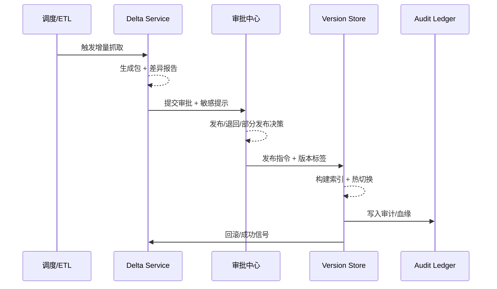

# Executive Summary

> 该子场景确保调度/ETL 捕获到的增量数据能在 30 分钟 SLA 内完成抓取、差异分析、审批与版本切换，差异准确率 ≥ 98%，并支持一键回滚与部分发布，避免过期或错误内容进入生产知识空间。

增量同步链路覆盖多源监测、策略化抓取、差异报告、敏感字段校验、审批与版本落地。业务价值体现在“持续可用 + 可追溯 + 可治理”：及时反映新文档、新表格、新 API 变更，同时提供完整的血缘和审计记录。

# Scope & Guardrails

- **In Scope**：多源增量检测、变更包生成、差异报告、影响范围标注、审批编排、版本切换、部分发布与回滚。
- **Out of Scope**：知识初次入库（由 `SCN-KNOWLEDGE-SPACE-001` 负责）、反馈驱动再加工、实时事件热更新、租户灰度策略。
- **Environment & Flags**：`PX_KNOWLEDGE_DELTA_SYNC`, `PX_KNOWLEDGE_VERSIONED_STORAGE`, `PX_KNOWLEDGE_PARTIAL_RELEASE`。依赖 `ingestion-orchestrator`, `approval-center`, `version-store`, `audit-ledger`。

# Participants & Responsibilities

| Scope | Repository | Layer | 责任与交付物 | Owners |
|-------|------------|-------|--------------|--------|
| Delta Orchestrator | powerx-core | service | 监测外部源、生成增量包、触发差异计算 | Knowledge Platform Squad |
| Approval Center | powerx-core | service | 敏感字段校验、版本差异审阅、审批/退回流转 | Governance Squad |
| Version Store & Rollback | powerx-core | data | 版本构建、索引刷新、血缘记录、回滚控制 | Reliability Squad |

# End-to-End Flow

1. **Stage 1 – Detect & Package**：调度/ETL 根据策略或事件抓取增量，生成包含源、批次、签名的变更包。
2. **Stage 2 – Diff & Impact**：差异引擎与现有版本对比，产出新增/修改/删除报告并标记受影响的知识节点与敏感字段。
3. **Stage 3 – Approve & Publish**：知识工程师在审批中心阅览差异、执行敏感校验，选择发布、部分发布或退回；审批记录写入审计。
4. **Stage 4 – Switch & Rollback**：通过版本存储生成新索引/向量/图谱节点，支持热切换；若失败或质量告警则执行回滚。

# Key Interactions & Contracts

- **APIs / Jobs**：`POST /knowledge/delta/jobs`, `GET /knowledge/delta/reports/:job_id`, `POST /knowledge/delta/publish`, `POST /knowledge/version/rollback`, `POST /audit/logs`.
- **Configs / Schemas**：`configs/knowledge/delta_sources.yaml`, `delta_diff_schema.json`, `approval_playbook.md`, `version_store_policies.yaml`。
- **Security / Compliance**：审批动作必须记录操作者与理由；敏感字段开启双人审批；所有版本号需与租户/空间维度绑定以满足合规追踪。

# Usecase Links

- `UC-KNOWLEDGE-UPDATE-SYNC-001` — 增量抓取→审批→发布/回滚主链路（Service 层，powerx）。

# Acceptance Criteria

1. 增量包从检测到发布 ≤ 30 分钟，差异报告准确率 ≥ 98%，敏感字段全部被标记。
2. 审批记录与版本血缘在 `audit-ledger` 可查询，失败后 5 分钟内可一键回滚。
3. 支持部分发布/租户定向投放，未发布部分保持旧版本且可追溯。

# Telemetry & Ops

- 指标：`knowledge.delta.sla`, `knowledge.delta.approval_time`, `knowledge.delta.rollback_count`, `knowledge.delta.partial_release`.
- 告警阈值：SLA > 30m、审批 > 15m、回滚次数 > 2/天、差异报告失败，即触发 P1。
- 观测来源：Grafana `Knowledge Delta Sync`、`reports/_state/knowledge-delta.json`、Audit 查询脚本。

# Open Issues & Follow-ups

| 风险/事项 | 影响范围 | 负责人 | ETA |
|-----------|----------|--------|-----|
| `scripts/knowledge/diff_report.mjs` 缺少 API 源适配器 | 多源增量 | Knowledge Platform Squad | 2025-02-23 |
| 部分发布 CLI 尚未接入审计 ID | 审批/回滚 | Governance Squad | 2025-02-24 |

# Appendix

- Meta 参考：`docs/meta/scenarios/powerx/agent-and-automation/knowledge-and-reasoning/knowledge-update-and-feedback/primary.md`（子场景 A）。
- Usecase Seed：`docs/usecases-seeds/SCN-KNOWLEDGE-UPDATE-001/UC-KNOWLEDGE-UPDATE-SYNC-001.md`。
