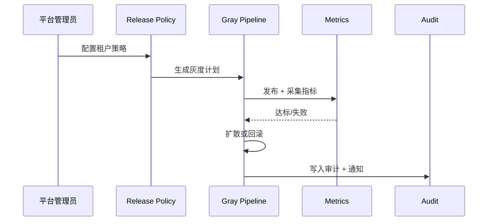

# Executive Summary

> 该子场景为不同租户/部门提供差异化的更新节奏，支持灰度试点、指标监控、自动扩散与失败回滚，保证租户版本可追溯且跨租户数据隔离。

当知识更新涉及敏感业务时，需要先在试点租户（如 `demo-retail`）验证质量指标，再逐步扩散到全量租户。治理策略应覆盖审批、审计、告警与回滚按钮，确保问题不会扩大化。

# Scope & Guardrails

- **In Scope**：租户策略配置、试点选择、灰度发布、指标监控、自动扩散、失败回滚、审计、跨租户反馈聚合。
- **Out of Scope**：增量包生成、反馈再加工、事件热修、电商 Marketplace 发布。
- **Environment & Flags**：`PX_KNOWLEDGE_GRAY_RELEASE`, `PX_TENANT_RELEASE_MATRIX`, `PX_KNOWLEDGE_RELEASE_GUARD`. 依赖 `release-controller`, `metrics-gateway`, `audit-ledger`, `notifications`, `iam-service`。

# Participants & Responsibilities

| Scope | Repository | Layer | 责任与交付物 | Owners |
|-------|------------|-------|--------------|--------|
| Release Policy Config | powerx-core | service | 维护 `tenant_release_matrix`, 配置审批/指标阈值 | Governance Squad |
| Gray Pipeline | powerx-core | ops | 执行灰度、观察指标、自动扩散或暂停 | Reliability Squad |
| Audit & Alerts | powerx-core | ops | 审计日志、租户对照、失败回滚、告警通知 | Platform Ops Squad |

# End-to-End Flow

1. **Stage 1 – Plan & Configure**：管理员为租户/部门设定更新策略（频次、审批人、指标阈值），并挑选灰度试点。
2. **Stage 2 – Pilot Release**：将新版本发布到试点租户，收集质量指标、反馈与安全信号。
3. **Stage 3 – Monitor & Expand**：若指标达标，自动扩散至下一批租户；若不达标，暂停扩散并回滚试点。
4. **Stage 4 – Audit & Feedback**：记录版本号、时间、审批链、回滚原因；收集跨租户反馈并回流至知识更新看板。

# Key Interactions & Contracts

- **APIs / Events**：`POST /knowledge/release/policies`, `POST /knowledge/release/publish`, `POST /knowledge/release/promote`, `POST /knowledge/release/rollback`, `GET /knowledge/release/status/:tenant`, `release.gray.alert`。
- **Configs / Schemas**：`tenant_release_matrix.yaml`, `release_guardrails.md`, `gray_monitoring_dashboard.json`。
- **Security / Compliance**：租户策略需绑定 IAM；跨租户发布必须验证数据隔离；所有灰度操作必须记录审批 ID、版本号、责任人。

# Usecase Links

- `UC-KNOWLEDGE-UPDATE-TENANT-001` — 租户策略配置→灰度发布→扩散/回滚（Ops 层，powerx）。

# Acceptance Criteria

1. 灰度发布指标监控实时可见，达标后可一键扩散，失败自动暂停并回滚。
2. 每个租户的知识版本可追溯，审计日志包含策略、审批、发布、回滚信息。
3. 跨租户反馈在看板聚合，策略可按租户/部门差异化调整并即时生效。

# Telemetry & Ops

- 指标：`knowledge.release.gray_state`, `knowledge.release.rollback_count`, `knowledge.release.tenant_coverage`, `knowledge.release.alerts`.
- 告警阈值：灰度失败率 > 5%、回滚连续发生、租户版本不一致、策略同步失败。
- 观测来源：`Tenant Release Control` 看板、`reports/_state/knowledge-release.json`, Audit 查询。

# Open Issues & Follow-ups

| 风险/事项 | 影响范围 | 负责人 | ETA |
|-----------|----------|--------|-----|
| `tenant_release_matrix.yaml` 未补齐金融/医疗租户策略 | 策略准确性 | Governance Squad | 2025-02-25 |
| `reports/_state/knowledge-release.json` 尚未自动生成 | 观测缺口 | Reliability Squad | 2025-02-26 |

# Appendix

- Meta 参考：`docs/meta/scenarios/powerx/agent-and-automation/knowledge-and-reasoning/knowledge-update-and-feedback/primary.md`（子场景 E）。
- Usecase Seed：`docs/usecases-seeds/SCN-KNOWLEDGE-UPDATE-001/UC-KNOWLEDGE-UPDATE-TENANT-001.md`（待生成）。
