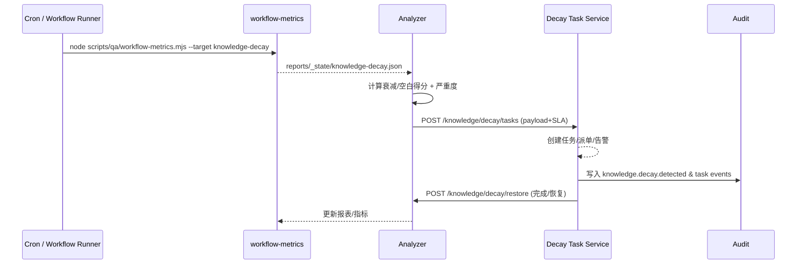

doc_id: UC-KNOWLEDGE-UPDATE-DECAY-001
scn_id: SCN-KNOWLEDGE-UPDATE-001
title: 知识衰减巡检与空白补齐（ops/knowledge）
status: Draft
version: v0.1.0
repo_key: powerx
scope: powerx
layer: ops
domain: knowledge
scenario_title: "知识更新与反馈"
owners:
  - name: Michael Hu
    role: Tech Steward
    contact: tech@artisan-cloud.com
  - name: Matrix-X
    role: Docs Coordinator
    contact: dev@artisan-cloud.com
contributors:
  - name: Irene Zhao
    role: Reliability Squad PO
    contact: reliability@artisan-cloud.com
  - name: Victor Shen
    role: Knowledge Ops Lead
    contact: ops@artisan-cloud.com
linked_requirements:
  - id: SCN-KNOWLEDGE-UPDATE-DECAY-001
    description: 子场景《知识衰减与空白检测》
code_refs:
  - repo: powerx
    path: scripts/qa/workflow-metrics.mjs
    description: 巡检任务入口，汇总引用频次/反馈/失败率
  - repo: powerx
    path: reports/_state/knowledge-decay.json
    description: 巡检输出的指标快照，供 Dashboard 与审计读取
  - repo: powerx
    path: backend/config/knowledge/decay_thresholds.yaml
    description: 领域阈值、告警级别与误判恢复策略
feature_flags:
  - PX_KNOWLEDGE_DECAY_GUARD
  - PX_KNOWLEDGE_GAP_ALERT
  - PX_KNOWLEDGE_RESTORE_FLOW
optional: false
last_reviewed_at: 2025-02-20

---

# Usecase Overview

- **业务目标**：每 4 小时巡检一次知识库引用频次、反馈评分、检索失败率与最近更新时间，自动识别衰减或空白区域，生成补齐/恢复任务并在修复后回写指标，确保高价值知识保持新鲜、可追溯。
- **成功度量**：衰减识别准确率 ≥ 90%，误判恢复 ≤ 10 分钟；空白补齐任务 7 天内完成率 ≥ 95%；`knowledge.gap.backlog` < 20 且自动告警；巡检任务 SLA ≤ 15 分钟。
- **场景关联**：对应 `SCN-KNOWLEDGE-UPDATE-001` Stage 4（Observe & Iterate）与子场景 `SCN-KNOWLEDGE-UPDATE-DECAY-001`，为增量同步、反馈再加工与灰度发布提供健康度基线。

> 巡检→检测→任务→恢复形成闭环，使知识治理具备可量化的健康度指标并能快速回补高风险空白。

# Context & Assumptions

- **前置条件**
  - Feature Flags `PX_KNOWLEDGE_DECAY_GUARD`, `PX_KNOWLEDGE_GAP_ALERT`, `PX_KNOWLEDGE_RESTORE_FLOW` 已启用。
  - `scripts/qa/workflow-metrics.mjs` 能访问 `knowledge-space`, `feedback-service`, `retrieval-metrics` 等 API 以收集指标。
  - `decay_thresholds.yaml` 已按领域配置引用下限、反馈阈值、误判策略；`gap_task_template.md` 定义任务字段。
  - `task-center`（或等效工作流引擎）具备自动派单与 SLA 追踪能力，并与审批中心互通。
  - 审计服务 `audit-ledger` 可写入巡检、任务、恢复事件。
- **输入/输出**
  - 输入：引用频次、反馈评分、检索失败率、最后更新时间、Agent 触发次数、业务标签、租户映射。
  - 输出：`knowledge.decay.detected` 事件、`reports/_state/knowledge-decay.json` 报表、`POST /knowledge/decay/tasks` 生成的补齐/恢复任务、`POST /knowledge/decay/restore` 恢复结果。
- **边界**
  - 不直接执行内容再加工（交由 `UC-KNOWLEDGE-UPDATE-FEEDBACK-001`）。
  - 不负责租户灰度推广（交由 `UC-KNOWLEDGE-UPDATE-TENANT-001`）。
  - 巡检仅覆盖已入库知识，数据采集/初次入库由 `SCN-KNOWLEDGE-SPACE-001` 处理。

# Solution Blueprint

## 体系分解

| 层 | 主要组件/模块 | 责任 | 代码入口 |
|----|---------------|------|---------|
| Data / Observability | `scripts/qa/workflow-metrics.mjs` | 从 metrics API、反馈中心、检索日志聚合指标并推送到 `reports/_state/knowledge-decay.json` | `scripts/qa` |
| Ops / Analyzer | `services/knowledge/decay/analyzer.ts` | 根据 `decay_thresholds.yaml` 计算衰减/空白列表、生成严重度标记、触发事件 | `services/knowledge/decay` |
| Ops / Task Board | `services/knowledge/decay/task_service.ts` | `POST /knowledge/decay/tasks`、创建任务、绑定 SLA、路由业务专家 | `services/knowledge/decay` |
| Ops / Restore Flow | `services/knowledge/decay/restore_controller.ts` | `POST /knowledge/decay/restore`，一键恢复误判或回滚补齐失败，并写入审计 | `services/knowledge/decay` |

> 若上述 service 文件尚未创建，可使用相同命名在 `powerx-core` 中落地，保持职责划分清晰。

## 流程与时序

1. **Step 1 – Collect Metrics**：调度器运行 `node scripts/qa/workflow-metrics.mjs --target knowledge-decay`，采集引用/反馈/失败率/更新时间，并输出到 `reports/_state/knowledge-decay.json`。
2. **Step 2 – Detect & Classify**：Analyzer 读取报表与阈值，计算 `decay_score`、`gap_score`，筛选高/中/低风险，并将结果写入 `knowledge.decay.detected` 事件。
3. **Step 3 – Task Generation**：对高/中风险条目调用 `POST /knowledge/decay/tasks`，使用 `gap_task_template.md` 生成补齐或恢复任务，自动指派业务专家并设置 7 天 SLA。
4. **Step 4 – Restore & Feedback**：任务完成后调用 `POST /knowledge/decay/restore` 更新状态，执行回滚或发布；同时刷新指标并记录审计，必要时通知灰度/反馈链路。

# Contracts & Interfaces

- **Inbound APIs / Jobs**
  - `node scripts/qa/workflow-metrics.mjs --target knowledge-decay` — 定时任务，参数支持 `--tenant`, `--domains`, `--since`.
- `POST /knowledge/decay/tasks` — 请求体包含 `knowledge_id`, `tenant_uuid`, `decay_score`, `gap_reason`, `sla_hours`, `assignee`。
  - `POST /knowledge/decay/restore` — 请求体包含 `task_id`, `action` (`restore`/`rollback`), `reason`, `approver`.
- **Outbound 调用**
  - `POST /task-center/tasks` — 创建/更新任务卡片，写入 SLA、执行者、复核人。
  - `POST /notifications/send` — 通知业务专家、治理团队或触发告警频道。
  - `POST /audit/logs` — 记录巡检、任务、恢复操作（事件类型 `knowledge.decay.*`）。
- **配置与脚本**
  - `backend/config/knowledge/decay_thresholds.yaml` — 按领域设定引用/反馈/更新时间阈值与严重度映射。
  - `gap_task_template.md` — 任务描述模板、字段说明。
  - `restore_playbook.md` — 误判恢复与回滚 SOP。

# Implementation Checklist

| 项目 | 描述 | 完成状态 | 负责人 |
|------|------|----------|--------|
| 指标采集脚本 | 扩展 `workflow-metrics.mjs` 支持知识域指标与租户过滤 | [ ] | Reliability Squad |
| 阈值配置 | 在 `decay_thresholds.yaml` 中按领域/敏感级别定义阈值、告警级别 | [ ] | Knowledge Ops Squad |
| 任务服务 | 实现 `POST /knowledge/decay/tasks` + `task-center` 集成、SLA 驱动 | [ ] | Governance Squad |
| 恢复流程 | 实现 `POST /knowledge/decay/restore`、审计写入、回滚操作 | [ ] | Reliability Squad |
| Dashboard & 报表 | 更新 `Knowledge Decay Monitor`、`reports/_state/knowledge-decay.json` | [ ] | Observability Team |

# Testing Strategy

- **单元测试**
  - `decay_score` 与 `gap_score` 计算函数，覆盖阈值边界、数据缺失、异常值。
  - 任务生成器模板替换、SLA 计算、严重度映射。
- **集成测试**
  - 使用 `scripts/workflows/mock-knowledge-decay.mjs`（或等效）生成样例数据，模拟任务生成→恢复链路；验证 `task-center` API、通知与审计调用。
  - 验证 `workflow-metrics.mjs` 对 multiple tenants 的过滤与并发执行。
- **端到端验证**
  - 在沙箱租户 `demo-corp` 执行巡检→任务→补齐→恢复完整流程，确保 7 天 SLA、10 分钟恢复指标可追踪。
  - 演练误判恢复：手动标记关键知识为低质量，确认恢复后可自动回滚指标。
- **非功能测试**
  - 巡检任务在 15 分钟内完成、CPU/内存占用监控。
  - 任务中心大批量（>500 条）生成时的性能与幂等校验。

# Observability & Ops

- **指标**
  - `knowledge.decay.detected`（按严重度统计）、`knowledge.decay.false_positive`, `knowledge.gap.backlog`, `knowledge.gap.fill_time`, `knowledge.decay.sla_violation`.
- **日志**
  - `decay_analyzer.log` 记录输入指标摘要、阈值版本、严重度判断。
  - `decay_task_service.log` 记录任务创建/更新/恢复动作及操作人。
- **告警**
  - `decay.detected.high > 5`（P1）、`false_positive_rate > 10%`（P2）、`gap.backlog > 20`（P1）、`restore_latency > 10m`（P2）。
  - 告警推送到 `#px-knowledge-ops`、`PagerDuty Knowledge Update` 值班组。
- **Dashboards**
  - Grafana《Knowledge Decay Monitor》展示检测数量、SLA、误判率。
  - `reports/_state/knowledge-decay.json` 供周报/审计引用。

# Rollback & Failure Handling

- **回滚步骤**
  1. 若新的阈值或检测逻辑导致误报警，回滚 `decay_thresholds.yaml` 至上一个版本并重新运行巡检。
  2. 使用 `POST /knowledge/decay/restore` + `restore_playbook.md` 恢复被误下线的知识内容，回写审计。
  3. 若任务批量创建异常，调用 `task-center` 的批量关闭 API 并重新生成。
- **补救措施**
  - 为 `workflow-metrics` 脚本提供 `--replay <report_path>` 以复用历史指标。
  - 提供 `scripts/workflows/patch-gap-task.mjs` 修正任务字段或 SLA。
- **数据修复**
  - 提供 SQL/CLI 示例（如 `px knowledge restore --task <id>`）帮助手动回滚知识节点与指标。

# Follow-ups & Risks

| 风险/事项 | 影响 | 缓解方案 | 负责人 | ETA |
|-----------|------|----------|--------|-----|
| `decay_thresholds.yaml` 尚未按领域细化 | 容易误报或漏报，影响准确率 | 结合历史指标自动推荐阈值，并引入版本号 + 审批流 | Reliability Squad | 2025-02-23 |
| Gap Task 看板未与审批中心打通 | 任务无法自动通过审批，延长 SLA | 在 `task_service` 中补充审批钩子，失败自动升级到治理组 | Governance Squad | 2025-02-27 |
| Dashboard 缺乏租户维度 | 难以定位高风险租户 | 扩展报表与 Grafana 维度，增加 `tenant_uuid` Filter | Observability Team | 2025-03-01 |

# References & Links

- 场景文档：`docs/scenarios/knowledge/SCN-KNOWLEDGE-UPDATE-001.md`
- 子场景：`docs/scenarios/knowledge/SCN-KNOWLEDGE-UPDATE-DECAY-001.md`
- 配置：`backend/config/knowledge/decay_thresholds.yaml`, `gap_task_template.md`, `restore_playbook.md`
- 脚本：`scripts/qa/workflow-metrics.mjs`, `scripts/workflows/mock-knowledge-decay.mjs`（若新增）
- Dashboard：Grafana《Knowledge Decay Monitor》
- 发布指引：`npm run publish:usecases -- --scn-id SCN-KNOWLEDGE-UPDATE-001 --validate-only`
