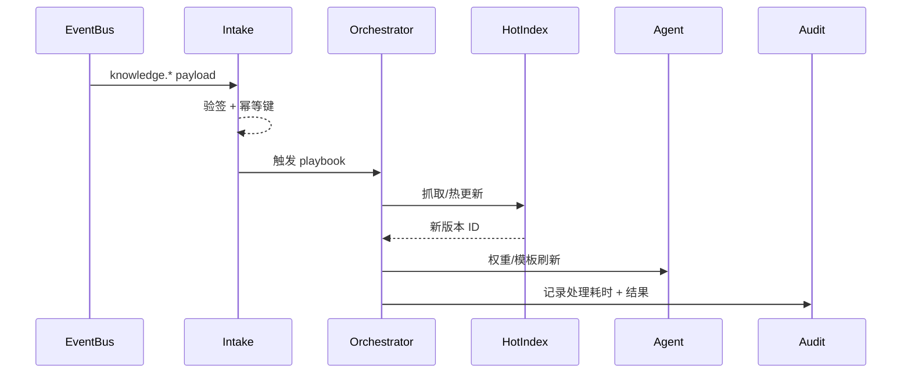

doc_id: UC-KNOWLEDGE-UPDATE-EVENT-001
scn_id: SCN-KNOWLEDGE-UPDATE-001
title: 实时事件驱动知识刷新（service/knowledge）
status: Draft
version: v0.1.0
repo_key: powerx
scope: powerx
layer: service
domain: knowledge
scenario_title: "知识更新与反馈"
owners:
  - name: Michael Hu
    role: Tech Steward
    contact: tech@artisan-cloud.com
  - name: Matrix-X
    role: Docs Coordinator
    contact: dev@artisan-cloud.com
contributors:
  - name: Leo Zhang
    role: Platform Event Lead
    contact: event@artisan-cloud.com
  - name: Ada Wu
    role: Agent Experience PM
    contact: agent@artisan-cloud.com
linked_requirements:
  - id: SCN-KNOWLEDGE-UPDATE-EVENT-001
    description: 子场景《实时事件驱动的知识刷新》
code_refs:
  - repo: powerx
    path: services/knowledge/event_hotfix/intake.ts
    description: 订阅 `knowledge.*` 事件、验签、生成幂等键
  - repo: powerx
    path: services/knowledge/event_hotfix/orchestrator.ts
    description: 策略匹配、触发抓取/补丁/索引热更新
  - repo: powerx
    path: services/knowledge/event_hotfix/agent_sync.ts
    description: 刷新在线索引、更新 Agent 检索权重与回答模板
feature_flags:
  - PX_KNOWLEDGE_EVENT_HOTFIX
  - PX_KNOWLEDGE_EVENT_IDEMPOTENT
  - PX_AGENT_WEIGHT_REFRESH
optional: false
last_reviewed_at: 2025-02-20

---

# Usecase Overview

- **业务目标**：当法规变更、价格策略调整、API 推送等关键事件抵达时，5 分钟内刷新相关知识片段与在线索引，并通知 Agent 调整检索权重，确保后续问答或工作流引用最新内容。
- **成功度量**：事件处理延迟 ≤ 5 分钟；幂等策略重复事件只执行一次；Agent 刷新成功率 ≥ 99%；事件失败自动重试 ≤ 3 次并升级；审计记录覆盖率 100%。
- **场景关联**：支撑 `SCN-KNOWLEDGE-UPDATE-001` Stage 3（Event-driven Hot Refresh）及子场景 `SCN-KNOWLEDGE-UPDATE-EVENT-001`，与增量同步、反馈再加工、租户灰度形成闭环。

> 通过“事件总线 → 策略匹配 → 热更新 → Agent 通知”的最短路径，防止高优内容滞后或重复处理。

# Context & Assumptions

- **前置条件**
  - Feature Flags `PX_KNOWLEDGE_EVENT_HOTFIX`, `PX_KNOWLEDGE_EVENT_IDEMPOTENT`, `PX_AGENT_WEIGHT_REFRESH` 已开启。
  - `event-bus` 能投递 `knowledge.*` 类事件，payload 包含租户、知识空间、版本、业务标签。
  - `event_hotfix_policies.yaml` 定义事件类型→工作流 playbook（重抓、补丁、字段更新、热索引等）。
  - `hot-index` 服务支持在线索引局部刷新，并暴露健康检查。
  - Agent 签到服务 `agent-notify` 可接收权重/模板更新。
  - 审计服务 `audit-ledger` 可记录事件 ID、处理耗时、结果与操作者。
- **输入/输出**
  - 输入：`knowledge.event.received`（包含 `event_id`, `event_type`, `tenant_uuid`, `payload_hash`）、补丁文档、API 回调。
  - 输出：`knowledge.event.applied`/`knowledge.event.failed` 事件、热更新后的索引标识、Agent 通知、审计日志。
- **边界**
  - 不负责大批量增量包（交由 `UC-KNOWLEDGE-UPDATE-SYNC-001`）或用户反馈再加工。
  - 灰度/租户策略由 `UC-KNOWLEDGE-UPDATE-TENANT-001` 控制，热修只处理已授权租户。
  - 事件来源验证前不写入任何知识数据。

# Solution Blueprint

## 体系分解

| 层 | 主要组件/模块 | 责任 | 代码入口 |
|----|---------------|------|---------|
| Event Intake | `services/knowledge/event_hotfix/intake.ts` | 订阅事件、验签、生成幂等键、写入队列 | `services/knowledge/event_hotfix` |
| Hotfix Orchestrator | `services/knowledge/event_hotfix/orchestrator.ts` | 根据 `event_hotfix_policies.yaml` 选择 playbook、调用数据抓取/补丁/索引热更新 | `services/knowledge/event_hotfix` |
| Hot Index Builder | `services/knowledge/index/hot_update.ts` | 对指定知识空间执行向量/倒排热更新、记录版本血缘 | `services/knowledge/index` |
| Agent Sync | `services/knowledge/event_hotfix/agent_sync.ts` | 调用 `agent-notify` 刷新权重/模板，确认下一轮回答引用最新内容 | `services/knowledge/event_hotfix` |

## 流程与时序

1. **Step 1 – Receive & Verify**：Intake 通过 `event-bus` 订阅 `knowledge.*`，校验签名/租户，生成幂等键并写入队列。
2. **Step 2 – Plan & Execute**：Orchestrator 查表匹配 playbook，执行重抓/补丁脚本，必要时拉取外部文档。
3. **Step 3 – Hot Update & Agent Refresh**：调用 Hot Index Builder 热更新向量/倒排/图谱；完成后通知 Agent 调整权重或更新回答模板。
4. **Step 4 – Audit & Retry**：写入审计并根据执行结果发送 `knowledge.event.applied/failed`；失败自动重试，超过 3 次升级并保留 resume token。

# Contracts & Interfaces

- **Inbound APIs / Events**
  - `knowledge.event.received` — EventBus 消息，字段含 `event_id`, `tenant_uuid`, `event_type`, `source`, `payload`, `signature`。
  - `POST /knowledge/events/apply` — 手动触发或重放事件，支持 `idempotency_key`.
- **Outbound 调用**
- `POST /knowledge/index/hot-update` — 请求 `knowledge_id`, `tenant_uuid`, `playbook`, `event_id`。
  - `POST /agent/weights/refresh` — Body 包含 `agent_id`, `knowledge_version`, `weight_patch`。
  - `POST /audit/logs` — 记录事件、耗时、重试次数、幂等状态。
- **配置与脚本**
  - `event_hotfix_policies.yaml` — 事件类型→playbook（重抓路径、脚本、阈值）。
  - `scripts/workflows/mock-event-hotfix.mjs`（建议新增）— 本地或 CI 模拟事件链。
  - `agent_weight_matrix.yaml` — Agent 权重映射。

# Implementation Checklist

| 项目 | 描述 | 完成状态 | 负责人 |
|------|------|----------|--------|
| 事件验签 & 幂等 | 实现 `intake.ts`，支持签名校验、Payload hash、Redis/DB 幂等记录 | [ ] | Platform Event Squad |
| Playbook 编排 | `orchestrator.ts` 解析 `event_hotfix_policies.yaml`，调用抓取/补丁/索引 | [ ] | Core Platform Squad |
| 热更新接口 | 扩展 `hot_update.ts` 支持局部刷新与版本血缘记录 | [ ] | Knowledge Platform Squad |
| Agent 同步 | `agent_sync.ts` 调整检索权重/回答模板并验证成功率 | [ ] | Agent Experience Squad |
| 审计与告警 | 写入 `audit-ledger`、配置 `knowledge.event.latency` 指标和告警 | [ ] | Observability Team |

# Testing Strategy

- **单元测试**
  - 幂等键生成、签名验证、事件分类逻辑。
  - Playbook 解析、策略降级（抓取失败→补丁→告警）。
- **集成测试**
  - 使用 `mock-event-hotfix` 工具模拟 `policy-update-event`，观察热更新→Agent 通知→审计流水。
  - 幂等测试：同一事件推送 3 次，仅第一次触发热修，其余记录“已忽略”。
- **端到端验证**
  - 在沙箱租户 `demo-retail` 推送法规更新，确认 5 分钟内完成刷新、Agent 下一问引用新条款。
  - 逆向场景：故意让热更新失败三次，验证重试与升级告警链路。
- **非功能测试**
  - 事件高峰（>200/min）时的吞吐与 backpressure。
  - 热更新过程中索引可用性与锁竞争。

# Observability & Ops

- **指标**：`knowledge.event.latency`, `knowledge.event.retry_count`, `knowledge.event.idempotent_skips`, `agent.refresh.success_rate`, `knowledge.event.failures`.
- **日志**：Intake/Orchestrator 分别记录 `event_id`, `tenant_uuid`, `playbook`, `retry`, `duration_ms`, `result`; Agent 同步需记录引用版本。
- **告警**：
  - `event.latency_p95 > 5m`（P1），自动升级值班；
  - `retry_count >= 3` 或 `agent.refresh.success_rate < 99%`（P1）；
  - `idempotent_skips == 0` 且重复事件>3，提示幂等失效（P2）。
- **Dashboards**：Grafana《Event Hotfix》面板、`reports/_state/knowledge-event.json`。

# Rollback & Failure Handling

- **回滚步骤**
  1. 通过 `PX_KNOWLEDGE_EVENT_HOTFIX` Feature Flag 熔断热修，恢复到定时增量路径。
  2. 若某个 playbook 有误，回滚 `event_hotfix_policies.yaml` 并重播事件（`POST /knowledge/events/apply --resume-token`）。
  3. 使用 `hot_index rollback` CLI 恢复到上一个向量/倒排版本。
- **补救措施**
  - 对失败事件记录 `resume_token`，支持重新执行未完成步骤。
  - 提供 `scripts/workflows/replay-event.mjs` 批量重放在失败窗口内的事件。
  - 当 Agent 刷新人未生效时，触发 `agent-notify` 的补偿 API 并写入审计。

# Follow-ups & Risks

| 风险/事项 | 影响 | 缓解方案 | 负责人 | ETA |
|-----------|------|----------|--------|-----|
| `event_hotfix_policies.yaml` 尚缺“价格策略”与“合作伙伴 API”策略 | 事件无法精准匹配，需 fallback | Core Platform Squad | 2025-02-24 |
| 幂等记录目前仅在内存中 | 重启后可能重复执行 | 引入 Redis/DB 存储，并设置 24h TTL | Platform Event Squad | 2025-02-25 |
| Agent 权重刷新缺少回归测试 | 可能导致下一轮回答仍引用旧内容 | 完成 `agent_sync` e2e 测试，接入 pipeline | Agent Experience Squad | 2025-02-26 |

# References & Links

- 场景：`docs/scenarios/knowledge/SCN-KNOWLEDGE-UPDATE-001.md`
- 子场景：`docs/scenarios/knowledge/SCN-KNOWLEDGE-UPDATE-EVENT-001.md`
- 配置：`event_hotfix_policies.yaml`, `agent_weight_matrix.yaml`
- 脚本：`scripts/qa/workflow-metrics.mjs`, `scripts/workflows/mock-event-hotfix.mjs`
- 发布指引：`npm run publish:usecases -- --scn-id SCN-KNOWLEDGE-UPDATE-001 --validate-only`
