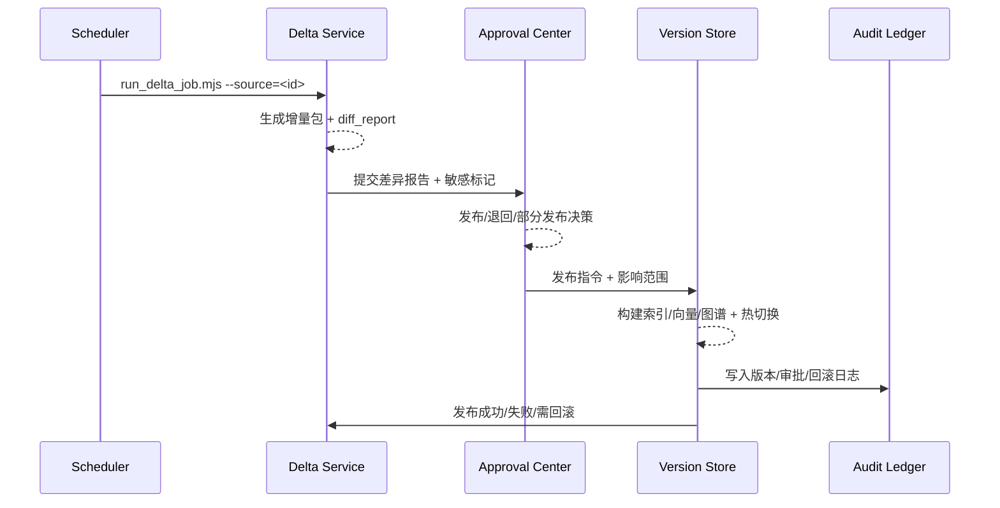

doc_id: UC-KNOWLEDGE-UPDATE-SYNC-001
scn_id: SCN-KNOWLEDGE-UPDATE-001
title: 增量同步与版本管理（service/knowledge）
status: Draft
version: v0.1.0
repo_key: powerx
scope: powerx
layer: service
domain: knowledge
scenario_title: "知识更新与反馈"
owners:
  - name: Michael Hu
    role: Tech Steward
    contact: tech@artisan-cloud.com
  - name: Matrix-X
    role: Docs Coordinator
    contact: dev@artisan-cloud.com
contributors:
  - name: David Lin
    role: Knowledge Platform PM
    contact: platform@artisan-cloud.com
  - name: Renee Qiao
    role: Governance Lead
    contact: governance@artisan-cloud.com
linked_requirements:
  - id: SCN-KNOWLEDGE-UPDATE-SYNC-001
    description: 子场景《增量同步与版本管理》
code_refs:
  - repo: powerx
    path: services/knowledge/delta/orchestrator.ts
    description: 增量检测、变更包生成与调度策略入口
  - repo: powerx
    path: services/knowledge/delta/diff_reporter.ts
    description: 差异计算、敏感字段标注与影响范围分析
  - repo: powerx
    path: services/knowledge/version/store.ts
    description: 版本存储、索引构建、回滚与血缘记录
  - repo: powerx
    path: scripts/knowledge/run_delta_job.mjs
    description: 调度/ETL 入口，按策略触发增量抓取
  - repo: powerx
    path: scripts/knowledge/diff_report.mjs
    description: 生成差异报告并推送审批中心
feature_flags:
  - PX_KNOWLEDGE_DELTA_SYNC
  - PX_KNOWLEDGE_VERSIONED_STORAGE
  - PX_KNOWLEDGE_PARTIAL_RELEASE
optional: false
last_reviewed_at: 2025-02-20

---

# Usecase Overview

- **业务目标**：将文档/API/表格等多源增量在 30 分钟 SLA 内抓取、比对、审批并发布，差异准确率 ≥ 98%，并支持敏感字段校验、部分发布与一键回滚，确保知识库持续可用且可追溯。
- **成功度量**：`knowledge.delta.sla ≤ 30m`、`knowledge.delta.approval_time ≤ 15m`、`knowledge.delta.rollback_count ≤ 2/day`、差异报告准确率 ≥ 98%，审计覆盖率 100%。
- **场景关联**：覆盖 `SCN-KNOWLEDGE-UPDATE-001` Stage 1-3（Detect & Collect / Assess & Approve / Apply & Validate），并与 `SCN-KNOWLEDGE-UPDATE-SYNC-001` 子场景、`UC-KNOWLEDGE-UPDATE-EVENT-001`、`UC-KNOWLEDGE-UPDATE-TENANT-001` 协同。

> 该用例是知识更新闭环的“入口链路”，决定了所有后续反馈、灰度、治理能否建立在可靠、可审计的版本基础之上。

# Context & Assumptions

- **前置条件**
  - Feature Flags `PX_KNOWLEDGE_DELTA_SYNC`, `PX_KNOWLEDGE_VERSIONED_STORAGE`, `PX_KNOWLEDGE_PARTIAL_RELEASE` 已开启。
  - 数据源凭据、调度策略在 `configs/knowledge/delta_sources.yaml` 中配置完毕。
  - `ingestion-orchestrator`, `approval-center`, `version-store`, `audit-ledger`、`release-controller` 均可用。
  - 审批人、回滚授权人在 IAM 中完成授权，被写入审批中心的审批流。
  - `reports/_state/knowledge-delta.json` 作为指标快照，需要具备读写权限。
- **输入/输出**
  - 输入：外部源变化（文档/表格/API）、调度事件、人工触发、差异报告。
  - 输出：增量变更包、差异报告（新增/修改/删除）、审批决定、版本 ID、索引/向量/图谱快照、审计日志、回滚记录。
- **边界**
  - 不涵盖知识初次入库（`SCN-KNOWLEDGE-SPACE-001`）。
  - 不处理反馈驱动再加工（`UC-KNOWLEDGE-UPDATE-FEEDBACK-001`）或灰度策略（`UC-KNOWLEDGE-UPDATE-TENANT-001`）。
  - 对事件热修链路仅提供输入数据，不直接触发实时事件流程。

# Solution Blueprint

## 体系分解

| 层 | 主要组件/模块 | 责任 | 代码入口 |
|----|---------------|------|---------|
| 调度 / ETL | `scripts/knowledge/run_delta_job.mjs` | 连接各数据源、生成增量包、写入对象存储并触发差异计算 | `scripts/knowledge` |
| 差异计算 & 报告 | `services/knowledge/delta/diff_reporter.ts` | 对比旧版，产出新增/修改/删除列表、敏感字段、影响节点 | `services/knowledge/delta` |
| 审批中心集成 | `services/knowledge/delta/approval_adapter.ts` | 将差异报告推送审批中心，处理发布/退回/部分发布结果 | `services/knowledge/delta` |
| 版本存储 & 切换 | `services/knowledge/version/store.ts` | 生成版本快照、构建索引/向量/图谱、执行热切换 + 回滚 | `services/knowledge/version` |
| 审计 & 指标 | `services/knowledge/delta/telemetry.ts` | 记录 `knowledge.delta.*` 指标、审计链路、SLA 告警 | `services/knowledge/delta` |

## 流程与时序

1. **Step 1 – Detect & Package**：调度器按策略或事件触发 `run_delta_job.mjs`，抓取外部源并生成增量包（含签名、来源、hash）。
2. **Step 2 – Diff & Analyze**：`diff_reporter` 对比上一个版本，生成差异报告 + 影响范围 + 敏感字段标记，并写入对象存储与审批中心。
3. **Step 3 – Approve / Return**：审批人审核差异，可选择“发布”“部分发布”“退回”，或触发敏感字段二次校验；审批结果写入 `approval-center` 与审计。
4. **Step 4 – Publish & Version**：版本服务根据审批结果生成新版本、刷新索引/向量/图谱，支持租户/空间维度的部分发布与热切换。
5. **Step 5 – Rollback & Audit**：若发布失败或指标异常，调用 `version-store rollback` 回退；全流程写入 `audit-ledger`、`reports/_state/knowledge-delta.json`。

# Contracts & Interfaces

- **Inbound APIs / Jobs**
  - `node scripts/knowledge/run_delta_job.mjs --source <id> --delta-id <uuid>` — 调度入口；支持 `--since`, `--tenant`, `--dry-run`。
  - `POST /knowledge/delta/jobs` — 供控制面触发增量抓取；请求体含 `source_id`, `trigger_type`, `force_full`.
  - `POST /knowledge/delta/publish` — 审批中心回调，携带 `job_id`, `decision`, `partial_scope`, `approver_id`.
- **Outbound 调用**
  - `POST /approval-center/diff_reports` — 推送差异报告、敏感字段、影响范围、审计 ID。
  - `POST /knowledge/version/apply` — 发布版本，字段含 `version_id`, `scope`, `partial_targets`.
  - `POST /knowledge/version/rollback` — 回滚操作，要求 `reason`, `approver`, `previous_version`.
  - `POST /audit/logs` — 写入 `knowledge.delta.generated`, `knowledge.delta.approved`, `knowledge.delta.rollback`.
- **配置与脚本**
  - `configs/knowledge/delta_sources.yaml` — 数据源、抓取策略、认证信息。
  - `delta_diff_schema.json` — 差异报告字段定义。
  - `configs/knowledge/partial_release.yaml` — 租户/空间的部分发布策略。

# Implementation Checklist

| 项目 | 描述 | 完成状态 | 负责人 |
|------|------|----------|--------|
| 数据源适配器 | 为新源实现抓取器 + 签名校验，确保 run_delta_job 支持多策略 | [ ] | Knowledge Platform Squad |
| 差异报告 | 完成 diff_reporter 的敏感标记、风险排序、分页能力 | [ ] | Core Platform Squad |
| 审批集成 | 与 `approval-center` 建立 API/回调，支持部分发布、退回及多 approver | [ ] | Governance Squad |
| 版本存储 | 扩展 version-store 记录血缘、租户粒度版本、回滚 CLI | [ ] | Reliability Squad |
| Telemetry & 告警 | 写入 `knowledge.delta.*` 指标、接入 Grafana + PagerDuty | [ ] | Observability Team |

# Testing Strategy

- **单元测试**
  - 撷取器与 diff 算法（新增/修改/删除、敏感字段、冲突情形）。
  - 审批状态机：发布、部分发布、退回、异常。
  - 版本存储回滚函数，确保血缘与快照一致。
- **集成测试**
  - 使用 `scripts/knowledge/run_delta_job.mjs --dry-run` + `scripts/knowledge/diff_report.mjs` 演练 A-1/A-2 场景。
  - 模拟冲突包（错误字段、重复 ID）确保系统拒绝发布并提示。
  - 验证 `POST /knowledge/version/rollback` 对索引/向量/图谱的回滚一致性。
- **端到端验证**
  - 沙箱 `demo-corp`：上传 `finance-policy-v2.pdf` 并在 30 分钟内完成审批发布。
  - 逆向：上传 `finance-policy-error.pdf`，确认冲突被阻断并能回滚。
  - 部分发布：先对试点租户发布，再扩散到全量并记录审计。
- **非功能测试**
  - 大型增量包（>2GB 或 1M 行）下的差异计算性能。
  - 同时处理多源增量时的资源消耗与调度优先级。

# Observability & Ops

- **指标**
  - `knowledge.delta.sla`, `knowledge.delta.approval_time`, `knowledge.delta.diff_accuracy`, `knowledge.delta.rollback_count`, `knowledge.delta.partial_release`.
- **日志**
  - `delta_orchestrator.log`: 记录 source、delta_id、耗时、结果。
  - `version_store.log`: 记录版本生成、索引刷新、回滚动作。
  - 所有日志需包含 `tenant_id`, `knowledge_space_id`, `job_id`, `approver`.
- **告警**
  - SLA > 30m（P1）、审批 > 15m（P2）、diff 精度 < 98%（P2）、当日回滚 > 2 次（P1）。
  - 无法写入审计或版本血缘时立即触发 P0 告警。
- **Dashboards**
  - Grafana《Knowledge Delta Sync》：展示 SLA、审批时长、差异准确率、回滚。
  - `reports/_state/knowledge-delta.json`：供周报与自动化验证使用。

# Rollback & Failure Handling

- **回滚步骤**
  1. 触发 `POST /knowledge/version/rollback`（或 CLI `px knowledge rollback --version <id>`）恢复至上个稳定版。
  2. 在审批中心标记此次发布失败，阻止同批次的进一步扩散。
  3. 回滚后重新生成差异报告，必要时将 delta 包拆分成更小批次。
- **补救措施**
  - 对冲突或失败包使用 `run_delta_job.mjs --retry <delta_id>` 重新执行。
  - 支持“部分发布”→“回滚未发布部分”策略，减少影响面。
  - 若差异报告损坏，可从对象存储或 `audit-ledger` 中下载快照。
- **数据修复**
  - 通过 `version-store` 保留的快照恢复旧索引/向量/图谱。
  - 提供 SQL/CLI 示例用于修复审批记录或审计缺口。

# Follow-ups & Risks

| 风险/事项 | 影响 | 缓解方案 | 负责人 | ETA |
|-----------|------|----------|--------|-----|
| `scripts/knowledge/diff_report.mjs` 缺少某些 API 源适配器 | 导致差异报告不完整 | 按源优先级补齐适配器，并增加回归测试 | Knowledge Platform Squad | 2025-02-23 |
| 部分发布 CLI 尚未写入审计 ID | 无法追溯租户级版本 | 升级 CLI，发布/回滚都携带审计 ID | Governance Squad | 2025-02-24 |
| 指标尚未同步到 `reports/_state/knowledge-delta.json` | 领导看板数据缺失 | 扩展 telemetry 脚本并在 CI 校验 | Observability Team | 2025-02-26 |

# References & Links

- 场景：`docs/scenarios/knowledge/SCN-KNOWLEDGE-UPDATE-001.md`
- 子场景：`docs/scenarios/knowledge/SCN-KNOWLEDGE-UPDATE-SYNC-001.md`
- 配置：`configs/knowledge/delta_sources.yaml`, `delta_diff_schema.json`, `configs/knowledge/partial_release.yaml`
- 脚本：`scripts/knowledge/run_delta_job.mjs`, `scripts/knowledge/diff_report.mjs`
- 发布指引：`npm run publish:usecases -- --scn-id SCN-KNOWLEDGE-UPDATE-001 --validate-only`
