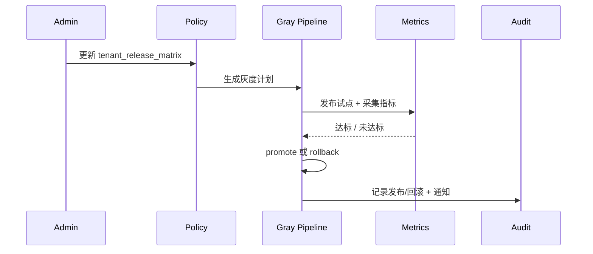

doc_id: UC-KNOWLEDGE-UPDATE-TENANT-001
scn_id: SCN-KNOWLEDGE-UPDATE-001
title: 租户灰度发布与治理（ops/knowledge）
status: Draft
version: v0.1.0
repo_key: powerx
scope: powerx
layer: ops
domain: knowledge
scenario_title: "知识更新与反馈"
owners:
  - name: Michael Hu
    role: Tech Steward
    contact: tech@artisan-cloud.com
  - name: Matrix-X
    role: Docs Coordinator
    contact: dev@artisan-cloud.com
contributors:
  - name: Kelly Wu
    role: Governance Squad PM
    contact: governance@artisan-cloud.com
  - name: Eric Zhou
    role: Platform Ops Lead
    contact: ops@artisan-cloud.com
linked_requirements:
  - id: SCN-KNOWLEDGE-UPDATE-TENANT-001
    description: 子场景《租户灰度发布与治理》
code_refs:
  - repo: powerx
    path: services/knowledge/release/policy_controller.ts
    description: 管理 `tenant_release_matrix`、审批链、阈值配置
  - repo: powerx
    path: services/knowledge/release/gray_pipeline.ts
    description: 执行灰度计划、监控指标、自动扩散或暂停
  - repo: powerx
    path: services/knowledge/release/rollback_service.ts
    description: 失败时回滚租户版本、写入审计、触发告警
  - repo: powerx
    path: scripts/knowledge/release/run_gray_plan.mjs
    description: CLI/调度脚本，加载策略并触发试点发布
feature_flags:
  - PX_KNOWLEDGE_GRAY_RELEASE
  - PX_TENANT_RELEASE_MATRIX
  - PX_KNOWLEDGE_RELEASE_GUARD
optional: false
last_reviewed_at: 2025-02-20

---

# Usecase Overview

- **业务目标**：让知识版本可以按租户/部门灰度发布，先在试点租户验证关键指标，再自动扩散到全量，若指标异常则暂停并回滚，保证敏感租户安全与版本可追溯。
- **成功度量**：灰度处理延迟 ≤ 10 分钟；指标命中达标率 ≥ 95%；灰度失败自动回滚率 100%；租户版本一致率 ≥ 99%；审计覆盖率 100%。
- **场景关联**：对应 `SCN-KNOWLEDGE-UPDATE-001` Stage 4（Observe & Iterate）与子场景 `SCN-KNOWLEDGE-UPDATE-TENANT-001`，与增量同步、事件热修共享版本信息。

> 通过租户矩阵 + 灰度流水线，确保不同租户按照可控节奏接收知识更新，并在异常时快速回退。

# Context & Assumptions

- **前置条件**
  - Feature Flags `PX_KNOWLEDGE_GRAY_RELEASE`, `PX_TENANT_RELEASE_MATRIX`, `PX_KNOWLEDGE_RELEASE_GUARD` 已启用。
  - `tenant_release_matrix.yaml` 定义租户分组、优先级、指标阈值、审批人。
  - `release-controller`, `metrics-gateway`, `notifications`, `audit-ledger`, `iam-service` 可用。
  - 增量同步/事件热修已生成待发布版本并写入 `version-store`。
  - 租户与知识空间的访问矩阵在 IAM 中配置完毕。
- **输入/输出**
  - 输入：新版本 ID、租户策略、审批决定、指标数据、反馈信号。
  - 输出：灰度计划、每批发布进度、回滚记录、审计日志、告警通知、`reports/_state/knowledge-release.json`。
- **边界**
  - 不处理知识差异计算（`UC-KNOWLEDGE-UPDATE-SYNC-001`）或反馈再加工。
  - 灰度仅针对 PowerX 自有租户，Marketplace 分发另有流程。
  - 不直接控制 Agent 行为，但需提供版本状态供 Agent 调整。

# Solution Blueprint

## 体系分解

| 层 | 主要组件/模块 | 责任 | 代码入口 |
|----|---------------|------|---------|
| Policy Config | `services/knowledge/release/policy_controller.ts` | CRUD `tenant_release_matrix`, 审批链配置、阈值校验 | `services/knowledge/release` |
| Gray Pipeline | `services/knowledge/release/gray_pipeline.ts` | 生成灰度计划、执行试点/扩散、收集指标与反馈 | `services/knowledge/release` |
| Metrics & Guard | `services/knowledge/release/metric_guard.ts` | 调用 `metrics-gateway`/反馈中心，评估是否扩散或暂停 | `services/knowledge/release` |
| Rollback & Audit | `services/knowledge/release/rollback_service.ts` | 触发 `POST /knowledge/release/rollback`, 写入审计、通知 | `services/knowledge/release` |
| CLI / Scheduler | `scripts/knowledge/release/run_gray_plan.mjs` | 支持 CLI/调度执行灰度流程、导出报告 | `scripts/knowledge/release` |

## 流程与时序

1. **Stage 1 – Plan**：管理员更新 `tenant_release_matrix` 并提交审批；策略写入数据库/配置中心。
2. **Stage 2 – Pilot Release**：灰度流水线将新版本发布到试点租户（如 `demo-retail`），指标守卫持续观测。
3. **Stage 3 – Monitor & Promote**：指标达标则调用 `POST /knowledge/release/promote` 将版本扩散到下一批；若不达标，触发 `release.gray.alert` 并回滚试点。
4. **Stage 4 – Audit & Feedback**：每次发布/回滚都写入 `audit-ledger`，并把跨租户反馈同步到知识治理看板。

# Contracts & Interfaces

- **Inbound APIs / Jobs**
  - `POST /knowledge/release/policies` — 新建/修改租户策略，校验 IAM 绑定。
  - `POST /knowledge/release/publish` — 提交新版本 + 灰度计划（含版本 ID、租户批次、阈值）。
  - `POST /knowledge/release/promote` — 指定批次扩散。
  - `POST /knowledge/release/rollback` — 对租户或批次执行回滚。
  - `GET /knowledge/release/status/:tenant` — 查询租户当前版本与灰度状态。
- **Outbound 调用**
  - `POST /metrics-gateway/query` — 获取指标（准确率、事件延迟、反馈等）。
  - `POST /notifications/send` — 推送灰度成功或告警到值班渠道。
  - `POST /audit/logs` — 记录策略变动、发布、回滚、失败。
- **配置与脚本**
  - `tenant_release_matrix.yaml` — 租户分组、阈值、审批。
  - `release_guardrails.md` — 指标门槛、暂停策略。
  - `gray_monitoring_dashboard.json` — Grafana 配置。
  - `scripts/knowledge/release/run_gray_plan.mjs` — 触发灰度执行。

# Implementation Checklist

| 项目 | 描述 | 完成状态 | 负责人 |
|------|------|----------|--------|
| Policy Controller | CRUD API + IAM 校验 + 审批人绑定 | [ ] | Governance Squad |
| Gray Pipeline | 执行批次队列、支持并发/延迟、记录状态 | [ ] | Reliability Squad |
| Metrics Guard | 接入指标/反馈数据、判定 promote/rollback | [ ] | Observability Team |
| Rollback Service | 批量回滚租户版本、通知与审计集成 | [ ] | Platform Ops Squad |
| Dashboard & Reports | 生成 `knowledge-release.json`、Grafana 面板 | [ ] | Observability Team |

# Testing Strategy

- **单元测试**
  - 策略解析、阈值校验、审批验证。
  - 灰度计划状态机（pending → pilot → promote → completed / rollback）。
  - Rollback 与通知逻辑。
- **集成测试**
  - 在沙箱租户运行 `run_gray_plan.mjs --dry-run`，验证策略加载、试点发布、指标采集。
  - 模拟指标不达标，确保自动暂停 + 回滚 + 告警。
- **端到端验证**
  - 试点：将版本推送到 `demo-retail`，确认指标稳定后扩散到 `demo-corp`，审计记录齐全。
  - 灰度失败：制造高错误率，验证系统暂停扩散、触发 `release.gray.alert`、回滚试点。
  - Tenant 差异：两个租户策略不同，确认各自指标与审批路径生效。
- **非功能测试**
  - 多租户并行灰度的吞吐与锁控制。
  - 版本一致性检查（跨 100+ 租户）性能与缓存策略。

# Observability & Ops

- **指标**：`knowledge.release.gray_state`, `knowledge.release.rollback_count`, `knowledge.release.tenant_coverage`, `knowledge.release.alerts`, `knowledge.release.latency`.
- **日志**：`release_policy.log`, `gray_pipeline.log`, `rollback_service.log`，记录 `tenant_uuid`, `batch_id`, `version`, `decision`, `approver`.
- **告警**：
  - 灰度失败率 > 5%（P1）、连续回滚 ≥ 2（P1）、租户版本不一致 > 1%（P1）。
  - 策略同步失败或审计写入失败立即触发 P0。
- **Dashboards**：Grafana《Tenant Release Control》、`reports/_state/knowledge-release.json`。

# Rollback & Failure Handling

- **回滚步骤**
  1. 触发 `POST /knowledge/release/rollback` 指定租户/批次，恢复至上个版本。
  2. 更新 `tenant_release_matrix` 状态，防止自动扩散继续执行。
  3. 记录回滚原因、责任人，并通知治理/平台 OPS。
- **补救措施**
  - 若策略配置错误，回滚策略版本并重新生成灰度计划。
  - 对指标缺失的批次可手动补录数据或跳过扩散。
  - 提供 `run_gray_plan.mjs --resume <token>` 重新执行中断的灰度。
- **数据修复**
  - 通过 `version-store` 回滚租户版本。
  - 在 `audit-ledger` 中补写缺失条目、保持版本血缘完整。

# Follow-ups & Risks

| 风险/事项 | 影响 | 缓解方案 | 负责人 | ETA |
|-----------|------|----------|--------|-----|
| `tenant_release_matrix.yaml` 尚缺关键租户配置 | 无法准确灰度或审计 | 收集金融/医疗租户需求，补齐策略并设审批 | Governance Squad | 2025-02-25 |
| `knowledge-release.json` 未自动生成 | 无法在看板监控覆盖率 | 扩展 telemetry 任务，每次灰度更新报表 | Observability Team | 2025-02-26 |
| 回滚操作缺少租户级审计 ID | 难以追溯责任 | 在 rollback API 中强制附带审计 ID 与审批人 | Platform Ops Squad | 2025-02-24 |

# References & Links

- 场景：`docs/scenarios/knowledge/SCN-KNOWLEDGE-UPDATE-001.md`
- 子场景：`docs/scenarios/knowledge/SCN-KNOWLEDGE-UPDATE-TENANT-001.md`
- 配置：`tenant_release_matrix.yaml`, `release_guardrails.md`, `gray_monitoring_dashboard.json`
- 脚本：`scripts/knowledge/release/run_gray_plan.mjs`
- 发布指引：`npm run publish:usecases -- --scn-id SCN-KNOWLEDGE-UPDATE-001 --validate-only`
