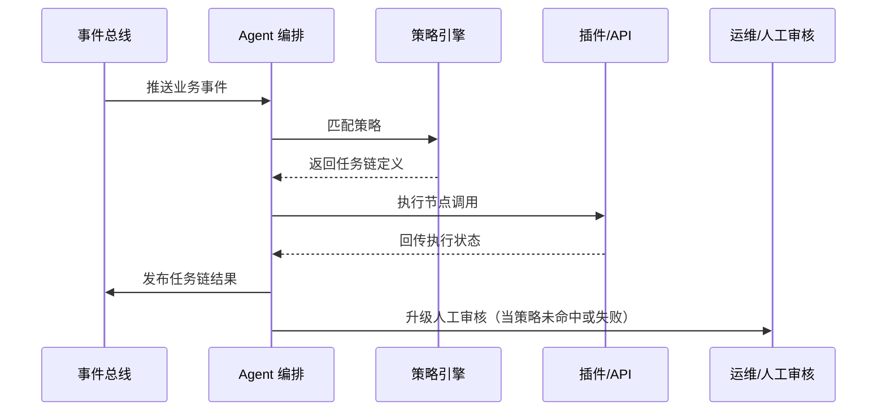

scn_id: SCN-OPS-AGENT-ORCHESTRATION-001
title: Agent 自动化任务链编排
status: Draft
version: v0.1.0
owners:
  - name: Matrix Ops
    role: Platform Ops Lead
    contact: ops@artisan-cloud.com
  - name: Eva Zhang
    role: Automation Steward
    contact: automation@artisan-cloud.com
domains: [ops]
layers: [service, ops]
repos:
  - key: powerx
    scope: core-platform
    responsibility: Agent 策略库、编排服务、可视化与审计
related_usecases:
  - doc_id: UC-OPS-AGENT-ORCHESTRATION-001
    layer: service
    domain: ops
last_reviewed_at: 2025-10-31

---

# Executive Summary

Agent 编排服务监听事件总线，根据策略库自动生成任务链并调用插件或外部 API。该子场景描述事件接入、策略匹配、任务链构建、执行回写与人工接管流程，目标是在 10 秒内完成自动化决策并实现可视化追踪与审计闭环。

# Scope & Guardrails

- **In Scope**：事件订阅、策略匹配、任务链构建、节点执行、状态回写、人工审核升级。
- **Out of Scope**：策略编写 IDE、外部系统权限申请、长周期人工流程的工单协作（另有运营系统负责）。
- **Environment & Flags**：`agent-orchestrator`、`agent-strategy-library`、`audit-streaming`；依赖事件总线、策略库、Ops 控制台编排视图。

# Participants & Responsibilities

| Scope | Repository | Layer | 责任与交付物 | Owners |
|-------|------------|-------|--------------|--------|
| core-platform | powerx | service | 事件监听、策略匹配、任务链构建、节点执行 | Matrix Ops（Platform Ops Lead / ops@artisan-cloud.com） |
| automation | powerx | ops | 策略库治理、可视化报表、人工接管流程、Runbook | Eva Zhang（Automation Steward / automation@artisan-cloud.com） |

# End-to-End Flow

1. **Stage 1 – 事件接入与幂等校验**：Agent 订阅事件、校验租户与幂等键，构建上下文。
2. **Stage 2 – 策略匹配**：根据事件类型、条件权重、租户策略决定是否生成任务链。
3. **Stage 3 – 任务链构建与执行**：生成顺序/并行节点，调用插件或 API 执行，跟踪状态。
4. **Stage 4 – 回写与人工接管**：执行结果写入事件总线与审计；未命中或失败升级为人工审核。

# Key Interactions & Contracts

- **APIs / Events**：`EVENT plugin.job.completed`、`EVENT agent.workflow.generated`、`POST /internal/agent/events`、`POST /ops/manual-review`。
- **Configs / Schemas**：`config/agent/strategies/*.yaml`、`docs/standards/agent/orchestration-contract.md`、`docs/standards/events/agent-workflow-schema.md`。
- **Security / Compliance**：策略审批与发布、最小权限配置、操作审计、人工接管多因子验证。

# Usecase Links

- `UC-OPS-AGENT-ORCHESTRATION-001` — Agent 自动生成任务链编排。

# Acceptance Criteria

1. Agent 策略命中率 ≥ 80%，任务链生成耗时 ≤ 10 秒。
2. 自动执行成功率 ≥ 95%，失败 3 次内触发人工升级，人工响应 ≤ 10 分钟。
3. 编排视图展示完整拓扑，审计日志覆盖事件上下文、策略版本、执行轨迹。

# Telemetry & Ops

- 指标：`agent.strategy.hit_rate`、`agent.workflow.generated_total`、`agent.node.success_total`、`agent.manual_escalation_total`、`agent.workflow.latency_p95`。
- 告警阈值：策略未命中率 >20%/15 分钟、自动任务失败率 >10%、人工升级积压 >20 条。
- 观测来源：Grafana `Runtime Ops / Agent Automation`、Datadog `agent.*`、Ops 控制台编排视图、`scripts/ops/agent-replay.mjs`。

# Open Issues & Follow-ups

| 风险/事项 | 影响范围 | 负责人 | ETA |
|-----------|----------|--------|-----|
| 策略库缺少版本回滚与自动回归 | 错误策略导致大面积异常 | Eva Zhang | 2025-11-10 |
| Agent 执行权限治理待补强 | 可能触发越权调用 | Matrix Ops | 2025-11-18 |

# Appendix

- `docs/meta/scenarios/powerx/core-platform/runtime-ops/event-and-taskflow-management/primary.md`
- `scripts/ops/agent-strategy-test.mjs`、`scripts/ops/agent-replay.mjs`
- Agent 策略治理规范（Confluence：Runtime-Ops-Agent-Policy）
