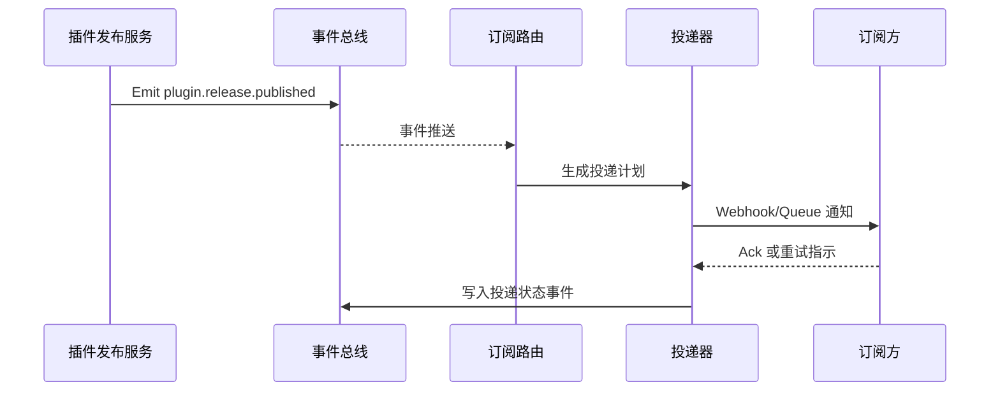

scn_id: SCN-OPS-EVENT-NOTIFY-001
title: 插件发布事件订阅通知
status: Draft
version: v0.1.0
owners:
  - name: Matrix Ops
    role: Platform Ops Lead
    contact: ops@artisan-cloud.com
  - name: Eva Zhang
    role: Automation Steward
    contact: automation@artisan-cloud.com
domains: [ops]
layers: [service, integration]
repos:
  - key: powerx
    scope: core-platform
    responsibility: 事件总线、订阅治理、重试策略实现
  - key: powerx-plugin
    scope: plugin-ecosystem
    responsibility: 插件事件发布适配器、订阅配置管理
related_usecases:
  - doc_id: UC-OPS-EVENT-NOTIFY-001
    layer: service
    domain: ops
last_reviewed_at: 2025-10-31

---

# Executive Summary

插件在生产租户发布新版本后，需要在 5 秒内将 `plugin.release.published` 等关键事件投递给运维控制台、CI/CD、告警平台等订阅方。本子场景聚焦统一事件模型、订阅治理与多通道投递，目标是确保事件可靠达达、失败自动补偿、全链路可追溯，同时避免重复通知与限流风暴。

# Scope & Guardrails

- **In Scope**：事件 schema 标准化、租户隔离、订阅匹配、Webhook/消息队列投递、延迟重试、事件追溯与审计。
- **Out of Scope**：插件发布审批流程、订阅方内部业务处理、跨区域事件镜像（由全局运维场景覆盖）。
- **Environment & Flags**：`event-bus-v2`、`plugin-release-webhook`、`audit-streaming`；依赖 Kafka 事件总线、订阅配置库、Ops 控制台事件中心。

# Participants & Responsibilities

| Scope | Repository | Layer | 责任与交付物 | Owners |
|-------|------------|-------|--------------|--------|
| core-platform | powerx | service | 事件模型校验、订阅匹配、投递与重试、审计追溯 | Matrix Ops（Platform Ops Lead / ops@artisan-cloud.com） |
| plugin-ecosystem | powerx-plugin | integration | 插件发布事件适配器、订阅配置模板、SDK 工具 | Plugin Guild（Plugin Partner / plugin@artisan-cloud.com） |
| automation | powerx | ops | 事件重放脚本、失败告警、Ops 控制台治理能力 | Eva Zhang（Automation Steward / automation@artisan-cloud.com） |

# End-to-End Flow

1. **Stage 1 – 事件发布**：插件发布流水线向事件总线发送标准化 `plugin.release.published` 事件并记录幂等键。
2. **Stage 2 – 订阅匹配**：事件路由根据租户、标签、速率限制匹配订阅方，生成投递计划。
3. **Stage 3 – 多通道投递**：投递器按 Webhook/消息队列协议推送，失败进入延迟重试或熔断。
4. **Stage 4 – 追溯与补偿**：投递结果写入事件仓，Ops 可查询、重放或生成人工工单补偿。

# Key Interactions & Contracts

- **APIs / Events**：`EVENT plugin.release.published`、`EVENT event.delivery.failed`、`POST /internal/events/publish`（重放）、`POST /internal/events/subscriptions`.
- **Configs / Schemas**：`docs/standards/events/event-bus-schema.md`、`config/events/subscriptions.yaml`、`docs/standards/ops/event-retry-policy.md`.
- **Security / Compliance**：HMAC 签名校验、防重放幂等键、租户隔离、审计日志落库、失败告警审批。

# Usecase Links

- `UC-OPS-EVENT-NOTIFY-001` — 插件发布事件多通道订阅通知。

# Acceptance Criteria

1. 首次投递成功率 ≥ 97%，重试后累计成功率 ≥ 99.5%，重复投递率 < 0.5%。
2. 事件中心可在 1 分钟内展现投递明细，支持按租户、订阅方、状态筛选与重放。
3. 订阅失败自动进入延迟重试，并在失败次数达到阈值时触发 PagerDuty 告警。

# Telemetry & Ops

- 指标：`event.delivery.success_total`、`event.delivery.retry_total`、`event.delivery.latency_p95`、`event.delivery.duplicate_total`。
- 告警阈值：失败率 >5%/5 分钟、签名验证失败、订阅延迟 >10 秒。
- 观测来源：Grafana `Runtime Ops / Event Delivery`、Datadog `event.delivery.*`、Ops 控制台事件中心、`scripts/ops/replay-event.mjs`。

# Open Issues & Follow-ups

| 风险/事项 | 影响范围 | 负责人 | ETA |
|-----------|----------|--------|-----|
| 跨区域事件镜像延迟 >8 秒影响全球租户同步 | 多区域订阅方 | Matrix Ops | 2025-11-12 |
| 签名密钥轮换缺少自动提醒 | Webhook 通知安全性 | Eva Zhang | 2025-11-18 |

# Appendix

- `docs/meta/scenarios/powerx/core-platform/runtime-ops/event-and-taskflow-management/primary.md`
- `scripts/ops/replay-event.mjs`、`scripts/ops/validate-webhook.mjs`
- Ops 控制台事件订阅配置指南（Confluence：Runtime-Ops-Event-Subscriptions）
