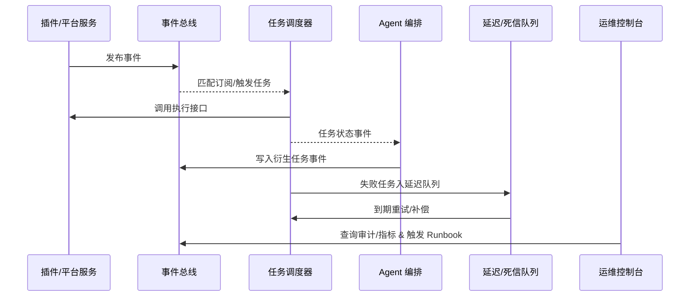

# Positioning & Goals

PowerX 需要统一的事件与任务流骨干，确保插件发布通知、自动化任务执行、Agent 编排与补偿链路在跨租户、跨插件场景中可追踪、可恢复、可度量。目标是关键事件 95% 在 5 秒内送达，任务准时率 ≥98%，失败任务 60 秒内进入重试/补偿流程，并让 Ops 团队通过一个控制面实时掌握状态与回滚能力。

# Scope & Guardrails

- **In Scope**：事件模型与租户隔离、订阅治理、重试策略；Cron/事件驱动任务调度；Agent 自动化链路；延迟/死信队列、补偿 Runbook；可视化监控与审计。
- **Out of Scope**：单插件内部业务编排、私有队列实现、基础设施容量扩缩容、商业计费与权限策略。
- **Environment & Flags**：`event-bus-v2`、`task-scheduler-v3`、`agent-orchestrator`、`task-retry-queue`；依赖 Kafka 集群、任务状态存储（Redis/DB）、Ops 控制台、Audit Streaming。

# Core Capabilities

1. **Event Bus Governance**：标准化事件模型、订阅治理、租户隔离与重试策略。
2. **Task Scheduling & Execution**：Cron + 事件驱动调度、SLA 追踪、执行回调、失败升级与 Runbook。
3. **Automation & Recovery**：Agent 自动链路、延迟/死信队列、补偿工单与观测仪表盘。

# Participants & Responsibilities

| Scope | Repository | Layer | 责任与交付物 | Owners |
|-------|------------|-------|--------------|--------|
| core-platform | powerx | service | 事件总线、订阅管理、调度器、延迟/死信队列、审计 | Matrix Ops |
| automation | powerx | ops | Agent 自动化策略、Runbook、工单自动化、观测脚本 | Eva Zhang |
| plugin-ecosystem | powerx-plugin | integration | 插件事件适配器、Webhook/回调协议、SDK 支持 | Plugin Guild |

# Validation Workflow

1. **事件发布与匹配**：插件/平台服务发布事件，事件总线完成租户隔离、订阅匹配与投递。
2. **调度与执行**：任务调度中心根据 Cron 或事件创建任务实例，完成资源校验、排队与执行调用。
3. **Agent 自动化**：Agent 根据事件拓扑生成自动化任务链，驱动下游插件/API 并维护状态。
4. **重试与补偿**：失败任务进入延迟/死信队列，按策略重试或生成补偿工单，记录审计与指标。

# Architecture Diagram

# Key Interactions & Contracts

- **APIs / Events**：`EVENT plugin.release.published`、`EVENT task.execution.updated`、`EVENT agent.automation.triggered`、`POST /internal/tasks/schedule`、`POST /internal/tasks/retry`、`GET /internal/events/history`、签名 Webhook 协议。
- **Configs / Schemas**：`docs/standards/events/event-bus-schema.md`、`docs/standards/ops/task-sla-matrix.md`、`docs/standards/agent/orchestration-contract.md`。
- **Security / Compliance**：租户隔离、幂等 Token、防重放签名、操作审计、失败升级审批。

# Related Links

- `UC-OPS-EVENT-NOTIFY-001` — 事件订阅与通知。
- `UC-OPS-TASK-SCHEDULE-001` — 调度中心 Cron/事件触发执行。
- `UC-OPS-AGENT-ORCHESTRATION-001` — Agent 自动化任务链。
- `UC-OPS-RETRY-RECOVERY-001` — 延迟队列重试与补偿。
- 设计稿：`docs/meta/scenarios/powerx/core-platform/runtime-ops/event-and-taskflow-management/primary.md`
- Runbook：`ops/runbooks/taskflow-recovery.md`
- 指标面板：Grafana `Runtime Ops / Event & Taskflow`

# Acceptance Criteria

1. 关键事件 95% 在 5 秒内送达订阅方，失败事件自动重试 ≥3 次并写入审计。
2. 任务调度准时率 ≥98%，失败任务 60 秒内进入重试/补偿流程，Ops 控制台可一键回放。
3. Agent 自动化策略命中率 ≥80%，人工接管在 10 分钟内响应并留痕；补偿工单在 30 分钟内完成。

# Telemetry & Ops

- 指标：`event.bus.delivery_latency_p95`、`event.bus.retry_success_total`、`task.scheduler.on_time_rate`、`task.execution.success_total`、`agent.automation.generated_total`、`task.retry.escalated_total`。
- 告警阈值：事件延迟 >10 秒/5 分钟、调度失败率 >5%、重试失败超过阈值立即通知 Ops 值班。
- 观测来源：Grafana、Datadog、`scripts/qa/workflow-metrics.mjs`、Ops 控制台事件中心。

# Open Issues & Follow-ups

| 风险/事项 | 影响范围 | 负责人 | ETA |
|-----------|----------|--------|-----|
| 跨区域事件镜像延迟 >8 秒，影响全球租户订阅体验 | 多区域订阅方 | Matrix Ops | 2025-11-12 |
| Agent 策略库缺少自动回归测试，存在误判风险 | 自动化任务链 | Eva Zhang | 2025-11-20 |

# Appendix

- `docs/meta/scenarios/powerx/core-platform/runtime-ops/event-and-taskflow-management/primary.md`
- `ops/runbooks/taskflow-recovery.md`
- `docs/standards/events/event-bus-schema.md`
