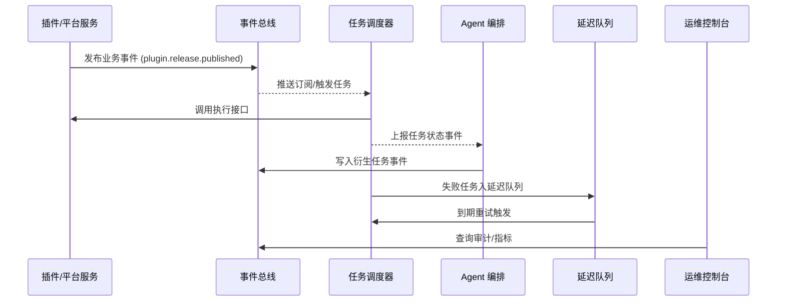

scn_id: SCN-OPS-EVENT-TASKFLOW-001
title: PowerX 事件与任务流管理
status: Draft
version: v0.1.0
owners:
  - name: Matrix Ops
    role: Platform Ops Lead
    contact: ops@artisan-cloud.com
  - name: Eva Zhang
    role: Automation Steward
    contact: automation@artisan-cloud.com
domains: [ops]
layers: [service, ops, integration]
repos:
  - key: powerx
    scope: core-platform
    responsibility: 事件总线、任务调度、Agent 编排服务
  - key: powerx-plugin
    scope: plugin-ecosystem
    responsibility: 插件事件集成、订阅配置、执行适配器
related_usecases:
  - doc_id: UC-OPS-EVENT-NOTIFY-001
    layer: service
    domain: ops
  - doc_id: UC-OPS-TASK-SCHEDULE-001
    layer: ops
    domain: ops
  - doc_id: UC-OPS-AGENT-ORCHESTRATION-001
    layer: service
    domain: ops
  - doc_id: UC-OPS-RETRY-RECOVERY-001
    layer: ops
    domain: ops
last_reviewed_at: 2025-10-31

---

# Executive Summary

事件与任务流管理为 PowerX 插件生态提供统一的事件发布、任务调度与自动化执行骨干。平台通过标准化事件模型、跨仓订阅投递、Agent 智能扩展以及延迟队列重试，确保插件发布通知、定时任务与补偿流程都可追踪、可恢复、可度量。目标是在秒级完成事件触达、分钟级保障任务按 SLA 执行，并让运维团队拥有闭环编排与治理能力。

# Scope & Guardrails

- **In Scope**：
  - `event-bus-v2` 事件模型、租户隔离、订阅治理与重试策略；
  - 统一任务调度服务（Cron 与事件驱动）的触发、执行、SLA 追踪；
  - Agent 编排根据事件生成自动化任务链、上下游插件联动；
  - 延迟队列、死信队列与补偿工单的策略配置与执行。
- **Out of Scope**：
  - 单个插件内部的业务逻辑编排与私有队列实现；
  - 基础设施层（Kubernetes、存储）容量扩缩容策略；
  - 商业计费、权限授权与风控策略细则（分别由其他场景覆盖）。
- **Environment & Flags**：
  - `event-bus-v2`、`task-scheduler-v3`、`agent-orchestrator`、`task-retry-queue`；
  - 依赖 Kafka 事件总线、Redis/DB 任务状态存储、Ops 控制台、Audit Streaming。

# Participants & Responsibilities

| Scope | Repository | Layer | 责任与交付物 | Owners |
|-------|------------|-------|--------------|--------|
| core-platform | powerx | service | 事件总线、订阅管理、任务调度器、延迟队列与重试策略 | Matrix Ops（Platform Ops Lead / ops@artisan-cloud.com） |
| automation | powerx | ops | Agent 编排、Runbook、工单自动化、观测脚本与报警触发 | Eva Zhang（Automation Steward / automation@artisan-cloud.com） |
| plugin-ecosystem | powerx-plugin | integration | 插件事件适配器、Webhooks、任务执行协议、回调 SDK | Plugin Guild（Plugin Partner / plugin@artisan-cloud.com） |

# End-to-End Flow

1. **Stage 1 – 事件发布与订阅匹配**：插件或平台服务将业务事件写入总线，系统完成租户隔离、订阅匹配与投递分发。
2. **Stage 2 – 调度与执行触发**：任务调度中心根据 Cron 或事件触发任务实例，完成资源校验、排队与执行调用。
3. **Stage 3 – Agent 自动化编排**：Agent 订阅事件流，决定是否扩展任务链，调用下游插件或 API 并维护拓扑状态。
4. **Stage 4 – 重试与补偿闭环**：失败任务进入延迟/死信队列，按策略重试或生成人工工单，记录审计与指标。

# Key Interactions & Contracts

- **APIs / Events**：
  - `EVENT plugin.release.published`、`EVENT task.execution.updated`、`EVENT agent.automation.triggered`；
  - `POST /internal/tasks/schedule`、`POST /internal/tasks/retry`、`GET /internal/events/history`；
  - Webhook 投递协议（HMAC 签名、重试、幂等键）。
- **Configs / Schemas**：`docs/standards/events/event-bus-schema.md`、`docs/standards/ops/task-sla-matrix.md`、`docs/standards/agent/orchestration-contract.md`。
- **Security / Compliance**：租户隔离、幂等 Token、防重放签名、操作审计、失败升级审批。

# Usecase Links

- `UC-OPS-EVENT-NOTIFY-001` — 插件发布事件多通道订阅通知（service 层，powerx）。
- `UC-OPS-TASK-SCHEDULE-001` — 调度中心 Cron/事件触发任务管理（ops 层，powerx）。
- `UC-OPS-AGENT-ORCHESTRATION-001` — Agent 自动生成任务链（service 层，powerx）。
- `UC-OPS-RETRY-RECOVERY-001` — 延迟队列重试与补偿闭环（ops 层，powerx）。

# Acceptance Criteria

1. 关键事件 95% 在 5 秒内送达订阅方，失败自动重试至少 3 次并记录审计。
2. 任务调度准时率 ≥ 98%，失败任务在 60 秒内进入重试/补偿流程并具备可视追踪。
3. Agent 自动化与人工工单保持闭环：策略命中率 ≥ 80%，人工接管在 10 分钟内响应，所有动作留痕可查。

# Telemetry & Ops

- 指标：`event.bus.delivery_latency_p95`、`event.bus.retry_success_total`、`task.scheduler.on_time_rate`、`task.execution.success_total`、`agent.automation.generated_total`、`task.retry.escalated_total`。
- 告警阈值：事件延迟 >10 秒/5 分钟、调度失败率 >5%、重试失败超过阈值立即通知 Ops 值班。
- 观测来源：Grafana `Runtime Ops / Event & Taskflow`、Datadog `task-*` 指标、`scripts/qa/workflow-metrics.mjs` 周报、Ops 控制台事件中心。

# Open Issues & Follow-ups

| 风险/事项 | 影响范围 | 负责人 | ETA |
|-----------|----------|--------|-----|
| 跨区域事件镜像延迟仍 > 8 秒，影响全球租户通知及时性 | 多区域订阅方 | Matrix Ops | 2025-11-12 |
| Agent 策略库缺少自动回归测试，存在误判风险 | 自动化任务链 | Eva Zhang | 2025-11-20 |

# Appendix

- `docs/meta/scenarios/powerx/core-platform/runtime-ops/event-and-taskflow-management/primary.md` 背景与子场景原始分析。
- 自动化策略设计草案（Confluence：Runtime-Ops-Event-Automation）。
- Runbook：`ops/runbooks/taskflow-recovery.md`（待补充跨区域镜像治理步骤）。
