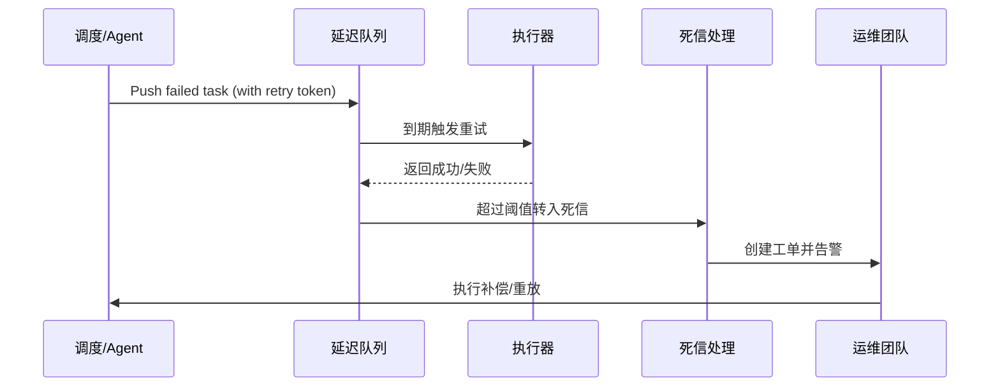

# Positioning & Goals

当任务执行失败时，平台需要自动进入延迟队列重试，并在达到阈值后升级为死信与人工补偿。本子场景定义重试策略、退避算法、死信治理和 Runbook 补偿流程，保障关键任务在异常情况下仍可恢复，且全过程审计可追溯。

# Scope & Guardrails

- **In Scope**：延迟队列入队/出队、重试策略、退避算法、死信队列、工单升级、Runbook 补偿、审计与告警。
- **Out of Scope**：跨仓数据修复、支付资金补偿、基础设施容灾。
- **Environment & Flags**：`task-retry-queue`、`dlq-inspector`、`audit-streaming`；依赖 Redis/Kafka、Ops 工单系统、PagerDuty/Slack 通知。

# Core Capabilities

1. **Adaptive Retry Engine**：统一退避算法、幂等 token 与最大尝试次数，保证重试可控可观测。
2. **Dead Letter Governance**：自动识别超阈值任务、创建工单、触发 PagerDuty/Slack，并提供巡检脚本。
3. **Compensation Automation**：Runbook + 控制台补偿操作与审计联动，生成指标、告警与回放能力。

# Participants & Responsibilities

| Scope | Repository | Layer | 责任与交付物 | Owners |
|-------|------------|-------|--------------|--------|
| core-platform | powerx | ops | 延迟队列、重试策略、死信处理、指标采集 | Matrix Ops（Platform Ops Lead / ops@artisan-cloud.com） |
| automation | powerx | ops | Runbook、工单集成、告警配置、队列巡检脚本 | Eva Zhang（Automation Steward / automation@artisan-cloud.com） |

# Validation Workflow

1. **Stage 1 – 失败入队**：任务失败事件触发重试策略，写入延迟队列并记录幂等 token。
2. **Stage 2 – 延迟重试**：到期后重新执行任务，成功则关闭告警并更新状态。
3. **Stage 3 – 死信升级**：多次失败后任务进入死信队列，自动创建工单并触发 PagerDuty。
4. **Stage 4 – 人工补偿与收尾**：运维依据 Runbook 执行补偿，记录结果并同步审计与指标。

# Architecture Diagram

# Key Interactions & Contracts

- **APIs / Events**：`EVENT task.execution.failed`、`EVENT task.retry.scheduled`、`POST /internal/tasks/retry`、`POST /ops/workorders`。
- **Configs / Schemas**：`config/tasks/retry-policies.yaml`、`docs/standards/ops/task-retry-governance.md`、`docs/standards/events/retry-status-schema.md`。
- **Security / Compliance**：重试幂等 token 校验、工单审批、审计记录、防止重复执行和权限越界。

# Related Links

- `UC-OPS-RETRY-RECOVERY-001` — 延迟队列重试与补偿闭环。
- 设计稿：`docs/meta/scenarios/powerx/core-platform/runtime-ops/event-and-taskflow-management/primary.md`
- Runbook：`ops/runbooks/taskflow-recovery.md`
- 巡检脚本：`scripts/ops/retry-inspect.mjs`

# Acceptance Criteria

1. 自动重试成功率 ≥ 90%，重试延迟符合 SLA（默认 2 分钟退避）。
2. 死信升级后 5 分钟内创建工单并通知值班，人工补偿完成率 ≥ 95%。
3. Ops 控制台可实时查看重试队列、死信队列、补偿状态，支持一键重放与策略调整。

# Telemetry & Ops

- 指标：`task.retry.scheduled_total`、`task.retry.success_total`、`task.retry.failure_total`、`task.retry.dlq_total`、`task.retry.escalated_total`。
- 告警阈值：重试失败率 >15%/10 分钟、死信队列长度超过阈值、工单创建失败。
- 观测来源：Grafana `Runtime Ops / Retry & Recovery`、Datadog `task.retry.*`、Ops 控制台补偿面板、`scripts/ops/retry-inspect.mjs`。

# Open Issues & Follow-ups

| 风险/事项 | 影响范围 | 负责人 | ETA |
|-----------|----------|--------|-----|
| 死信堆积清理流程未自动化 | 工单积压与补偿延迟 | Matrix Ops | 2025-11-07 |
| 重试策略未结合业务 SLA | 恢复动作可能过晚 | Eva Zhang | 2025-11-14 |

# Appendix

- `docs/meta/scenarios/powerx/core-platform/runtime-ops/event-and-taskflow-management/primary.md`
- `scripts/ops/retry-inspect.mjs`、`scripts/ops/recovery-runbook.mjs`
- 重试治理 Runbook（Confluence：Runtime-Ops-Retry-Recovery）
