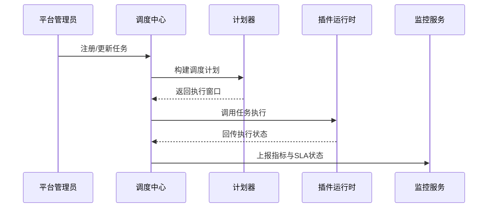

scn_id: SCN-OPS-TASK-SCHEDULE-001
title: 调度中心定时与事件任务管理
status: Draft
version: v0.1.0
owners:
  - name: Matrix Ops
    role: Platform Ops Lead
    contact: ops@artisan-cloud.com
  - name: Eva Zhang
    role: Automation Steward
    contact: automation@artisan-cloud.com
domains: [ops]
layers: [ops, service]
repos:
  - key: powerx
    scope: core-platform
    responsibility: Cron 解析、资源预检、任务执行管道
related_usecases:
  - doc_id: UC-OPS-TASK-SCHEDULE-001
    layer: ops
    domain: ops
last_reviewed_at: 2025-10-31

---

# Executive Summary

调度中心负责按 Cron 或事件规则触发插件任务，保证在 SLA 内完成执行并可视化追踪。本子场景覆盖任务登记、资源校验、执行调用、状态回写与失败补偿，确保批处理、周期任务和事件驱动作业在多租户环境下稳定运行。

# Scope & Guardrails

- **In Scope**：定时/事件任务登记、Cron 解析、资源配额与互斥策略、执行触发、状态追踪、SLA 告警、重试策略对接。
- **Out of Scope**：插件内部业务逻辑、底层基础设施扩缩容、手工工单审批流。
- **Environment & Flags**：`task-scheduler-v3`、`task-sla-monitor`、`task-retry-queue`；依赖 Redis/Etcd 锁、Kafka 执行队列、Ops 控制台任务面板。

# Participants & Responsibilities

| Scope | Repository | Layer | 责任与交付物 | Owners |
|-------|------------|-------|--------------|--------|
| core-platform | powerx | ops | Cron 引擎、任务计划器、执行客户端、状态回写 | Matrix Ops（Platform Ops Lead / ops@artisan-cloud.com） |
| automation | powerx | ops | SLA 告警、Runbook、任务巡检报表、Ops 控制台集成 | Eva Zhang（Automation Steward / automation@artisan-cloud.com） |

# End-to-End Flow

1. **Stage 1 – 任务登记**：管理员配置 Cron/事件任务，校验租户、作用域与互斥策略。
2. **Stage 2 – 预检排程**：调度窗口前执行资源校验、配额检查与去抖动，必要时排队或发出预警。
3. **Stage 3 – 任务执行**：到达触发时间后调用插件运行时/Agent 接口，记录 Trace ID，持续收集心跳。
4. **Stage 4 – 状态追踪**：执行结果写入任务仓库与指标系统；失败任务触发重试或补偿。

# Key Interactions & Contracts

- **APIs / Events**：`POST /internal/tasks/register`、`PUT /internal/tasks/{id}/pause|resume`、`EVENT task.execution.updated`、`EVENT task.execution.failed`。
- **Configs / Schemas**：`config/tasks/default_policy.yaml`、`docs/standards/ops/task-sla-matrix.md`、`docs/standards/events/task-status-schema.md`。
- **Security / Compliance**：任务操作权限校验、审计日志、租户级配额与隔离、SLA 告警审批。

# Usecase Links

- `UC-OPS-TASK-SCHEDULE-001` — 调度中心 Cron/事件触发任务管理。

# Acceptance Criteria

1. 调度准时率 ≥ 98%，任务执行成功率 ≥ 97%，延迟 < 1 分钟。
2. Ops 控制台可实时查看任务状态、执行日志，支持暂停/恢复、手动重试。
3. 资源冲突提前预警命中率 ≥ 90%，SLA 违约在 60 秒内告警。

# Telemetry & Ops

- 指标：`task.scheduler.on_time_rate`、`task.scheduler.missed_total`、`task.execution.success_total`、`task.execution.retry_total`、`task.sla.breach_total`。
- 告警阈值：调度失败率 >5%/5 分钟、连续 3 次 SLA 违约、锁争用率 >70%。
- 观测来源：Grafana `Runtime Ops / Scheduler Overview`、Datadog `task.scheduler.*`、Ops 控制台任务时间线、`scripts/ops/task-sla-report.mjs`。

# Open Issues & Follow-ups

| 风险/事项 | 影响范围 | 负责人 | ETA |
|-----------|----------|--------|-----|
| 调度中心扩容策略尚未自动化 | 高峰期 SLA 风险 | Matrix Ops | 2025-11-08 |
| 互斥策略配置复杂易误配 | 任务被阻塞 | Eva Zhang | 2025-11-15 |

# Appendix

- `docs/meta/scenarios/powerx/core-platform/runtime-ops/event-and-taskflow-management/primary.md`
- `scripts/ops/task-dryrun.mjs`、`scripts/ops/task-sla-report.mjs`
- Ops 控制台调度配置指南（Confluence：Runtime-Ops-Scheduler）
