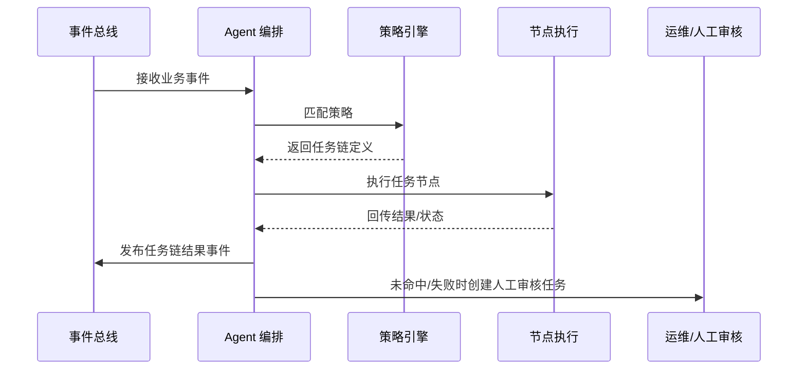

doc_id: UC-OPS-AGENT-ORCHESTRATION-001
scn_id: SCN-OPS-EVENT-TASKFLOW-001
title: Agent 自动生成任务链编排
status: Draft
version: v0.1.0
repo_key: powerx
scope: powerx
layer: service
domain: ops
scenario_title: "PowerX 事件与任务流管理"
owners:
  - name: Matrix Ops
    role: Platform Ops Lead
    contact: ops@artisan-cloud.com
  - name: Eva Zhang
    role: Automation Steward
    contact: automation@artisan-cloud.com
contributors: []
linked_requirements:
  - SCN-OPS-EVENT-TASKFLOW-001-C
code_refs:
  - repo: powerx
    path: internal/agent/subscribers/event_listener.go
    description: 事件订阅、过滤与上下文构建
  - repo: powerx
    path: internal/agent/strategy/matcher.go
    description: 策略匹配引擎、条件与权重评估
  - repo: powerx
    path: internal/agent/orchestrator/workflow_builder.go
    description: 自动化任务链构建、节点依赖管理
  - repo: powerx
    path: internal/agent/executor/node_runner.go
    description: 节点执行、重试与状态回写
  - repo: powerx
    path: pkg/ops/agent_insight_reporter.go
    description: 可视化编排图输出、指标与审计写入
feature_flags:
  - agent-orchestrator
  - agent-strategy-library
  - audit-streaming
optional: false
last_reviewed_at: 2025-10-31

---

# Usecase Overview

- **业务目标**：当 Agent 监听到特定业务事件时，自动匹配策略生成任务链，调用插件或外部 API 完成后续动作，并保持状态追踪与审计闭环，降低人工干预。
- **成功度量**：策略命中率 ≥ 80%，任务链生成耗时 ≤ 10 秒；自动任务成功率 ≥ 95%；人工干预率 < 10%；审计日志完整率 100%。
- **场景关联**：对应主场景 `SCN-OPS-EVENT-TASKFLOW-001` Stage 3，承接事件通知、调度执行，并为重试/补偿提供上下文。

> 通过策略驱动的 Agent 编排，实现事件触发的自动化任务链扩展，覆盖报表生成、通知联动、审批同步等场景。

# Context & Assumptions

- **前置条件**
  - `agent-orchestrator`、`agent-strategy-library`、`audit-streaming` Feature Flag 已启用。
  - Agent 服务部署在高可用集群，具备策略库、变量模板、权限校验能力。
  - 事件总线已提供标准化 payload，包含租户、上下文、幂等键。
  - 下游插件/API 支持幂等调用、Trace 注入与异步状态回报。
- **输入/输出**
  - 输入：订阅的事件（如 `plugin.job.completed`、`tenant.request.pending`）、策略配置、上下文变量、租户及权限信息。
  - 输出：自动生成的任务链（节点、依赖、参数）、执行结果、审计记录、人工审批任务或告警。
- **边界**
  - 不涵盖策略编写 IDE 或模拟器（另有标准文档覆盖）；
  - 不负责外部系统权限申请，仅调用配置的凭据；
  - 不包含长周期人工流程的工单协作（由运营系统处理）。

# Solution Blueprint

## 体系分解

| 层 | 主要组件/模块 | 责任 | 代码入口 |
|----|---------------|------|---------|
| 事件监听层 | `internal/agent/subscribers/event_listener.go` | 订阅事件、构建上下文、做幂等判定 | `services/agent/subscribers` |
| 策略评估层 | `internal/agent/strategy/matcher.go` | 匹配策略、执行条件校验、生成变量 | `services/agent/strategy` |
| 编排构建层 | `internal/agent/orchestrator/workflow_builder.go` | 构建任务节点、依赖关系、参数注入 | `services/agent/orchestrator` |
| 节点执行层 | `internal/agent/executor/node_runner.go` | 执行节点、处理重试、回写状态 | `services/agent/executor` |
| 可视化层 | `pkg/ops/agent_insight_reporter.go` | 输出可视化编排、指标、审计事件 | `pkg/ops` |

## 流程与时序

1. **Step 1 – 事件接入**：Agent 订阅到事件后进行租户校验、幂等判断，构建上下文字典。
2. **Step 2 – 策略匹配**：策略引擎依据事件类型、条件、权重选出命中策略，合并参数模板。
3. **Step 3 – 任务链生成**：Workflow Builder 构建任务节点（顺序/并行）、依赖关系及回调配置。
4. **Step 4 – 节点执行**：Node Runner 调用插件或 API，处理成功/失败/延迟，更新状态并记录审计。
5. **Step 5 – 反馈与人工接管**：若策略未命中或多次失败，自动生成人工审核任务，通知负责人。

# Contracts & Interfaces

- **Inbound APIs / Events**
  - `EVENT plugin.job.completed`、`EVENT tenant.request.pending` — 包含租户、作业 ID、上下文 payload。
  - `POST /internal/agent/events` — 人工重放事件入口，需签名与幂等校验。
- **Outbound 调用**
  - `POST /plugin/runtime/{pluginId}/execute` — 调用插件自动任务，携带策略上下文。
  - `POST /notifications/agent-task` — 通知相关角色任务生成或失败。
  - `POST /ops/manual-review` — 创建人工审核任务/工单。
- **配置与脚本**
  - `config/agent/strategies/*.yaml` — 策略库与变量模板。
  - `scripts/ops/agent-strategy-test.mjs` — 策略单测与模拟工具。
  - `scripts/ops/agent-replay.mjs` — 事件重放与回溯脚本。

# Implementation Checklist

| 项目 | 描述 | 完成状态 | 负责人 |
|------|------|----------|--------|
| 策略库 | 完成策略 DSL、条件解析与版本管理 | [ ] | Eva Zhang |
| 幂等治理 | 实现事件幂等键生成、缓存、过期策略 | [ ] | Matrix Ops |
| 编排构建 | 构建任务链模板、依赖解析、变量注入 | [ ] | Eva Zhang |
| 可观测性 | 输出指标、编排图、审计日志、告警 | [ ] | Matrix Ops |
| 人工接管 | 打通 Ops 工单/通知通道，支持审批流程 | [ ] | Eva Zhang |

# Testing Strategy

- **单元测试**：策略匹配、条件组合、变量替换、幂等缓存、节点状态机。
- **集成测试**：执行用例 C-1 验证事件触发生成报表任务链，检查执行与审计；执行 C-2 验证未命中策略时进入人工审核。
- **端到端验证**：通过沙箱事件流触发多种策略，观察可视化编排图、Ops 控制台状态与通知链路；模拟失败重试、人工接管。
- **非功能测试**：压力测试 200 TPS 事件输入；Chaos 注入策略库不可用、下游 API 失败，验证降级与告警。

# Observability & Ops

- **指标**：`agent.strategy.hit_rate`、`agent.workflow.generated_total`、`agent.node.success_total`、`agent.manual_escalation_total`、`agent.workflow.latency_p95`。
- **日志**：记录 `event_id`, `strategy_id`, `workflow_id`, `node_id`, `status`, `duration`, `escalation_reason`，敏感信息脱敏。
- **告警**：策略未命中率 >20%/15 分钟、自动任务失败率 >10%、人工升级积压 > 20 件；通过 Slack、PagerDuty 通知。
- **Dashboards**：Grafana `Runtime Ops / Agent Automation`、Datadog `agent.*`、Ops 控制台编排视图。

# Rollback & Failure Handling

- **回滚步骤**：退回旧版策略库与 Agent 服务，关闭 `agent-orchestrator` Feature Flag，清理未完成任务链。
- **补救措施**：使用 `agent-replay.mjs` 重放关键事件，手动触发必要任务，人工补充执行结果。
- **数据修复**：对 `agent_workflows` 表进行数据校验，修复孤立节点；重新生成审计追踪。

# Follow-ups & Risks

| 风险/事项 | 影响 | 缓解方案 | 负责人 | ETA |
|-----------|------|----------|--------|-----|
| 策略库缺少版本回滚导致误发布 | 大量任务链异常 | 引入策略审批与版本回滚机制 | Eva Zhang | 2025-11-10 |
| Agent 执行权限管理尚不完善 | 潜在越权调用 | 对接权限系统、添加最小权限配置 | Matrix Ops | 2025-11-18 |

# References & Links

- 主场景：`docs/scenarios/runtime-ops/SCN-OPS-EVENT-TASKFLOW-001.md`
- 子场景：`docs/scenarios/runtime-ops/SCN-OPS-AGENT-ORCHESTRATION-001.md`
- 背景材料：`docs/meta/scenarios/powerx/core-platform/runtime-ops/event-and-taskflow-management/primary.md`
- 工具脚本：`scripts/ops/agent-strategy-test.mjs`、`scripts/ops/agent-replay.mjs`
