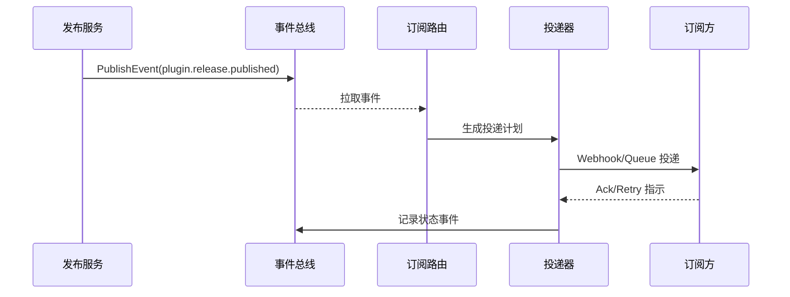

doc_id: UC-OPS-EVENT-NOTIFY-001
scn_id: SCN-OPS-EVENT-TASKFLOW-001
title: 插件发布事件订阅通知编排
status: Draft
version: v0.1.0
repo_key: powerx
scope: powerx
layer: service
domain: ops
scenario_title: "PowerX 事件与任务流管理"
owners:
  - name: Matrix Ops
    role: Platform Ops Lead
    contact: ops@artisan-cloud.com
  - name: Eva Zhang
    role: Automation Steward
    contact: automation@artisan-cloud.com
contributors: []
linked_requirements:
  - SCN-OPS-EVENT-TASKFLOW-001-A
code_refs:
  - repo: powerx
    path: internal/events/bus/publisher.go
    description: 标准事件模型封装与发布入口
  - repo: powerx
    path: internal/events/subscriptions/router.go
    description: 订阅匹配、幂等校验与速率治理
  - repo: powerx
    path: internal/events/delivery/webhook_dispatcher.go
    description: Webhook/队列投递管道与重试策略
  - repo: powerx
    path: internal/events/storage/event_log_repository.go
    description: 事件持久化与追溯查询接口
  - repo: powerx
    path: pkg/audit/event_audit_logger.go
    description: 审计日志写入与告警触发
feature_flags:
  - event-bus-v2
  - plugin-release-webhook
  - audit-streaming
optional: false
last_reviewed_at: 2025-10-31

---

# Usecase Overview

- **业务目标**：在插件发布完成后 5 秒内，将 `plugin.release.published` 等关键事件可靠投递给所有订阅方，并提供追溯、补偿与幂等保障，确保跨系统协作及时触发。
- **成功度量**：事件首次送达成功率 ≥ 97%，重试后累计成功率 ≥ 99.5%；重复投递率 < 0.5%；订阅方 Ack 延迟 P95 ≤ 3 秒；审计日志覆盖率 100%。
- **场景关联**：对应主场景 `SCN-OPS-EVENT-TASKFLOW-001` Stage 1，为调度、Agent 编排与补偿链路提供可信事件源。

> 通过统一事件模型和投递策略，实现插件版本发布后通知运营控制台、CI/CD、告警平台等订阅系统的自动化闭环。

# Context & Assumptions

- **前置条件**
  - `event-bus-v2`、`plugin-release-webhook`、`audit-streaming` Feature Flag 已启用。
  - Kafka 集群/事件总线可用，订阅配置存放于 `event_subscription` 表并通过控制台维护。
  - 订阅方提供的 Webhook/队列端点支持 HMAC 验签与幂等键，具备重试接收能力。
- **输入/输出**
  - 输入：插件发布流水线产出的 `plugin.release.published` 事件、订阅配置、幂等键、租户上下文。
  - 输出：对各订阅方的投递请求、投递结果状态、事件持久化记录、审计事件与指标。
- **边界**
  - 不覆盖插件发布流水线自身的审核/签名流程；
  - 不负责订阅方内部处理逻辑，仅保证投递成功与失败告警；
  - 租户跨区域复制延迟由事件镜像任务处理，此用例仅关注主区域。

# Solution Blueprint

## 体系分解

| 层 | 主要组件/模块 | 责任 | 代码入口 |
|----|---------------|------|---------|
| 事件发布层 | `internal/events/bus/publisher.go` | 校验事件模式、租户信息、生成幂等键并入总线 | `services/events` |
| 订阅匹配层 | `internal/events/subscriptions/router.go` | 根据订阅策略筛选目标、执行速率与权限校验 | `services/events` |
| 投递执行层 | `internal/events/delivery/webhook_dispatcher.go` | Webhook/队列投递、重试、熔断与延迟控制 | `services/events/delivery` |
| 存储与追溯层 | `internal/events/storage/event_log_repository.go` | 记录事件、投递状态、重试历史供查询 | `services/events/storage` |
| 审计观测层 | `pkg/audit/event_audit_logger.go` | 写入审计流、触发失败告警、上报指标 | `pkg/audit` |

## 流程与时序

1. **Step 1 – 发布事件**：插件发布服务调用 `PublishEvent`，校验 schema、租户、幂等键后写入 Kafka Topic。
2. **Step 2 – 匹配订阅**：Router 拉取事件，按租户/标签匹配订阅方，应用速率限制与黑名单。
3. **Step 3 – 投递执行**：Dispatcher 依据通道类型发送 Webhook/队列消息，记录响应码、耗时；失败进入延迟重试计划。
4. **Step 4 – 追溯与告警**：投递结果写入事件仓与审计流，失败超过阈值触发 PagerDuty/IM 告警，新事件同步至 Ops 控制台。
5. **Step 5 – 补偿与手动重放**：运维可通过控制台或 CLI 选择事件重放、修改订阅配置或生成工单。



# Contracts & Interfaces

- **Inbound APIs / Events**
  - `EVENT plugin.release.published` — Payload 包含版本、租户、依赖列表、发布人、校验摘要。
  - `POST /internal/events/publish` — 用于回放/补偿场景，需签名、幂等键。
- **Outbound 调用**
  - Webhook：`POST https://<subscriber>/powerx/events`，带 HMAC 签名头 `X-PowerX-Signature`、重试 3 次指数退避。
  - Queue：向租户指定的 Kafka Topic/AMQP 交换机投递，携带 `tenant_id`、`event_id`、`attempt`.
- **配置与脚本**
  - `config/events/subscriptions.yaml` — 默认订阅策略模板。
  - `scripts/ops/replay-event.mjs` — 事件重放脚本。
  - `scripts/ops/validate-webhook.mjs` — 验签/连通性测试脚本。

# Implementation Checklist

| 项目 | 描述 | 完成状态 | 负责人 |
|------|------|----------|--------|
| 事件 schema | 定义 `plugin.release.published` schema、版本兼容策略 | [ ] | Matrix Ops |
| 订阅治理 | 实现租户/标签匹配、幂等键与速率限制配置 | [ ] | Eva Zhang |
| 投递通道 | 开发 Webhook/队列投递器、重试与熔断逻辑 | [ ] | Matrix Ops |
| 控制台能力 | 更新订阅管理、事件追溯 UI、重放入口 | [ ] | Eva Zhang |
| 观测与告警 | 接入指标、审计、PagerDuty/IM 告警、报表脚本 | [ ] | Matrix Ops |

# Testing Strategy

- **单元测试**：覆盖事件发布参数校验、订阅匹配（标签/租户）、HMAC 签名生成与验证、重试调度窗口。
- **集成测试**：在沙箱 Kafka、Webhook 模拟器中验证成功投递、延迟重试、幂等，执行用例 A-1（正向送达）与 A-2（订阅失败重试）流程。
- **端到端验证**：触发一次真实插件发布流程，确认 Ops 控制台、告警平台、CI/CD 均收到通知且事件中心可追溯。
- **非功能测试**：压测 500 TPS 发布并观察延迟、失败率；注入网络丢包、签名错误，验证重试与告警闭环。

# Observability & Ops

- **指标**：`event.delivery.success_total`、`event.delivery.retry_total`、`event.delivery.latency_p95`、`event.delivery.duplicate_total`。
- **日志**：记录 `event_id`, `tenant_id`, `subscriber_id`, `attempt`, `status`, `latency_ms`, `signature_id`；敏感数据脱敏。
- **告警**：连续失败 >3 次或失败率 >5%/5 分钟触发 PagerDuty，签名验证失败立即通知安全群。
- **Dashboards**：Grafana `Runtime Ops / Event Delivery`、Datadog `event.delivery.*`、Ops 控制台事件中心。

# Rollback & Failure Handling

- **回滚步骤**：切换到旧版 Publisher/Dispatcher 镜像，恢复历史配置，关闭新 Feature Flag，清理未完成的重试任务。
- **补救措施**：使用 `replay-event.mjs` 重放失败事件、调整订阅配置、人工通知关键订阅方。
- **数据修复**：运行 `scripts/audit/reconcile-event-log.mjs` 对比事件仓与审计流；若幂等键异常，执行 SQL 更新修复状态。

# Follow-ups & Risks

| 风险/事项 | 影响 | 缓解方案 | 负责人 | ETA |
|-----------|------|----------|--------|-----|
| 订阅方 Webhook 泛洪导致延迟堆积 | 事件延迟、队列堆积 | 扩展速率限制、启用隔离队列与熔断策略 | Matrix Ops | 2025-11-05 |
| 签名密钥轮换机制尚未自动化 | 安全风险、通知失败 | 引入密钥轮换计划与通知模板，完善检测脚本 | Eva Zhang | 2025-11-12 |

# References & Links

- 主场景：`docs/scenarios/runtime-ops/SCN-OPS-EVENT-TASKFLOW-001.md`
- 背景材料：`docs/meta/scenarios/powerx/core-platform/runtime-ops/event-and-taskflow-management/primary.md`
- 运维脚本：`scripts/ops/replay-event.mjs`、`scripts/ops/validate-webhook.mjs`
---
scn_id: "SCN-OPS-EVENT-TASKFLOW-001"
scenario_name: "PowerX 事件与任务流管理"
slug: "powerx-event-taskflow-management"
primary_scope: "powerx"
primary_layer: "service"
primary_domain: "ops"
primary_repo: "powerx"
doc_owner: "Matrix Ops（Platform Ops Lead / ops@artisan-cloud.com）"
last_generated_at: "2025-10-31"
---

# PowerX 事件与任务流管理 Usecase Seed 生成指南

> 场景摘要：事件与任务流管理场景通过统一事件模型、调度能力与 Agent 自动化，让插件生态在秒级完成事件通知、分钟级保障任务执行，并在失败时具备可追踪的补偿闭环。

本文档面向场景负责人与仓库 Stewards，说明如何把跨仓场景拆解成可交付的子用例 Seed，为分发脚本与研发落地提供基础数据。请根据实际情况补充或修订所有 `{{PLACEHOLDER}}` 字段。

## Seed 的定位

- 代表仓库在 `PowerX 事件与任务流管理` 场景下需要实现的职责、接口、测试与运维要求。
- 与 `docs/_data/docmap.yaml` 中 `scn_id: SCN-OPS-EVENT-TASKFLOW-001` 的 `children` 节点一一对应，字段必须保持一致。
- 是 `npm run publish:usecases` 分发到下游仓库、`npm run publish:collected` 生成领导力视图的唯一信息来源。

## 前提条件

- 场景文档（如 `docs/scenarios/runtime-ops/SCN-OPS-EVENT-TASKFLOW-001.md` 与 `docs/scenarios/runtime-ops/SCN-OPS-EVENT-NOTIFY-001.md`）已经勾勒业务故事线与交付矩阵。
- `docs/_data/docmap.yaml` 中存在待维护场景节点，并为每个仓库预留了 `doc_id`、`scope`、`layer`、`domain`、`repo` 等字段。
- 对应仓库在 `docs/_data/repos.yaml` 中维护了 `usecase_seed_root`、默认分支与维护者信息。
- 事件通知链路需要启用 `event-bus-v2`、`plugin-release-webhook`、`audit-streaming` Feature Flag，并确保 Kafka 事件总线、订阅配置库、Ops 控制台事件中心、签名密钥仓库可用。
- 相关运维脚本（`scripts/ops/replay-event.mjs`、`scripts/ops/validate-webhook.mjs`）已更新到最新版本，可用于本地验证与补偿。

## 生成流程

1. **登记/更新 docmap 子节点**

   ```yaml
   # docs/_data/docmap.yaml
   - scn_id: SCN-OPS-EVENT-TASKFLOW-001
     title: PowerX 事件与任务流管理
     children:
       - doc_id: UC-OPS-EVENT-NOTIFY-001
         scope: powerx
         layer: service
         domain: ops
         optional: false
         repo: powerx
         path: docs/usecases-seeds/SCN-OPS-EVENT-TASKFLOW-001/UC-OPS-EVENT-NOTIFY-001.md
       - doc_id: UC-OPS-TASK-SCHEDULE-001
         scope: powerx
         layer: ops
         domain: ops
         optional: false
         repo: powerx
         path: docs/usecases-seeds/SCN-OPS-EVENT-TASKFLOW-001/UC-OPS-TASK-SCHEDULE-001.md
       - doc_id: UC-OPS-AGENT-ORCHESTRATION-001
         scope: powerx
         layer: service
         domain: ops
         optional: false
         repo: powerx
         path: docs/usecases-seeds/SCN-OPS-EVENT-TASKFLOW-001/UC-OPS-AGENT-ORCHESTRATION-001.md
       - doc_id: UC-OPS-RETRY-RECOVERY-001
         scope: powerx
         layer: ops
         domain: ops
         optional: false
         repo: powerx
         path: docs/usecases-seeds/SCN-OPS-EVENT-TASKFLOW-001/UC-OPS-RETRY-RECOVERY-001.md
   ```

   - `doc_id` 与 `path` 要匹配 Seed 文件名与下游仓库目录。
   - `optional: true/false` 用于领导力视图与发布脚本过滤，默认必选。

2. **复制模板并放置到对应目录**

   ```bash
   mkdir -p docs/usecases-seeds/SCN-OPS-EVENT-TASKFLOW-001
   cp docs/usecases-seeds/_template.md \
     docs/usecases-seeds/SCN-OPS-EVENT-TASKFLOW-001/UC-OPS-EVENT-NOTIFY-001.md
   ```

   - `doc_id` 应保持与 docmap 完全一致，避免脚本生成时找不到文件。
   - 如果存在多仓联合投递（如插件生态仓库），需为各仓库建立独立 Seed，并在正文引用共享模块。

3. **填充 Frontmatter 区域**

   - `doc_id`、`scn_id`、`scope`、`layer`、`domain` 应与 docmap 完全一致。
   - `repo_key` 使用 `docs/_data/repos.yaml` 的 `key`（本 Seed 为 `powerx`），`scenario_title` 建议使用主场景标题。
   - 默认 Owners：Matrix Ops（Platform Ops Lead / ops@artisan-cloud.com）、Eva Zhang（Automation Steward / automation@artisan-cloud.com）；若责任人调整，需同步更新 docmap。
   - `feature_flags` 至少包含 `event-bus-v2`、`plugin-release-webhook`、`audit-streaming`，并根据实现补充其它依赖。

4. **完善正文章节**

   - `Usecase Overview`：突出“5 秒内送达”、“重试后成功率 ≥99.5%”、订阅幂等等目标。
   - `Context & Assumptions`：列出事件 schema、订阅配置存储、Webhook HMAC、幂等键策略、跨区域镜像假设。
   - `Solution Blueprint`～`Rollback & Failure Handling`：细化事件发布、订阅匹配、投递通道、追溯与重放脚本、告警处理。
   - `Contracts & Interfaces`：覆盖 `EVENT plugin.release.published`、`EVENT event.delivery.failed`、`POST /internal/events/publish`、Webhook 协议与重试策略。
   - `Testing Strategy` 需涵盖成功投递、延迟重试、签名校验失败、压力与 Chaos 测试等。

5. **与场景文档互相链接**

   - 在 `docs/scenarios/runtime-ops/SCN-OPS-EVENT-NOTIFY-001.md` 的交付矩阵或相关章节添加 Seed 链接，便于往返。
   - 如引用新的事件 schema 或标准，请同步更新 `docs/standards/events/event-bus-schema.md` 或相关文档，保持契约唯一来源。

## 自检清单

- `docmap.yaml` 与 Seed frontmatter 字段完全一致，无大小写或路径差异。
- Seed 正文覆盖事件发布、订阅治理、幂等策略、重试机制、告警运维与补偿流程。
- 已验证 `scripts/ops/replay-event.mjs`、`scripts/ops/validate-webhook.mjs` 在最新实现下可用，并能支撑重放与验签。
- 运行 `npm run lint` 与 `npm run docs:build` 确认 Markdown 无语法错误、站点可构建。
- 使用 `npm run publish:scenarios -- --scn-id SCN-OPS-EVENT-TASKFLOW-001 --validate-only` 快速验证场景配置。
- 发布前通知下游仓库维护者，确认默认分支（`dev/docs`）可写，密钥/订阅配置在沙箱与生产环境均已就绪。

## 常见问题

| 问题 | 处理方式 |
|------|----------|
| 订阅方 Webhook 泛洪导致延迟堆积怎么办？ | 在 Seed 中补充速率限制、隔离队列和熔断策略，并列出监控指标与 Runbook。 |
| 跨区域事件镜像延迟较大如何处理？ | 在前置条件中注明镜像 SLA，列出补偿策略（如手动重放或区域隔离），必要时扩展补偿脚本。 |

完成上述步骤后，即可进入分发与发布流程，参考《发布 Usecase Seeds 指南》获取后续操作。
