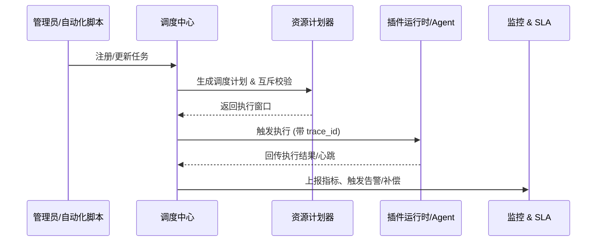

doc_id: UC-OPS-TASK-SCHEDULE-001
scn_id: SCN-OPS-EVENT-TASKFLOW-001
title: 调度中心 Cron/事件触发任务管理
status: Draft
version: v0.1.0
repo_key: powerx
scope: powerx
layer: ops
domain: ops
scenario_title: "PowerX 事件与任务流管理"
owners:
  - name: Matrix Ops
    role: Platform Ops Lead
    contact: ops@artisan-cloud.com
  - name: Eva Zhang
    role: Automation Steward
    contact: automation@artisan-cloud.com
contributors: []
linked_requirements:
  - SCN-OPS-EVENT-TASKFLOW-001-B
code_refs:
  - repo: powerx
    path: internal/tasks/scheduler/cron_engine.go
    description: Cron 解析、触发窗口计算与去抖动实现
  - repo: powerx
    path: internal/tasks/scheduler/planner.go
    description: 任务规划、资源校验与互斥治理
  - repo: powerx
    path: internal/tasks/executor/runtime_client.go
    description: 任务执行请求封装、SLA 与超时控制
  - repo: powerx
    path: internal/tasks/monitoring/task_metrics_collector.go
    description: 调度与执行指标采集、状态事件写入
  - repo: powerx
    path: pkg/ops/sla_notifier.go
    description: SLA 违约检测、告警与工单生成
feature_flags:
  - task-scheduler-v3
  - task-sla-monitor
  - task-retry-queue
optional: false
last_reviewed_at: 2025-10-31

---

# Usecase Overview

- **业务目标**：为插件提供统一的定时与事件驱动调度能力，确保任务按 SLA 准时触发、可追踪、可补偿，并提前预警资源冲突。
- **成功度量**：调度准时率 ≥ 98%，执行成功率 ≥ 97%，调度触发延迟 < 1 分钟；资源冲突提前预警命中率 ≥ 90%。
- **场景关联**：对应主场景 `SCN-OPS-EVENT-TASKFLOW-001` Stage 2，承接事件通知结果并为重试补偿提供基础任务实例。

> 通过统一调度中心，将 Cron 计划、事件触发、资源预检、执行回写及 SLA 告警串联成可度量的闭环。

# Context & Assumptions

- **前置条件**
  - `task-scheduler-v3`、`task-sla-monitor`、`task-retry-queue` Feature Flag 已启用。
  - 调度中心部署为高可用集群，使用 Redis/Etcd 作为计划存储与分布式锁。
  - 插件运行时接口支持幂等执行、SLA 报告与日志落库。
  - Ops 控制台已配置租户配额、互斥策略、执行窗口与冲突模板。
- **输入/输出**
  - 输入：Cron 表达式、事件触发信号、任务参数、租户配额、互斥策略。
  - 输出：任务实例状态（Pending/Running/Success/Failed）、执行日志、指标、告警、重试计划或工单。
- **边界**
  - 不负责插件内部业务逻辑与资源扩缩容，仅校验调度层配额；
  - 不处理跨租户共享任务（由多租户场景覆盖）；
  - 不包含手工运维任务的审批流程。

# Solution Blueprint

## 体系分解

| 层 | 主要组件/模块 | 责任 | 代码入口 |
|----|---------------|------|---------|
| 调度核心 | `internal/tasks/scheduler/cron_engine.go` | 解析 Cron、维护触发窗口、去抖动与错峰 | `services/tasks/scheduler` |
| 计划器 | `internal/tasks/scheduler/planner.go` | 资源校验、互斥锁、冲突检测与排队策略 | `services/tasks/scheduler` |
| 执行客户端 | `internal/tasks/executor/runtime_client.go` | 调用插件运行时/Agent，处理超时、重试、回传状态 | `services/tasks/executor` |
| 监控层 | `internal/tasks/monitoring/task_metrics_collector.go` | 收集执行指标、状态变更、写入事件中心与指标系统 | `services/tasks/monitoring` |
| SLA 告警 | `pkg/ops/sla_notifier.go` | 检测 SLA 违约、触发告警与工单、协调补偿 | `pkg/ops` |

## 流程与时序

1. **Step 1 – 任务登记**：管理员或 API 调用 `registerTask`，写入 Cron/事件规则与元数据。
2. **Step 2 – 预检与计划**：触发窗口前执行资源校验、互斥检查，必要时排队或发出预警。
3. **Step 3 – 调度执行**：到达触发时间后调用插件运行时/Agent 接口，记录 Trace 与执行上下文。
4. **Step 4 – 状态追踪**：Executor 收到执行结果或心跳，更新任务状态并写入指标、事件。
5. **Step 5 – 重试与补偿**：失败任务根据策略推送至重试队列或生成工单，触发 Stage 4 的补偿流程。

# Contracts & Interfaces

- **Inbound APIs / Events**
  - `POST /internal/tasks/register` — 新建任务，校验租户、Cron、互斥策略。
  - `PUT /internal/tasks/{id}/pause`、`PUT /internal/tasks/{id}/resume` — 控制任务生命周期。
  - `EVENT task.execution.updated` — 执行状态回传，包括进度、结果、错误码。
- **Outbound 调用**
  - `POST /plugin/runtime/{pluginId}/execute` — 插件任务执行入口，携带任务参数、Trace 上下文。
  - `POST /ops/capacity/reserve` — 预留资源、更新租户配额。
  - `POST /notifications/sla-breach` — SLA 违约告警或工单通知。
- **配置与脚本**
  - `config/tasks/default_policy.yaml` — 默认重试、冲突、SLA 策略。
  - `scripts/ops/task-dryrun.mjs` — 调度前置验证与互斥检测。
  - `scripts/ops/task-sla-report.mjs` — SLA 报告生成与巡检。

# Implementation Checklist

| 项目 | 描述 | 完成状态 | 负责人 |
|------|------|----------|--------|
| Cron 引擎 | 升级 Cron 解析、去抖、错峰策略并补充单元测试 | [ ] | Matrix Ops |
| 资源预检 | 接入租户配额、互斥策略、冲突检测与报错提示 | [ ] | Eva Zhang |
| 执行链路 | 完善 runtime_client 调用、超时/重试处理、Trace 注入 | [ ] | Matrix Ops |
| 观测能力 | 增加执行指标、日志、Ops 控制台任务面板 | [ ] | Eva Zhang |
| Runbook | 更新任务调度 Runbook、预警/告警 SOP | [ ] | Matrix Ops |

# Testing Strategy

- **单元测试**：Cron 解析、错峰算法、配额/冲突校验、任务状态机。
- **集成测试**：执行用例 B-1 验证按计划触发、配额足够；执行 B-2 验证资源不足时排队与扩容预警；模拟事件驱动任务。
- **端到端验证**：在沙箱租户配置日常任务，监控调度准时率、执行日志、Ops 控制台展示与告警；验证失败后进入重试并更新指标。
- **非功能测试**：压测 10k 定时任务并发调度；Chaos 注入 Redis/Etcd 故障验证锁降级；测试长时间运行任务对 SLA 的影响。

# Observability & Ops

- **指标**：`task.scheduler.on_time_rate`、`task.scheduler.missed_total`、`task.execution.success_total`、`task.execution.retry_total`、`task.sla.breach_total`。
- **日志**：记录 `task_id`, `tenant_uuid`, `trigger_time`, `actual_start`, `duration_ms`, `status`, `retry_count`, `error_code`。
- **告警**：调度失败率 >5%/5 分钟触发 PagerDuty；连续 3 次 SLA 违约升级到运维经理；锁争用 >70% 时提示扩容。
- **Dashboards**：Grafana `Runtime Ops / Scheduler Overview`、Datadog `task.scheduler.*`、Ops 控制台任务时间线。

# Rollback & Failure Handling

- **回滚步骤**：恢复旧版 Scheduler/Planner 镜像，回滚配置，关闭新特性 Flag，重新部署 Cron 表。
- **补救措施**：使用 `task-dryrun.mjs` 检测待执行任务，人工触发关键任务或通知租户，调整配额/互斥策略。
- **数据修复**：通过 SQL 更新错误状态、重新计算下次执行时间；使用 `task-sla-report.mjs --rebuild` 修复指标。

# Follow-ups & Risks

| 风险/事项 | 影响 | 缓解方案 | 负责人 | ETA |
|-----------|------|----------|--------|-----|
| 调度中心集群扩容策略未自动化 | 高峰期可能触发 SLA 违约 | 接入自动扩容脚本、扩展指标预警 | Matrix Ops | 2025-11-08 |
| 互斥策略配置复杂易误配 | 任务被意外阻塞或遗漏 | 在控制台提供模板与检测脚本，增加审批提示 | Eva Zhang | 2025-11-15 |

# References & Links

- 主场景：`docs/scenarios/runtime-ops/SCN-OPS-EVENT-TASKFLOW-001.md`
- 子场景：`docs/scenarios/runtime-ops/SCN-OPS-TASK-SCHEDULE-001.md`
- 背景材料：`docs/meta/scenarios/powerx/core-platform/runtime-ops/event-and-taskflow-management/primary.md`
- 工具脚本：`scripts/ops/task-dryrun.mjs`、`scripts/ops/task-sla-report.mjs`
