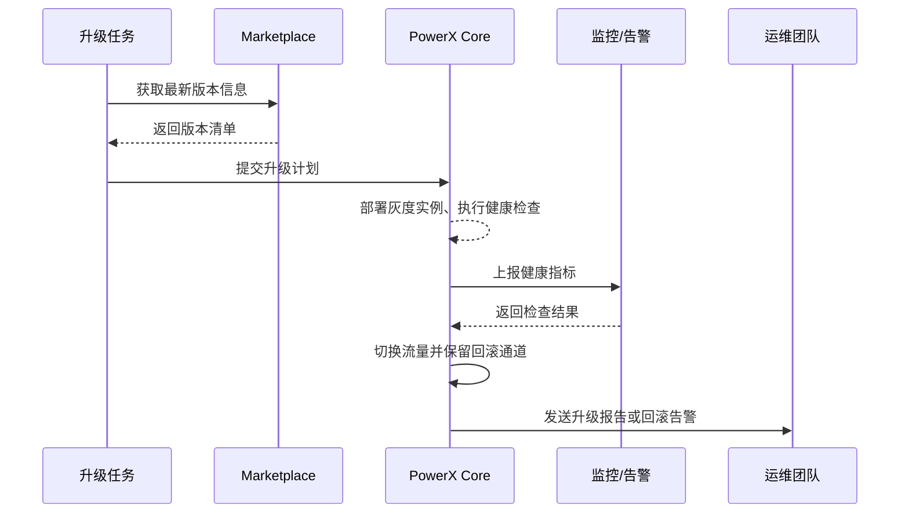

scn_id: SCN-OPS-PLUGIN-AUTO-UPGRADE-001
title: 插件自动化灰度升级
status: Draft
version: v0.1.0
owners:
  - name: Matrix Ops
    role: Platform Ops Lead
    contact: ops@artisan-cloud.com
  - name: Eva Zhang
    role: Automation Steward
    contact: automation@artisan-cloud.com
domains: [ops]
layers: [ops, service]
repos:
  - key: powerx
    scope: core-platform
    responsibility: 升级计划编排、灰度流量控制、健康检查、回滚管道
  - key: powerx-marketplace
    scope: marketplace
    responsibility: 版本元数据、发布通知、下载镜像
related_usecases:
  - doc_id: UC-OPS-PLUGIN-AUTO-UPGRADE-001
    layer: ops
    domain: ops
last_reviewed_at: 2025-11-02

---

# Executive Summary

该子场景描述自动化任务检测插件新版本后，如何在维护窗口内执行灰度升级、健康检查、流量切换并在异常时自动回滚。流程覆盖升级计划生成、灰度实例部署、监控指标校验、自动报告生成与通知，目标是在不中断关键业务的前提下完成版本迭代，同时保障回滚路径与审计闭环。

# Scope & Guardrails

- **In Scope**：版本对比与升级计划、灰度实例部署、配置加载、健康检查、流量切换、回滚策略、报告与通知。
- **Out of Scope**：插件代码测试、Marketplace 发布审批、手动升级操作细节。
- **Environment & Flags**：`plugin-upgrade-scheduler`、`plugin-traffic-shifter`、`plugin-health-check`、`plugin-upgrade-pause`；依赖 Marketplace 版本仓库、监控指标、审计日志、通知服务。

# Participants & Responsibilities

| Scope | Repository | Layer | 责任与交付物 | Owners |
|-------|------------|-------|--------------|--------|
| core-platform | powerx | ops | 升级计划生成、灰度部署、健康检查、流量切换、回滚 | Matrix Ops（Platform Ops Lead / ops@artisan-cloud.com） |
| automation | powerx | ops | 升级任务编排、维护窗口管理、报告与通知 | Eva Zhang（Automation Steward / automation@artisan-cloud.com） |
| marketplace | powerx-marketplace | service | 版本元数据、镜像分发、升级通知 | Michael Hu（Plugin Tech Lead / tech@artisan-cloud.com） |

# End-to-End Flow

1. **Stage 1 – 版本检测与计划生成**：升级任务对比 Marketplace/镜像仓库，生成升级计划并通知运维。
2. **Stage 2 – 灰度实例部署与健康检查**：在维护窗口内部署灰度实例，加载配置、执行健康检查并采集指标。
3. **Stage 3 – 流量切换与回滚保障**：健康检查通过后逐步切换流量，保留旧版本回滚通道并监控核心指标。
4. **Stage 4 – 报告与通知**：升级完成生成报告、更新版本状态，异常时自动回滚并触发告警。

# Key Interactions & Contracts

- **APIs / Events**：`POST /api/plugins/upgrade/plan`、`POST /api/plugins/upgrade/execute`、`POST /api/plugins/upgrade/rollback`、`EVENT plugin.upgrade.progress`、`EVENT plugin.upgrade.rollback`。
- **Configs / Schemas**：`config/plugins/upgrade_windows.yaml`、`config/plugins/health_checks.yaml`、`docs/standards/powerx-plugin/lifecycle/capabilities.md`。
- **Security / Compliance**：升级任务需审批、灰度环境隔离、变更日志与指标留存、回滚动作写入审计。

# Usecase Links

- `UC-OPS-PLUGIN-AUTO-UPGRADE-001` — 自动化灰度升级与回滚治理。

# Acceptance Criteria

1. 灰度升级覆盖至少 20% 流量并在 15 分钟内完成健康校验。
2. 流量切换后关键指标稳定，异常时自动回滚到上一版本并恢复流量。
3. 升级报告记录版本号、灰度数据、指标与回滚结果，通知同步至运维与管理员。

# Telemetry & Ops

- 指标：`plugin.upgrade.success_rate`、`plugin.upgrade.duration_p95`、`plugin.upgrade.rollback_total`、`plugin.upgrade.healthcheck_failure_total`。
- 告警阈值：健康检查失败率 >5%、升级超过维护窗口、回滚次数 >2/周。
- 观测来源：Grafana `Runtime Ops / Plugin Upgrade`、Datadog `plugin.upgrade.*`、Ops 控制台升级报告。

# Open Issues & Follow-ups

| 风险/事项 | 影响范围 | 负责人 | ETA |
|-----------|----------|--------|-----|
| 部分插件缺少灰度指标阈值配置，难以自动判定 | 升级决策 | Matrix Ops | 2025-11-16 |
| 升级暂停开关仅支持全局，需按租户细化 | 运营灵活性 | Eva Zhang | 2025-11-20 |

# Appendix

- `docs/meta/scenarios/powerx/core-platform/runtime-ops/plugin-install-and-ops/primary.md`
- `docs/standards/powerx-plugin/lifecycle/capabilities.md`
- 运维手册：Confluence《Plugin Upgrade Playbook》
