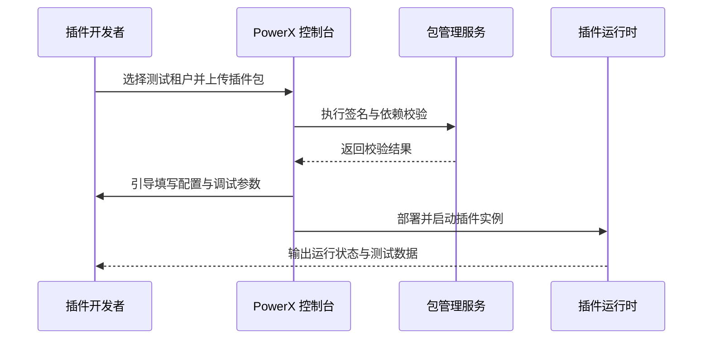

scn_id: SCN-OPS-PLUGIN-DEV-INSTALL-001
title: 测试租户手动上传插件
status: Draft
version: v0.1.0
owners:
  - name: Matrix Ops
    role: Platform Ops Lead
    contact: ops@artisan-cloud.com
  - name: Michael Hu
    role: Plugin Tech Lead
    contact: tech@artisan-cloud.com
domains: [ops]
layers: [proto, ops]
repos:
  - key: powerx
    scope: core-platform
    responsibility: 沙箱租户隔离、插件安装编排、资源配额治理
  - key: powerx-plugin
    scope: plugin-ecosystem
    responsibility: 插件包结构、CLI 上传工具、签名校验脚本
related_usecases:
  - doc_id: UC-OPS-PLUGIN-DEV-INSTALL-001
    layer: ops
    domain: ops
last_reviewed_at: 2025-11-02

---

# Executive Summary

该子场景聚焦插件开发者在测试租户通过手动上传 `.pxp` 或构建产物进行安装与调试的流程。系统在上传环节执行包签名、依赖、资源配额校验，并通过安装向导引导环境变量、密钥占位符与调试日志配置。目标是让开发者在 2 分钟内完成沙箱部署、独立验证插件行为，同时保证测试租户隔离、可随时回滚且审计可追溯。

# Scope & Guardrails

- **In Scope**：本地包上传、签名与依赖校验、租户配额验证、安装向导配置、自动生成沙箱测试数据、回滚与日志追踪。
- **Out of Scope**：插件代码构建流程、Marketplace 发布、生产租户安装与计费策略。
- **Environment & Flags**：`px-plugin-runtime-v2`、`plugin-sandbox-mode`、`plugin-dev-logs`；依赖包管理服务、租户隔离配置、调试日志通道与审计流。

# Participants & Responsibilities

| Scope | Repository | Layer | 责任与交付物 | Owners |
|-------|------------|-------|--------------|--------|
| sandbox | powerx | ops | 插件安装编排、签名与依赖校验、资源配额控制、沙箱日志面板 | Matrix Ops（Platform Ops Lead / ops@artisan-cloud.com） |
| plugin-ecosystem | powerx-plugin | proto | 插件 CLI 上传、包结构规范、开发者调试工具链 | Michael Hu（Plugin Tech Lead / tech@artisan-cloud.com） |

# End-to-End Flow

1. **Stage 1 – 沙箱租户选择与权限校验**：开发者在控制台选择测试租户，系统校验上传权限与租户资源。
2. **Stage 2 – 包体上传与校验**：上传本地插件包，平台执行签名、依赖、版本兼容检查并写入审计。
3. **Stage 3 – 安装向导配置**：向导引导填写环境变量、密钥占位符、调试日志级别并完成资源预配。
4. **Stage 4 – 启动与测试数据生成**：运行时启动插件实例，生成测试数据/入口，向开发者输出运行状态与日志。

# Key Interactions & Contracts

- **APIs / Events**：`POST /api/plugins/install/local`、`POST /internal/plugins/packages/validate`、`EVENT plugin.install.sandbox_completed`、`EVENT plugin.install.failed`。
- **Configs / Schemas**：`docs/standards/powerx-plugin/lifecycle/package.md`、`docs/standards/powerx-plugin/lifecycle/manifest-mapping.md`、`config/plugins/sandbox_limits.yaml`。
- **Security / Compliance**：强制签名与哈希校验、限制沙箱租户访问、调试操作写入审计、上传者需具备 `plugin:dev` 权限。

# Usecase Links

- `UC-OPS-PLUGIN-DEV-INSTALL-001` — 测试租户手动上传插件。

# Acceptance Criteria

1. 插件安装在 2 分钟内完成，状态变为“运行中”，生成独立测试入口。
2. 失败场景（签名、依赖、配额）触发自动回滚并提示开发者修改。
3. 所有上传、配置、日志操作写入审计，沙箱租户资源完全隔离。

# Telemetry & Ops

- 指标：`plugin.install.sandbox_duration_p95`、`plugin.install.sandbox_success_rate`、`plugin.install.rollback_total`、`plugin.sandbox.resource_usage`。
- 告警阈值：沙箱安装失败率 >10%/30 分钟、资源配额超限率 >80%、签名校验失败连续 3 次。
- 观测来源：Grafana `Runtime Ops / Plugin Sandbox`、控制台调试日志面板、`node scripts/qa/workflow-metrics.mjs`。

# Open Issues & Follow-ups

| 风险/事项 | 影响范围 | 负责人 | ETA |
|-----------|----------|--------|-----|
| 沙箱租户配额与生产不一致，影响回归测试 | 测试租户 | Matrix Ops | 2025-11-12 |
| CLI 缺少本地签名前置校验易触发失败 | 开发者体验 | Michael Hu | 2025-11-18 |

# Appendix

- `docs/meta/scenarios/powerx/core-platform/runtime-ops/plugin-install-and-ops/primary.md`
- `docs/standards/powerx-plugin/lifecycle/package.md`
- 开发者指南：Confluence《PowerX Plugin Sandbox Playbook》
