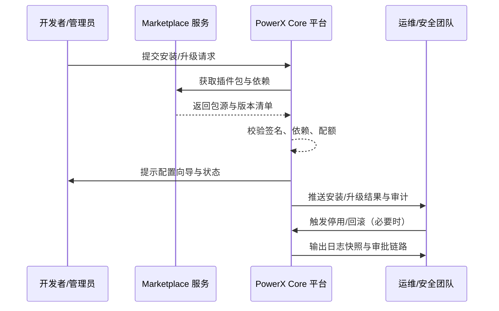

scn_id: SCN-OPS-PLUGIN-LIFECYCLE-001
title: PowerX 插件安装与启停运营
status: Draft
version: v0.1.0
owners:
  - name: Matrix Ops
    role: Platform Ops Lead
    contact: ops@artisan-cloud.com
  - name: Eva Zhang
    role: Automation Steward
    contact: automation@artisan-cloud.com
domains: [ops]
layers: [service, ops, security]
repos:
  - key: powerx
    scope: core-platform
    responsibility: 插件安装编排、运行时控制、升级与停用 API
  - key: powerx-marketplace
    scope: marketplace
    responsibility: 插件目录、依赖元数据、License 校验与包源分发
related_usecases:
  - doc_id: UC-OPS-PLUGIN-DEV-INSTALL-001
    layer: ops
    domain: ops
  - doc_id: UC-OPS-PLUGIN-MARKETPLACE-INSTALL-001
    layer: service
    domain: ops
  - doc_id: UC-OPS-PLUGIN-AUTO-UPGRADE-001
    layer: ops
    domain: ops
  - doc_id: UC-OPS-PLUGIN-RISK-SUSPEND-001
    layer: security
    domain: ops
last_reviewed_at: 2025-11-02

---

# Executive Summary

插件生态要在多租户环境中高效而可控地运行，平台必须提供覆盖安装、启停、升级、回滚与审计的统一运营能力。本主场景将手动上传、Marketplace 一键安装、自动化升级与风险停用串联成闭环，确保开发者能快速验证、管理员可安全部署、运维可自动治理、当出现风险时可秒级处置并留存证据。目标是在 2 分钟内完成测试环境安装、10 分钟内闭环生产安装到启用、升级全过程不中断关键业务，并让停用动作具备审批与审计链路。

# Scope & Guardrails

- **In Scope**：
  - 测试租户手动上传安装的签名校验、依赖解析、资源配额治理与回滚。
  - Marketplace 正式安装的 License 校验、配置引导、权限分配与计费联动。
  - 自动化升级的灰度编排、健康检查、流量切换、回滚策略与报告生成。
  - 风险停用的多模式执行（等待/强制）、通知广播、日志快照与审批链路。
- **Out of Scope**：
  - 插件代码开发与调试工具链（由“插件开发与调试”场景覆盖）。
  - Marketplace 审核、计费结算与分发渠道治理（归属发布/计费场景）。
  - 宿主与插件之间的业务协议、数据契约与跨插件通信。
- **Environment & Flags**：`px-plugin-runtime-v2`、`px-marketplace`、`plugin-upgrade-scheduler`、`plugin-safety-lock`；依赖包管理服务、租户与 License 服务、配置与密钥仓、监控与健康检查、通知与审计流。

# Participants & Responsibilities

| Scope | Repository | Layer | 责任与交付物 | Owners |
|-------|------------|-------|--------------|--------|
| core-platform | powerx | service | 插件安装编排、运行态控制、升级/停用 API、审计事件 | Matrix Ops（Platform Ops Lead / ops@artisan-cloud.com） |
| marketplace | powerx-marketplace | service | 插件目录、依赖元数据、License 校验、包源分发 | Michael Hu（Plugin Tech Lead / tech@artisan-cloud.com） |
| governance | powerx | security | 风险策略、审批流、通知与日志留存自动化 | Eva Zhang（Automation Steward / automation@artisan-cloud.com） |

# End-to-End Flow

1. **Stage 1 – 安装需求识别与发起**：开发者、管理员或自动任务在租户维度发起安装/升级请求，校验来源、租户与权限。
2. **Stage 2 – 包体校验与部署编排**：包管理服务完成签名、依赖、配额检查，触发安装或部署任务，并写入审计。
3. **Stage 3 – 运行态治理与升级**：运行时拉起插件实例、配置环境变量，升级任务执行灰度、健康检查、流量切换并生成报告。
4. **Stage 4 – 风险响应与审计闭环**：运维或安全团队可执行停用/回滚，系统推送通知、生成日志快照与审批记录。

# Key Interactions & Contracts

- **APIs / Events**：
  - `POST /api/plugins/install/local`、`POST /api/plugins/install/marketplace`、`POST /api/plugins/upgrade/plan`、`POST /api/plugins/{pluginId}/suspend`。
  - `EVENT plugin.install.completed`、`EVENT plugin.upgrade.failed`、`EVENT plugin.lifecycle.audit`.
- **Configs / Schemas**：
  - `config/plugins/allowed_sources.yaml`、`config/plugins/runtime_limits.yaml`。
  - `docs/standards/powerx-plugin/lifecycle/package.md`、`docs/standards/powerx-plugin/lifecycle/manifest-mapping.md`。
- **Security / Compliance**：
  - 包签名与来源可信校验、License 与租户授权校验、停用审批与证据留存、所有动作写入审计并保留 ≥30 天。

# Usecase Links

- `UC-OPS-PLUGIN-DEV-INSTALL-001` — 测试租户手动上传插件（ops 层）。
- `UC-OPS-PLUGIN-MARKETPLACE-INSTALL-001` — 生产租户 Marketplace 一键安装（service 层）。
- `UC-OPS-PLUGIN-AUTO-UPGRADE-001` — 自动化灰度升级与回滚治理（ops 层）。
- `UC-OPS-PLUGIN-RISK-SUSPEND-001` — 风险插件停用与证据留存（security 层）。

# Acceptance Criteria

1. 测试租户安装在 2 分钟内完成，失败可自动回滚并记录审计。
2. Marketplace 安装全自动完成依赖校验、配置引导与权限分配，失败可回滚且具备完整审计轨迹。
3. 自动升级具备灰度、健康检查、流量切换与回滚机制，可在维护窗口内完成且不中断关键业务。
4. 风险停用操作 1 分钟内生效，通知覆盖相关用户，日志与快照保留不少于 30 天。

# Telemetry & Ops

- 指标：`plugin.install.duration_p95`、`plugin.install.success_rate`、`plugin.upgrade.success_rate`、`plugin.upgrade.rollback_total`、`plugin.suspend.response_time`。
- 告警阈值：安装失败率 >5%/15 分钟、升级回滚次数 >3/维护窗口、停用响应时间 >60 秒。
- 观测来源：Grafana `Runtime Ops / Plugin Lifecycle`、Datadog `plugin.*` 指标、`scripts/qa/workflow-metrics.mjs` 周报、Ops 控制台插件运行面板。

# Open Issues & Follow-ups

| 风险/事项 | 影响范围 | 负责人 | ETA |
|-----------|----------|--------|-----|
| 沙箱租户资源配额模型需与生产对齐，避免回滚失败 | 测试与预发布环境 | Matrix Ops | 2025-11-10 |
| 停用审批链条缺少安全复核人，存在越权风险 | 风险停用全链路 | Eva Zhang | 2025-11-15 |

# Appendix

- `docs/meta/scenarios/powerx/core-platform/runtime-ops/plugin-install-and-ops/primary.md`
- `scripts/site/sync-scenario-pages.mjs`
- Runbook：Confluence《Runtime-Ops-Plugin-Lifecycle》
