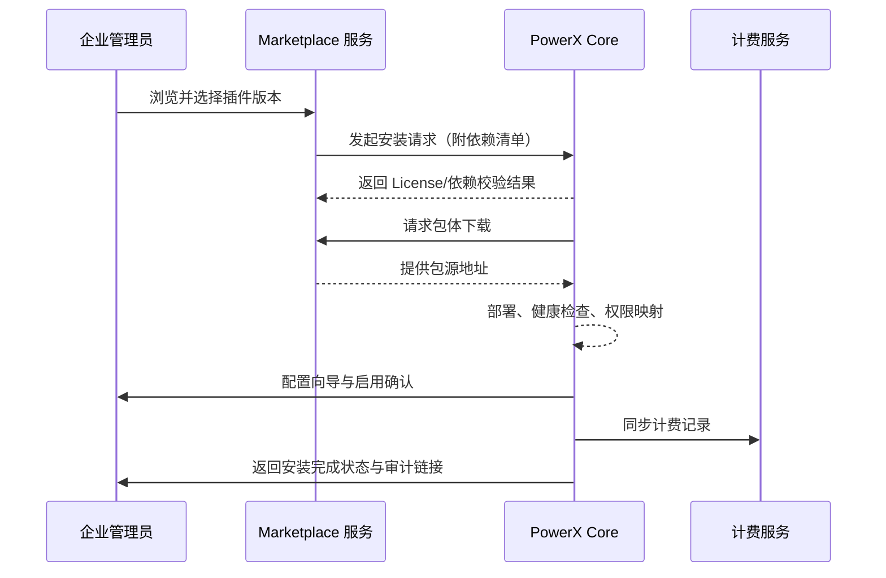

scn_id: SCN-OPS-PLUGIN-MARKETPLACE-INSTALL-001
title: 生产租户 Marketplace 一键安装
status: Draft
version: v0.1.0
owners:
  - name: Matrix Ops
    role: Platform Ops Lead
    contact: ops@artisan-cloud.com
  - name: Michael Hu
    role: Plugin Tech Lead
    contact: tech@artisan-cloud.com
domains: [ops]
layers: [service, ops]
repos:
  - key: powerx
    scope: core-platform
    responsibility: 安装编排、租户授权、运行时启用、审计落库
  - key: powerx-marketplace
    scope: marketplace
    responsibility: 插件目录、依赖清单、License 校验、包分发
related_usecases:
  - doc_id: UC-OPS-PLUGIN-MARKETPLACE-INSTALL-001
    layer: service
    domain: ops
last_reviewed_at: 2025-11-02

---

# Executive Summary

本子场景覆盖企业管理员在生产租户通过 Marketplace 一键安装官方插件的全流程。系统在选择版本后自动完成 License 与依赖校验、拉取包体、部署实例并执行自检，随后引导管理员配置权限、参数并发布给租户用户。目标是在无需人工干预的情况下完成部署，确保计费、权限、审计链路完备，并在异常时自动回滚与通知。

# Scope & Guardrails

- **In Scope**：Marketplace 浏览与版本选择、License/依赖校验、包体拉取与部署、自检、配置向导、权限分配、计费同步、回滚与审计。
- **Out of Scope**：Marketplace 审核、计费结算策略、插件代码内业务逻辑、自定义二次开发。
- **Environment & Flags**：`px-marketplace`、`px-plugin-runtime-v2`、`plugin-license-guard`、`plugin-config-wizard`；依赖 Marketplace 服务、租户与 License 服务、运行时监控、通知与审计。

# Participants & Responsibilities

| Scope | Repository | Layer | 责任与交付物 | Owners |
|-------|------------|-------|--------------|--------|
| core-platform | powerx | service | 安装编排、依赖校验、运行态启用、审计与回滚 | Matrix Ops（Platform Ops Lead / ops@artisan-cloud.com） |
| marketplace | powerx-marketplace | service | 插件目录、License 校验、包源分发、计费记录 | Michael Hu（Plugin Tech Lead / tech@artisan-cloud.com） |

# End-to-End Flow

1. **Stage 1 – 插件选择与信息确认**：管理员在 Marketplace 浏览插件、确认版本、权限请求与定价条款。
2. **Stage 2 – License 与依赖校验**：系统校验租户 License、计费权限、依赖插件是否满足，并准备安装计划。
3. **Stage 3 – 自动部署与自检**：自动拉取包体、部署实例、执行健康检查与权限映射。
4. **Stage 4 – 配置与发布**：管理员完成配置向导、授权角色，系统发布插件、同步计费记录并写入审计。

# Key Interactions & Contracts

- **APIs / Events**：`POST /api/marketplace/plugins/install`、`POST /api/plugins/install/marketplace`、`EVENT plugin.install.completed`、`EVENT plugin.install.rollback`。
- **Configs / Schemas**：`docs/standards/powerx-marketplace/marketplace/lifecycle-operations.md`、`docs/standards/powerx-plugin/lifecycle/package.md`、`config/plugins/marketplace_defaults.yaml`。
- **Security / Compliance**：License 与租户授权校验、Marketplace 分发签名校验、权限分配需审批、计费与审计留痕。

# Usecase Links

- `UC-OPS-PLUGIN-MARKETPLACE-INSTALL-001` — 生产租户 Marketplace 一键安装。

# Acceptance Criteria

1. 安装流程全自动完成，插件状态为“已启用”，相关角色获得访问入口。
2. License 或依赖不满足时阻断安装并提示补齐，无残留实例。
3. 计费与审计记录与安装操作保持一致，异常时自动回滚并通知管理员与运维。

# Telemetry & Ops

- 指标：`plugin.install.marketplace_duration_p95`、`plugin.install.marketplace_success_rate`、`plugin.install.dependency_block_total`、`plugin.billing.sync_latency`。
- 告警阈值：安装失败率 >3%/30 分钟、依赖阻断率 >10%、计费同步延迟 >5 分钟。
- 观测来源：Grafana `Runtime Ops / Plugin Marketplace`、Marketplace 审核日志、Ops 控制台插件运行面板。

# Open Issues & Follow-ups

| 风险/事项 | 影响范围 | 负责人 | ETA |
|-----------|----------|--------|-----|
| 依赖阻断缺少自动补齐提示，管理员需手动排查 | 安装成功率 | Matrix Ops | 2025-11-14 |
| 计费同步需补充重试与告警策略 | 财务对账 | Michael Hu | 2025-11-22 |

# Appendix

- `docs/meta/scenarios/powerx/core-platform/runtime-ops/plugin-install-and-ops/primary.md`
- `docs/standards/powerx-marketplace/marketplace/lifecycle-operations.md`
- 运维手册：Confluence《Marketplace Install Runbook》
