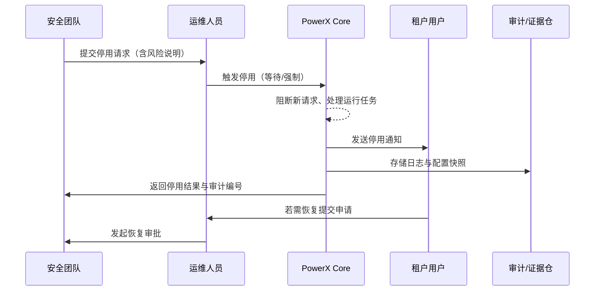

scn_id: SCN-OPS-PLUGIN-RISK-SUSPEND-001
title: 风险插件停用与证据留存
status: Draft
version: v0.1.0
owners:
  - name: Matrix Ops
    role: Platform Ops Lead
    contact: ops@artisan-cloud.com
  - name: Eva Zhang
    role: Automation Steward
    contact: automation@artisan-cloud.com
domains: [ops]
layers: [ops, security]
repos:
  - key: powerx
    scope: core-platform
    responsibility: 插件停用编排、通知广播、日志快照与审批管道
  - key: powerx-marketplace
    scope: marketplace
    responsibility: 风险插件标记、版本下架同步、依赖提醒
related_usecases:
  - doc_id: UC-OPS-PLUGIN-RISK-SUSPEND-001
    layer: ops
    domain: ops
last_reviewed_at: 2025-11-02

---

# Executive Summary

该子场景处理安全或合规团队发现插件存在风险时的停用动作。覆盖停用指令发起、逐步阻断新请求、等待或强制终止运行任务、生成日志与配置快照、通知相关人员，并确保重新启用需走审批。目标是在 1 分钟内完成停用、阻断风险扩散，同时保留完整证据链与审计留痕。

# Scope & Guardrails

- **In Scope**：停用指令审批、等待/强制停用、用户通知、日志与配置快照、审批与审计、复原流程。
- **Out of Scope**：漏洞根因分析、补丁开发、Marketplace 安全审核流程。
- **Environment & Flags**：`plugin-safety-lock`、`plugin-suspend-force`、`plugin-audit-stream`；依赖通知服务、审计日志服务、配置与密钥仓、工单系统。

# Participants & Responsibilities

| Scope | Repository | Layer | 责任与交付物 | Owners |
|-------|------------|-------|--------------|--------|
| core-platform | powerx | ops | 停用编排、工作流审批、日志与配置快照、恢复请求 | Matrix Ops（Platform Ops Lead / ops@artisan-cloud.com） |
| governance | powerx | security | 风险评估、审批策略、证据归档、合规报告 | Eva Zhang（Automation Steward / automation@artisan-cloud.com） |
| marketplace | powerx-marketplace | service | 风险插件标记、下架通知、依赖提醒 | Michael Hu（Plugin Tech Lead / tech@artisan-cloud.com） |

# End-to-End Flow

1. **Stage 1 – 风险识别与审批**：安全团队提交停用请求，系统校验权限并进入审批，必要时触发强制模式。
2. **Stage 2 – 停用编排**：控制台定位插件，逐步阻断新请求，等待当前任务完成或按策略强制终止。
3. **Stage 3 – 通知与证据留存**：系统发送停用通知，生成日志包、配置快照与操作审计，存入证据仓。
4. **Stage 4 – 恢复与复核**：如需恢复，管理员提交启用申请，需安全复核并更新审计记录。

# Key Interactions & Contracts

- **APIs / Events**：`POST /api/plugins/{pluginId}/suspend`、`POST /api/plugins/{pluginId}/suspend/force`、`POST /api/plugins/{pluginId}/resume`、`EVENT plugin.suspend.completed`、`EVENT plugin.resume.requested`。
- **Configs / Schemas**：`config/plugins/suspend_policies.yaml`、`docs/standards/powerx-plugin/security/vulnerability-response.md`、`docs/standards/powerx-plugin/security/audit-logs.md`。
- **Security / Compliance**：停用需双人审批、强制模式记录执行人与原因、证据链保存 ≥30 天、恢复需安全复核与审批。

# Usecase Links

- `UC-OPS-PLUGIN-RISK-SUSPEND-001` — 风险插件停用与证据留存。

# Acceptance Criteria

1. 停用指令在 1 分钟内生效，相关用户收到通知，插件状态标记为“已停用”。
2. 强制停用模式生成完整日志包与配置快照，并写入审计编号。
3. 恢复流程需经过管理员与安全团队审批，审计记录可追踪到执行人和时间。

# Telemetry & Ops

- 指标：`plugin.suspend.response_time`、`plugin.suspend.success_rate`、`plugin.suspend.force_total`、`plugin.resume.approval_duration`.
- 告警阈值：停用响应时间 >60 秒、强制停用失败、恢复审批超过 24 小时未处理。
- 观测来源：Grafana `Runtime Ops / Plugin Safety`、审计日志、工单系统、Ops 控制台。

# Open Issues & Follow-ups

| 风险/事项 | 影响范围 | 负责人 | ETA |
|-----------|----------|--------|-----|
| 停用通知渠道缺少多语言模板，影响国际租户 | 用户体验 | Matrix Ops | 2025-11-24 |
| 证据仓容量限制导致日志归档滞后 | 合规性 | Eva Zhang | 2025-11-28 |

# Appendix

- `docs/meta/scenarios/powerx/core-platform/runtime-ops/plugin-install-and-ops/primary.md`
- `docs/standards/powerx-plugin/security/vulnerability-response.md`
- `docs/standards/powerx-plugin/security/audit-logs.md`
