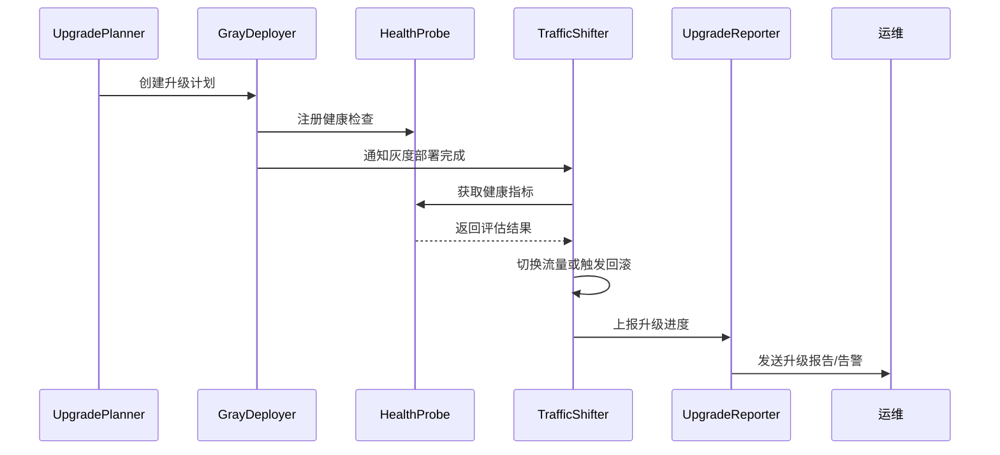

doc_id: UC-OPS-PLUGIN-AUTO-UPGRADE-001
scn_id: SCN-OPS-PLUGIN-LIFECYCLE-001
title: 自动化灰度升级与回滚治理
status: Draft
version: v0.1.0
repo_key: powerx
scope: powerx
layer: ops
domain: ops
scenario_title: "PowerX 插件安装与启停运营"
owners:
  - name: Matrix Ops
    role: Platform Ops Lead
    contact: ops@artisan-cloud.com
  - name: Eva Zhang
    role: Automation Steward
    contact: automation@artisan-cloud.com
contributors: []
linked_requirements:
  - SCN-OPS-PLUGIN-LIFECYCLE-001-C
code_refs:
  - repo: powerx
    path: internal/plugins/runtime/upgrade/planner.go
    description: 版本对比、升级计划生成、维护窗口管理
  - repo: powerx
    path: internal/plugins/runtime/upgrade/gray_deployer.go
    description: 灰度实例部署、配置加载、进度追踪
  - repo: powerx
    path: internal/plugins/runtime/healthcheck/probe.go
    description: 升级健康检查、指标阈值校验、失败策略
  - repo: powerx
    path: internal/plugins/runtime/traffic/shifter.go
    description: 流量切换、回滚通道、并发控制
  - repo: powerx
    path: pkg/audit/plugins/upgrade_reporter.go
    description: 升级报告生成、告警通知、审计落库
feature_flags:
  - plugin-upgrade-scheduler
  - plugin-traffic-shifter
  - plugin-upgrade-pause
optional: false
last_reviewed_at: 2025-11-02

---

# Usecase Overview

- **业务目标**：在检测到插件新版本时，通过自动化灰度升级保障业务连续性，提供健康检查、流量切换、自动回滚、报告与通知的闭环能力。
- **成功度量**：升级成功率 ≥ 95%；灰度覆盖 ≥ 20%；回滚响应 < 1 分钟；升级报告生成 ≤ 5 分钟。
- **场景关联**：对应主场景 `SCN-OPS-PLUGIN-LIFECYCLE-001` Stage 2-4，支撑升级任务的执行、流量治理与审计。

> 借助升级计划、灰度部署与指标驱动的流量切换，实现自动升级的稳健推进，并在异常时秒级回滚保业务安全。

# Context & Assumptions

- **前置条件**
  - 已启用 `plugin-upgrade-scheduler`、`plugin-traffic-shifter`、`plugin-upgrade-pause` Feature Flag。
  - 升级任务具备访问 Marketplace 版本清单与镜像仓库权限。
  - 监控平台提供健康指标（延迟、错误率、资源消耗）并支持阈值配置。
  - 审计与通知系统可接收升级过程事件。
- **输入/输出**
  - 输入：目标版本、维护窗口、灰度比例、健康检查规则、回滚策略。
  - 输出：升级执行状态、健康检查结果、流量切换进度、回滚结果、升级报告。
- **边界**
  - 不负责版本构建与 Marketplace 发布；不覆盖手工升级；不处理跨租户差异配置。

# Solution Blueprint

## 体系分解

| 模块 | 职责 | 代码入口 |
|------|------|---------|
| UpgradePlanner | 版本差异分析、维护窗口与灰度计划生成 | `internal/plugins/runtime/upgrade/planner.go` |
| GrayDeployer | 灰度实例部署、配置同步、进度追踪 | `internal/plugins/runtime/upgrade/gray_deployer.go` |
| HealthProbe | 健康检查执行、指标阈值校验、失败策略 | `internal/plugins/runtime/healthcheck/probe.go` |
| TrafficShifter | 流量切换、回滚通道、分批推进 | `internal/plugins/runtime/traffic/shifter.go` |
| UpgradeReporter | 升级报告、通知分发、审计落库 | `pkg/audit/plugins/upgrade_reporter.go` |

## 流程与时序

1. **Step 1 – 版本对比与计划**：UpgradePlanner 比对版本、生成灰度计划与维护窗口，通知运维确认。
2. **Step 2 – 灰度部署**：GrayDeployer 根据计划部署灰度实例、加载配置并绑定监控探针。
3. **Step 3 – 健康检查与流量切换**：HealthProbe 校验指标，TrafficShifter 按比例切换流量并保留回滚通道。
4. **Step 4 – 完成与报告**：升级成功则生成报告并更新版本状态；失败触发自动回滚与告警。

# Contracts & Interfaces

- **Inbound APIs / Events**
  - `POST /api/plugins/upgrade/plan` — 创建或更新升级计划。
  - `POST /api/plugins/upgrade/execute` — 启动升级任务。
  - `POST /api/plugins/upgrade/rollback` — 触发回滚。
  - `EVENT plugin.upgrade.progress`、`EVENT plugin.upgrade.rollback` — 升级进度与回滚事件。
- **Outbound 调用**
  - `GET /marketplace/plugins/{id}/releases` — 获取版本与镜像信息。
  - `POST /monitoring/check` — 触发健康检查并返回指标。
  - `POST /notify/ops` — 升级进度、回滚、报告通知运维与管理员。
  - `POST /audit/logs` — 记录版本切换、回滚、审批。
- **配置与脚本**
  - `config/plugins/upgrade_windows.yaml` — 维护窗口、灰度比例、暂停策略。
  - `config/plugins/health_checks.yaml` — 健康指标、阈值、重试策略。
  - `docs/standards/powerx-plugin/lifecycle/capabilities.md` — 升级能力与回滚要求。

# Implementation Checklist

| 项目 | 描述 | 完成状态 | 负责人 |
|------|------|----------|--------|
| 计划生成 | 支持按租户/插件配置灰度比例、维护窗口、暂停开关 | [ ] | Matrix Ops |
| 健康检查 | 丰富指标模板、支持自定义脚本与失败降级策略 | [ ] | Eva Zhang |
| 流量切换 | 提供分批进度控制、快照回滚、并发限制 | [ ] | Matrix Ops |
| 报告生成 | 输出升级总结、指标、回滚信息、通知渠道 | [ ] | Eva Zhang |
| 控制台集成 | 展示升级进度、健康状态、手动暂停/恢复按钮 | [ ] | Matrix Ops |

# Testing Strategy

- **单元测试**：计划生成、维护窗口校验、健康检查评估、流量切换状态机、回滚流程。
- **集成测试**：执行 primary.md C-1、C-2 用例；模拟健康检查失败、指标异常、回滚路径；验证暂停/恢复开关。
- **端到端验证**：在预生产环境上线新版本，观察灰度覆盖、指标、流量切换、报告；验证回滚恢复能力。
- **非功能测试**：大规模租户并发升级、健康检查超时、Marketplace 不可用、监控延迟。

# Observability & Ops

- **指标**：`plugin.upgrade.success_rate`、`plugin.upgrade.duration_p95`、`plugin.upgrade.rollback_total`、`plugin.upgrade.gray_coverage`、`plugin.upgrade.healthcheck_failure_total`。
- **日志**：记录 `plugin_id`、`from_version`、`to_version`、`gray_ratio`、`stage`、`status`、`rollback_reason`。
- **告警**：健康检查失败率 >5%、升级超出维护窗口、回滚失败、暂停状态超过 12 小时。
- **Dashboards**：Grafana `Runtime Ops / Plugin Upgrade`、Datadog `plugin.upgrade.*`、Ops 控制台升级视图。

# Rollback & Failure Handling

- **回滚步骤**：TrafficShifter 切换回旧版本、撤销新实例、恢复配置和流量；UpgradeReporter 更新报告。
- **补救措施**：保留旧版本配置快照；在灰度阶段可自动暂停并人工诊断；提供“重放灰度”脚本。
- **数据修复**：更新审计状态、重建升级报告、同步版本元数据；通知相关团队。

# Follow-ups & Risks

| 风险/事项 | 影响 | 缓解方案 | 负责人 | ETA |
|-----------|------|----------|--------|-----|
| 部分插件缺少专属健康指标导致误判 | 升级可靠性 | 引入“指标模板库”，支持按插件定制 | Matrix Ops | 2025-11-16 |
| 暂停开关仅支持全局，无法按租户细化 | 运营灵活性 | 支持租户/插件级暂停；更新控制台配置 | Eva Zhang | 2025-11-20 |

# References & Links

- 主场景：`docs/scenarios/runtime-ops/SCN-OPS-PLUGIN-LIFECYCLE-001.md`
- 子场景：`docs/scenarios/runtime-ops/SCN-OPS-PLUGIN-AUTO-UPGRADE-001.md`
- 背景材料：`docs/meta/scenarios/powerx/core-platform/runtime-ops/plugin-install-and-ops/primary.md`
- 标准文档：`docs/standards/powerx-plugin/lifecycle/capabilities.md`
