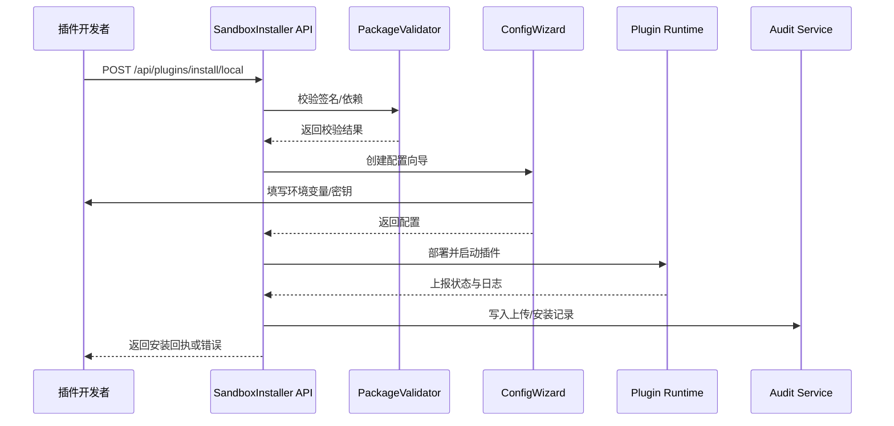

doc_id: UC-OPS-PLUGIN-DEV-INSTALL-001
scn_id: SCN-OPS-PLUGIN-LIFECYCLE-001
title: 测试租户手动上传插件
status: Draft
version: v0.1.0
repo_key: powerx
scope: powerx
layer: ops
domain: ops
scenario_title: "PowerX 插件安装与启停运营"
owners:
  - name: Matrix Ops
    role: Platform Ops Lead
    contact: ops@artisan-cloud.com
  - name: Michael Hu
    role: Plugin Tech Lead
    contact: tech@artisan-cloud.com
contributors: []
linked_requirements:
  - SCN-OPS-PLUGIN-LIFECYCLE-001-A
code_refs:
  - repo: powerx
    path: internal/plugins/runtime/installer/sandbox_installer.go
    description: 沙箱租户插件安装编排、资源分配与回滚
  - repo: powerx
    path: internal/plugins/runtime/validator/signature_validator.go
    description: 插件包签名、依赖与版本兼容校验
  - repo: powerx
    path: internal/plugins/runtime/config/wizard_flow.go
    description: 安装向导参数收集、环境变量与密钥占位符扩展
  - repo: powerx
    path: internal/plugins/runtime/logs/dev_channel.go
    description: 沙箱日志通道、调试级别控制与隔离
  - repo: powerx
    path: pkg/audit/plugins/sandbox_audit_writer.go
    description: 上传、安装、回滚动作的审计落库
feature_flags:
  - px-plugin-runtime-v2
  - plugin-sandbox-mode
  - plugin-dev-logs
optional: false
last_reviewed_at: 2025-11-02

---

# Usecase Overview

- **业务目标**：允许插件开发者在测试租户快速、可控地部署本地构建包，完成功能验证与调试，同时确保资源隔离、签名安全与回滚能力。
- **成功度量**：安装耗时 ≤ 2 分钟；沙箱安装成功率 ≥ 95%；签名校验误拒率 < 1%；回滚耗时 ≤ 30 秒。
- **场景关联**：对应主场景 `SCN-OPS-PLUGIN-LIFECYCLE-001` Stage 1-3，支撑开发者在生产发布前完成沙箱验证。

> 通过统一的沙箱安装向导与校验流程，实现插件快速迭代与安全隔离，避免因签名、依赖或配额问题阻塞调试。

# Context & Assumptions

- **前置条件**
  - 已启用 `px-plugin-runtime-v2`、`plugin-sandbox-mode` 与 `plugin-dev-logs` Feature Flag。
  - 测试租户具备独立资源配额、日志存储与审计空间。
  - 开发者账号拥有 `plugin: "dev`、`tenant:sandbox:write` 权限。"
  - 包管理服务可访问离线包体、签名证书与依赖索引。
- **输入/输出**
  - 输入：`.pxp` 插件包、`manifest.json`、依赖声明、签名摘要、环境变量模板。
  - 输出：插件运行实例、调试日志、审计记录、安装回执、沙箱测试入口。
- **边界**
  - 不处理插件代码构建与打包；不覆盖生产租户安装与计费；不负责 Marketplace 发布及审批。

# Solution Blueprint

## 体系分解

| 模块 | 职责 | 代码入口 |
|------|------|---------|
| SandboxInstaller | 控制租户隔离、资源配额、安装编排、回滚 | `internal/plugins/runtime/installer/sandbox_installer.go` |
| PackageValidator | 校验签名、版本、依赖、兼容性 | `internal/plugins/runtime/validator/signature_validator.go` |
| ConfigWizard | 引导参数填写、环境变量补全、密钥占位符校验 | `internal/plugins/runtime/config/wizard_flow.go` |
| DevLogChannel | 输出调试日志、控制级别、清理策略 | `internal/plugins/runtime/logs/dev_channel.go` |
| SandboxAuditWriter | 记录上传、校验、回滚动作，生成审计链路 | `pkg/audit/plugins/sandbox_audit_writer.go` |

## 流程与时序

1. **Step 1 – 上传校验**：开发者上传包体，PackageValidator 校验签名、依赖、版本，并写入审计。
2. **Step 2 – 资源与隔离配置**：SandboxInstaller 计算资源配额、租户隔离策略，预留运行实例。
3. **Step 3 – 安装向导**：ConfigWizard 引导填写环境变量、密钥占位符、调试日志级别。
4. **Step 4 – 部署与启动**：运行时部署插件，DevLogChannel 输出调试日志，SandboxInstaller 跟踪状态。
5. **Step 5 – 回执与回滚**：安装成功后生成回执与测试入口；失败触发自动回滚并释放资源。

# Contracts & Interfaces

- **Inbound APIs / Events**
  - `POST /api/plugins/install/local` — 上传本地插件包并触发安装向导。
  - `POST /internal/plugins/packages/validate` — 签名、依赖、版本校验；返回阻断原因。
  - `EVENT plugin.install.sandbox_completed` — 安装完成事件，附 `tenant_id`、`trace_id`、`install_duration_ms`。
- **Outbound 调用**
  - `POST /internal/tenants/{tenantId}/quota/reserve` — 校验并预留沙箱资源配额。
  - `POST /internal/notify/dev-channel` — 推送安装结果与调试入口。
  - `POST /audit/logs` — 写入审计记录，包含上传者、包版本、操作类型。
- **配置与脚本**
  - `config/plugins/sandbox_limits.yaml` — 沙箱租户资源配额、超时、并发限制。
  - `scripts/workflows/plugin-sandbox-dryrun.mjs` — 本地签名与依赖预校验脚本（需开发者执行）。
  - `docs/standards/powerx-plugin/lifecycle/package.md` — 包结构与 manifest 字段规范。

# Implementation Checklist

| 项目 | 描述 | 完成状态 | 负责人 |
|------|------|----------|--------|
| 签名校验 | 接入离线/在线证书验证、回显错误细节 | [ ] | Michael Hu |
| 资源配额 | 支持沙箱租户资源预留、溢出告警与回滚 | [ ] | Matrix Ops |
| 配置向导 | 支持环境变量模板、密钥占位符校验、默认调试级别 | [ ] | Michael Hu |
| 审计落库 | 上传、安装、回滚动作写入审计聚合 | [ ] | Matrix Ops |
| 开发者 CLI | 提供本地 `--validate-only` 模式，减少误上传 | [ ] | Michael Hu |

# Testing Strategy

- **单元测试**：签名校验、依赖解析、资源配额计算、安装状态机、回滚流程。
- **集成测试**：执行 primary.md 中 A-1、A-2 用例，覆盖成功安装与签名失败回滚；引入资源不足、依赖冲突场景。
- **端到端验证**：在沙箱环境上传真实插件，验证日志输出、审计记录、测试入口与回滚。
- **非功能测试**：并发上传压力（≥10 并发）、大包体（>200MB）传输、签名服务故障模拟。

# Observability & Ops

- **指标**：`plugin.install.sandbox_duration_p95`、`plugin.install.sandbox_success_rate`、`plugin.install.rollback_total`、`plugin.install.signature_failure_total`。
- **日志**：记录 `tenant_id`、`plugin_id`、`version`、`install_mode`、`duration_ms`、`status`、`failure_reason`。
- **告警**：签名校验连续失败、资源配额超限、安装耗时 >120 秒触发 PagerDuty；调试日志通道异常时提示开发者。
- **Dashboards**：Grafana `Runtime Ops / Plugin Sandbox`、内部审计面板、控制台调试页面。

# Rollback & Failure Handling

- **回滚步骤**：一键回滚释放资源、撤销配置、关闭日志通道；通知开发者并提供错误报告。
- **补救措施**：引导开发者执行 `plugin-sandbox-dryrun.mjs`、修复包签名或依赖；提供资源配额扩容建议。
- **数据修复**：允许重新触发安装、清理半安装状态、同步审计状态为失败。

# Follow-ups & Risks

| 风险/事项 | 影响 | 缓解方案 | 负责人 | ETA |
|-----------|------|----------|--------|-----|
| 沙箱资源配额模型与生产不一致导致回归差异 | 测试准确性 | 引入“仿真配额”配置、允许自助调节 | Matrix Ops | 2025-11-12 |
| 开发者缺少本地校验工具导致重复失败 | 开发效率 | 在 CLI 加入 `px-plugin validate` 指令并产出手册 | Michael Hu | 2025-11-18 |

# References & Links

- 主场景：`docs/scenarios/runtime-ops/SCN-OPS-PLUGIN-LIFECYCLE-001.md`
- 子场景：`docs/scenarios/runtime-ops/SCN-OPS-PLUGIN-DEV-INSTALL-001.md`
- 背景材料：`docs/meta/scenarios/powerx/core-platform/runtime-ops/plugin-install-and-ops/primary.md`
- 标准文档：`docs/standards/powerx-plugin/lifecycle/package.md`
