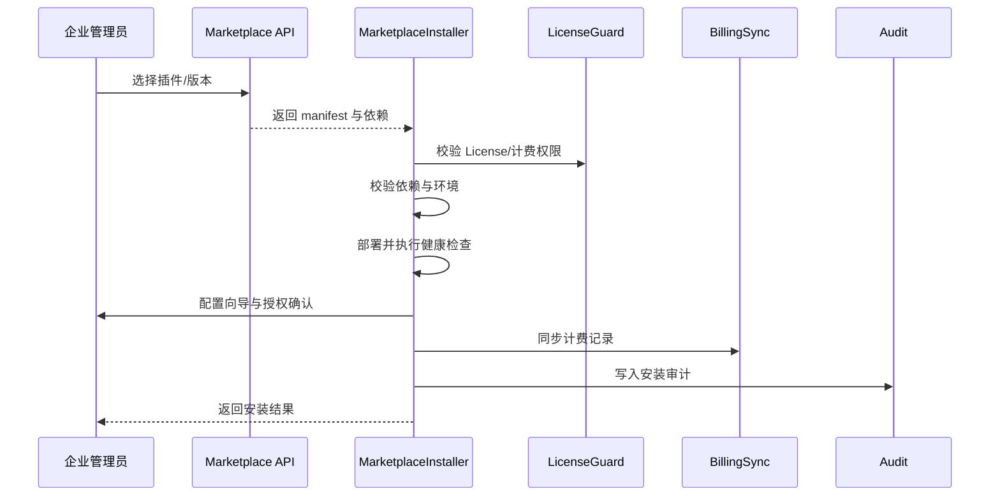

doc_id: UC-OPS-PLUGIN-MARKETPLACE-INSTALL-001
scn_id: SCN-OPS-PLUGIN-LIFECYCLE-001
title: 生产租户 Marketplace 一键安装
status: Draft
version: v0.1.0
repo_key: powerx
scope: powerx
layer: service
domain: ops
scenario_title: "PowerX 插件安装与启停运营"
owners:
  - name: Matrix Ops
    role: Platform Ops Lead
    contact: ops@artisan-cloud.com
  - name: Michael Hu
    role: Plugin Tech Lead
    contact: tech@artisan-cloud.com
contributors: []
linked_requirements:
  - SCN-OPS-PLUGIN-LIFECYCLE-001-B
code_refs:
  - repo: powerx
    path: internal/plugins/runtime/installer/marketplace_installer.go
    description: Marketplace 安装编排、状态管理与回滚
  - repo: powerx
    path: internal/plugins/runtime/license/license_guard.go
    description: License/租户授权校验、计费权限判断
  - repo: powerx
    path: internal/plugins/runtime/dependency/resolver.go
    description: 插件依赖解析、阻断提示与补齐建议
  - repo: powerx
    path: internal/plugins/runtime/config/marketplace_wizard.go
    description: Marketplace 安装配置向导、角色授权、默认参数
  - repo: powerx
    path: pkg/billing/marketplace_sync.go
    description: 安装计费记录同步、重试与审计
feature_flags:
  - px-marketplace
  - plugin-license-guard
  - plugin-config-wizard
optional: false
last_reviewed_at: 2025-11-02

---

# Usecase Overview

- **业务目标**：实现企业管理员在生产租户通过 Marketplace 一键安装官方插件的自动化流程，确保 License、依赖、配置、权限、计费与审计链路完整。
- **成功度量**：安装成功率 ≥ 98%；依赖阻断率 < 5%；计费同步延迟 < 1 分钟；回滚耗时 ≤ 2 分钟。
- **场景关联**：对应主场景 `SCN-OPS-PLUGIN-LIFECYCLE-001` Stage 1-4，贯穿 Marketplace 版本选择、自动部署与发布启用。

> 通过统一的 Marketplace 安装编排，让生产租户可以零手动操作地完成插件部署，同时在异常时即时回滚并通知相关人员。

# Context & Assumptions

- **前置条件**
  - 已启用 `px-marketplace`、`plugin-license-guard`、`plugin-config-wizard` Feature Flag。
  - Marketplace 提供版本元数据、依赖清单、包源地址与签名信息。
  - License 服务实时可用，支持租户配额、计费授权与依赖插件校验。
  - 计费服务支持安装事件同步与重试；通知系统可触达管理员与运维。
- **输入/输出**
  - 输入：插件 `manifest`、版本号、依赖列表、License 条款、默认配置模板。
  - 输出：安装状态、权限授权结果、计费记录、审计日志、回滚记录。
- **边界**
  - 不负责 Marketplace 审核与发布；不处理插件内部业务逻辑；不覆盖计费结算后续流程。

# Solution Blueprint

## 体系分解

| 模块 | 职责 | 代码入口 |
|------|------|---------|
| MarketplaceInstaller | 自动化安装编排、部署状态机、回滚 | `internal/plugins/runtime/installer/marketplace_installer.go` |
| LicenseGuard | 校验 License、计费授权与租户限制 | `internal/plugins/runtime/license/license_guard.go` |
| DependencyResolver | 检查依赖插件、版本兼容与补齐提示 | `internal/plugins/runtime/dependency/resolver.go` |
| ConfigWizard | 引导管理员完成配置、角色授权、默认参数设置 | `internal/plugins/runtime/config/marketplace_wizard.go` |
| BillingSync | 安装事件计费同步、重试与审计 | `pkg/billing/marketplace_sync.go` |

## 流程与时序

1. **Step 1 – 版本选择**：管理员在 Marketplace 选择插件版本，系统拉取 manifest 与依赖。
2. **Step 2 – License/依赖校验**：LicenseGuard 与 DependencyResolver 校验租户授权、依赖链、计费权限。
3. **Step 3 – 部署与自检**：MarketplaceInstaller 拉取包体，部署插件，执行健康检查与权限映射。
4. **Step 4 – 配置与发布**：ConfigWizard 引导管理员配置参数、授权角色，完成启用并通知用户。
5. **Step 5 – 计费与审计**：BillingSync 写入计费记录，Audit 服务记录操作链路；异常触发自动回滚。

# Contracts & Interfaces

- **Inbound APIs / Events**
  - `POST /api/marketplace/plugins/install` — 发起一键安装请求。
  - `POST /api/plugins/install/marketplace` — Core 内部安装编排接口。
  - `EVENT plugin.install.completed`、`EVENT plugin.install.rollback` — 安装完成/回滚通知。
- **Outbound 调用**
  - `GET /marketplace/plugins/{id}/versions/{version}` — 获取插件 manifest、依赖、签名。
  - `POST /license/validate` — 校验租户 License、配额与计费权限。
  - `POST /billing/records` — 写入安装计费记录。
  - `POST /notify/admins` — 通知管理员与运维安装结果。
- **配置与脚本**
  - `config/plugins/marketplace_defaults.yaml` — 默认参数、角色映射、启用策略。
  - `docs/standards/powerx-marketplace/marketplace/lifecycle-operations.md` — 安装流程与依赖治理标准。
  - `docs/standards/powerx-plugin/lifecycle/package.md` — 插件包结构规范。

# Implementation Checklist

| 项目 | 描述 | 完成状态 | 负责人 |
|------|------|----------|--------|
| License 校验 | 支持多 License 分层、试用期、License 过期提示 | [ ] | Matrix Ops |
| 依赖治理 | 提供依赖缺失阻断与补齐指引、支持自动排队重试 | [ ] | Michael Hu |
| 健康检查 | 双通道健康检查（安装前/后）、错误日志落库 | [ ] | Matrix Ops |
| 配置向导 | 支持按租户预设模板、权限授权批量设置 | [ ] | Michael Hu |
| 计费同步 | 引入异步重试、告警阈值、对账校验 | [ ] | Matrix Ops |

# Testing Strategy

- **单元测试**：License 校验、依赖解析、安装状态机、计费同步重试、回滚逻辑。
- **集成测试**：执行 primary.md B-1/B-2 用例；模拟 License 失效、依赖缺失、包体下载失败、健康检查失败。
- **端到端验证**：在预生产租户执行一键安装，验证权限授权、门户入口、计费记录、审计日志。
- **非功能测试**：Marketplace 响应延迟、包体下载超时、计费服务异常、安装幂等重试。

# Observability & Ops

- **指标**：`plugin.install.marketplace_duration_p95`、`plugin.install.marketplace_success_rate`、`plugin.install.dependency_block_total`、`plugin.install.rollback_total`、`plugin.billing.sync_latency`.
- **日志**：记录 `tenant_id`、`plugin_id`、`version`、`license_plan`、`dependency_status`、`install_duration_ms`、`result`。
- **告警**：安装失败率 >3%、依赖阻断率 >10%、计费同步失败连续 3 次、安装耗时 >10 分钟。
- **Dashboards**：Grafana `Runtime Ops / Plugin Marketplace`、Marketplace 审核日志、计费对账看板。

# Rollback & Failure Handling

- **回滚步骤**：停止并卸载新实例、恢复旧版本（如有）、撤销配置与权限变更、更新审计为“回滚”。
- **补救措施**：引导管理员安装依赖插件、补齐 License；提供手动重试或队列重试入口。
- **数据修复**：修正计费记录、同步审计状态、重新生成安装报告并通知相关人员。

# Follow-ups & Risks

| 风险/事项 | 影响 | 缓解方案 | 负责人 | ETA |
|-----------|------|----------|--------|-----|
| 依赖阻断缺乏自动补齐导致安装中断 | 安装效率 | 引入“自动补齐依赖”选项，提供一键安装依赖 | Matrix Ops | 2025-11-14 |
| 计费同步缺乏重试与告警 | 财务对账 | 增加幂等重试、告警、对账脚本 | Michael Hu | 2025-11-22 |

# References & Links

- 主场景：`docs/scenarios/runtime-ops/SCN-OPS-PLUGIN-LIFECYCLE-001.md`
- 子场景：`docs/scenarios/runtime-ops/SCN-OPS-PLUGIN-MARKETPLACE-INSTALL-001.md`
- 背景材料：`docs/meta/scenarios/powerx/core-platform/runtime-ops/plugin-install-and-ops/primary.md`
- 标准文档：`docs/standards/powerx-marketplace/marketplace/lifecycle-operations.md`
