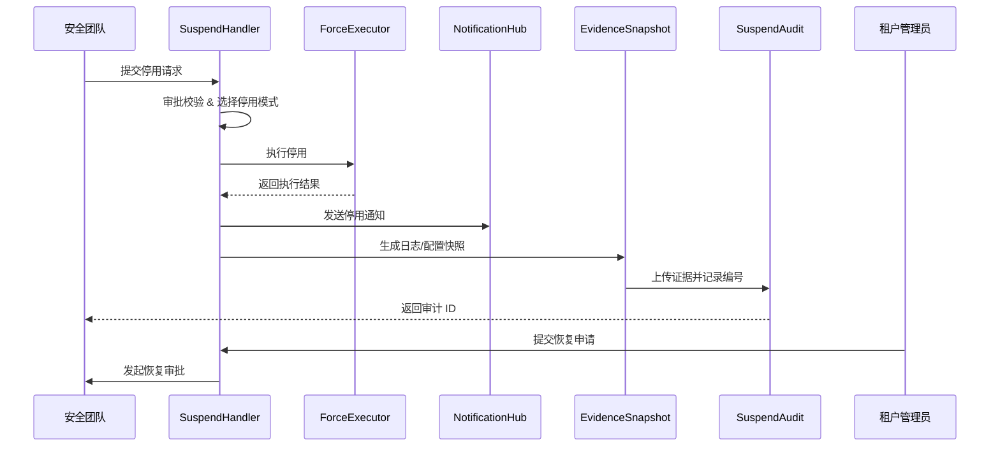

doc_id: UC-OPS-PLUGIN-RISK-SUSPEND-001
scn_id: SCN-OPS-PLUGIN-LIFECYCLE-001
title: 风险插件停用与证据留存
status: Draft
version: v0.1.0
repo_key: powerx
scope: powerx
layer: ops
domain: ops
scenario_title: "PowerX 插件安装与启停运营"
owners:
  - name: Matrix Ops
    role: Platform Ops Lead
    contact: ops@artisan-cloud.com
  - name: Eva Zhang
    role: Automation Steward
    contact: automation@artisan-cloud.com
contributors: []
linked_requirements:
  - SCN-OPS-PLUGIN-LIFECYCLE-001-D
code_refs:
  - repo: powerx
    path: internal/plugins/runtime/suspend/handler.go
    description: 停用工作流编排、审批校验、状态变更
  - repo: powerx
    path: internal/plugins/runtime/suspend/force_executor.go
    description: 强制停用执行、运行任务终止、超时控制
  - repo: powerx
    path: internal/plugins/runtime/notifications/notifier.go
    description: 停用/恢复通知、渠道路由、多语言模板
  - repo: powerx
    path: internal/plugins/runtime/evidence/snapshot_builder.go
    description: 日志、配置、指标快照生成与归档
  - repo: powerx
    path: pkg/audit/plugins/suspend_audit.go
    description: 停用/恢复审计、审批记录、证据编号
feature_flags:
  - plugin-safety-lock
  - plugin-suspend-force
  - plugin-audit-stream
optional: false
last_reviewed_at: 2025-11-02

---

# Usecase Overview

- **业务目标**：当插件出现安全或合规风险时，提供可审批、快速、可审计的停用能力，并保留完整证据链，支持后续调查与恢复。
- **成功度量**：停用响应时间 ≤ 60 秒；强制停用成功率 ≥ 99%；证据快照生成 < 2 分钟；恢复审批闭环 ≤ 24 小时。
- **场景关联**：对应主场景 `SCN-OPS-PLUGIN-LIFECYCLE-001` Stage 4，覆盖风险识别、停用执行、通知、证据与恢复。

> 通过停用编排、强制执行与证据归档，确保风险插件能在一分钟内被控制，同时保留链路供合规复盘，并支持审批恢复。

# Context & Assumptions

- **前置条件**
  - `plugin-safety-lock`、`plugin-suspend-force`、`plugin-audit-stream` Feature Flag 已启用。
  - 安全团队具备提交停用审批的权限；工单系统与审计服务可用。
  - 配置、日志、指标存储支持快照归档且容量充足。
  - 通知系统支持管理员、租户用户多渠道触达。
- **输入/输出**
  - 输入：停用原因、插件 ID、租户 ID、停用模式（等待/强制）、证据需求、审批凭证。
  - 输出：停用状态、通知记录、日志/配置快照、审计编号、恢复审批任务。
- **边界**
  - 不负责漏洞修复或补丁开发；不覆盖 Marketplace 下架；不包含第三方取证流程。

# Solution Blueprint

## 体系分解

| 模块 | 职责 | 代码入口 |
|------|------|---------|
| SuspendHandler | 停用审批、编排、状态管理、恢复申请 | `internal/plugins/runtime/suspend/handler.go` |
| ForceExecutor | 强制停用执行、超时控制、任务终止策略 | `internal/plugins/runtime/suspend/force_executor.go` |
| NotificationHub | 通知管理员、租户用户、工单系统 | `internal/plugins/runtime/notifications/notifier.go` |
| EvidenceSnapshot | 生成日志、配置、指标快照、上传证据仓 | `internal/plugins/runtime/evidence/snapshot_builder.go` |
| SuspendAudit | 记录停用/恢复动作、审批链、证据编号 | `pkg/audit/plugins/suspend_audit.go` |

## 流程与时序

1. **Step 1 – 停用请求与审批**：SuspendHandler 接收安全团队请求，校验权限并启动审批，必要时允许强制模式。
2. **Step 2 – 执行停用**：执行等待或强制停用，阻断新请求、处理在途任务，记录执行人与时间。
3. **Step 3 – 通知与证据**：NotificationHub 发送停用通知，EvidenceSnapshot 生成日志、配置快照并上传证据仓。
4. **Step 4 – 审计与恢复**：SuspendAudit 写入审计；如需恢复，管理员发起申请并通过安全复核。

# Contracts & Interfaces

- **Inbound APIs / Events**
  - `POST /api/plugins/{pluginId}/suspend` — 发起停用（等待模式）。
  - `POST /api/plugins/{pluginId}/suspend/force` — 强制停用。
  - `POST /api/plugins/{pluginId}/resume` — 恢复申请。
  - `EVENT plugin.suspend.completed`、`EVENT plugin.resume.requested`。
- **Outbound 调用**
  - `POST /notify/security`、`POST /notify/tenant-users` — 停用/恢复通知。
  - `POST /evidence/upload` — 上传日志、配置、指标快照。
  - `POST /audit/logs` — 记录审批、执行、证据编号。
  - `POST /tickets/create` — 创建或更新安全工单。
- **配置与脚本**
  - `config/plugins/suspend_policies.yaml` — 停用审批策略、默认模式、超时配置。
  - `config/plugins/evidence_retention.yaml` — 证据保留天数、存储策略。
  - `docs/standards/powerx-plugin/security/vulnerability-response.md` — 风险响应流程。

# Implementation Checklist

| 项目 | 描述 | 完成状态 | 负责人 |
|------|------|----------|--------|
| 停用审批 | 支持多级审批、审批模板、异常路径 | [ ] | Matrix Ops |
| 强制执行 | 提供等待/强制两种策略、运行任务终止与超时处理 | [ ] | Eva Zhang |
| 证据快照 | 收集日志、配置、指标、版本信息并上传证据仓 | [ ] | Matrix Ops |
| 通知渠道 | 支持邮件、短信、控制台、Webhook，多语言模板 | [ ] | Eva Zhang |
| 恢复流程 | 双人审批、审计关联、操作回放 | [ ] | Matrix Ops |

# Testing Strategy

- **单元测试**：审批状态机、权限校验、强制停用执行、通知模板、证据生成。
- **集成测试**：执行 primary.md D-1/D-2 用例；验证等待模式、强制模式；模拟证据存储故障、通知失败。
- **端到端验证**：在预生产环境触发停用，检查响应时间、通知、日志快照、审计链路；验证恢复审批。
- **非功能测试**：并发停用请求、证据仓容量限制、长时间运行任务终止、审计服务降级。

# Observability & Ops

- **指标**：`plugin.suspend.response_time`、`plugin.suspend.success_rate`、`plugin.suspend.force_total`、`plugin.resume.approval_duration`。
- **日志**：记录 `plugin_id`、`tenant_id`、`mode`、`requester`、`approver`、`status`、`evidence_id`、`elapsed_ms`。
- **告警**：停用响应 >60 秒、强制停用失败、证据上传失败、恢复审批超时。
- **Dashboards**：Grafana `Runtime Ops / Plugin Safety`、审计面板、工单系统看板、通知投递监控。

# Rollback & Failure Handling

- **回滚步骤**：若停用失败，自动重试或升级审批；强制失败时触发告警并锁定插件、阻断入口。
- **补救措施**：提供手动执行脚本、手动上传证据；通知安全团队介入；记录失败原因。
- **数据修复**：可重新生成证据快照、补写审计记录；对通知失败用户补发消息。

# Follow-ups & Risks

| 风险/事项 | 影响 | 缓解方案 | 负责人 | ETA |
|-----------|------|----------|--------|-----|
| 多语言通知模板缺失影响国际租户理解 | 用户体验 | 增补多语言模板并纳入审计 | Matrix Ops | 2025-11-24 |
| 证据仓容量不足导致归档失败 | 合规风险 | 提前容量告警、自动扩容、分级清理策略 | Eva Zhang | 2025-11-28 |

# References & Links

- 主场景：`docs/scenarios/runtime-ops/SCN-OPS-PLUGIN-LIFECYCLE-001.md`
- 子场景：`docs/scenarios/runtime-ops/SCN-OPS-PLUGIN-RISK-SUSPEND-001.md`
- 背景材料：`docs/meta/scenarios/powerx/core-platform/runtime-ops/plugin-install-and-ops/primary.md`
- 标准文档：`docs/standards/powerx-plugin/security/vulnerability-response.md`
