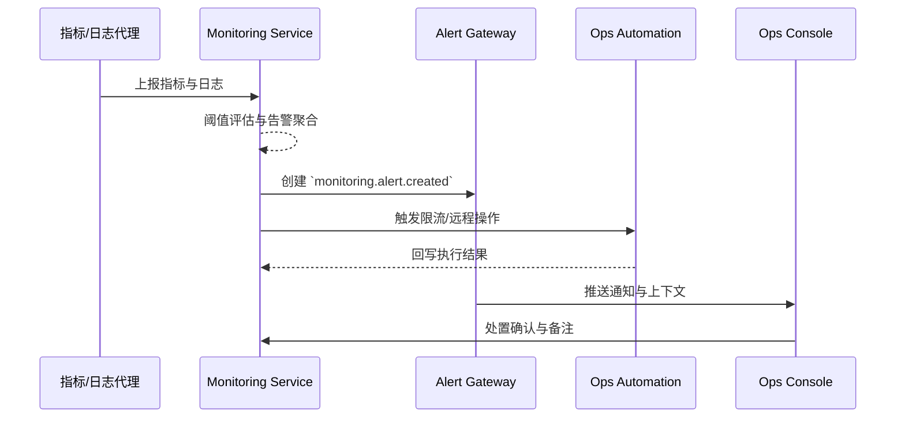
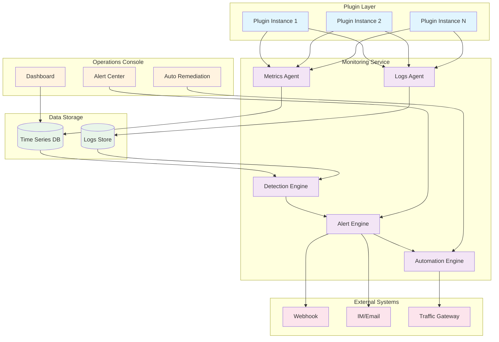

# Executive Summary

PowerX 系统监控与告警场景聚焦于统一采集插件与宿主运行指标、实时异常检测、跨通道告警通知以及自动化处置流程。监控服务需要在秒级发现 CPU、内存、响应时间与日志异常，通过限流、远程操作和协同通知缩短 MTTR，并在控制台呈现可审计、可回溯的运维上下文，确保多租户平台稳定可用。

# Positioning & Goals

## 业务目标
- **持续可用性**：通过实时监控与自动限流机制，避免单个插件异常影响整租户稳定性
- **透明可视化**：提供统一的健康仪表盘与性能分析，支持跨租户、跨插件对比
- **主动告警**：异常日志、阈值突破和事件可触发多通道告警，降低漏报风险
- **快速处置**：运维可在告警上下文中直接执行远程重启、限流等操作，缩短 MTTR

## 核心价值
- 将被动运维转变为主动预防
- 将人工处置转变为自动化响应
- 将分散监控转变为统一视图

# Core Capabilities

1. **多维指标采集**：CPU、内存、响应时间、错误率等核心指标实时采集
2. **智能异常检测**：基于滑动窗口与阈值的异常检测算法
3. **自动处置引擎**：限流、重启等自动化操作触发与执行
4. **统一告警中心**：多通道告警通知、状态追踪、升级机制
5. **可视化运维控制台**：仪表盘、拓扑视图、巡检报告导出

# Scope & Guardrails

- **In Scope**：核心插件与宿主实例的指标采集、异常检测、限流与远程操作、运维控制台可视化、告警通知、审计留痕。
- **Out of Scope**：插件自定义业务指标、底层基础设施（K8s/存储）硬件监控、计费与 SLA 赔偿流程。
- **Environment & Flags**：`monitoring-service`, `alert-gateway`, `ops-console`, `remote-ops-automation`; 依赖事件总线、Webhook 网关、权限与审计系统。

# Participants & Responsibilities

| Scope | Repository | Layer | 责任与交付物 | Owners |
|-------|------------|-------|--------------|--------|
| core-platform | powerx | service | 指标/日志接入、异常检测、告警编排、自动限流与远程操作触发 | Matrix Ops（Platform Ops Lead / ops@artisan-cloud.com） |
| ops-tooling | powerx | ops | 运维控制台可视化、巡检报表、操作审批、Runbook 与审计对接 | Iris Chen（Observability Steward / observability@artisan-cloud.com） |

# End-to-End Flow

1. **Stage 1 – 可观测数据采集**：指标代理与日志采集器每 10 秒上报插件与宿主运行态，监控服务校验租户上下文并写入时序/日志存储。
2. **Stage 2 – 异常检测与聚合**：规则引擎与机器学习模型识别资源、性能或日志异常，合并重复告警并打上租户/插件标签。
3. **Stage 3 – 告警编排与自动处置**：根据策略触发限流或远程操作，同时通过 Webhook、IM、邮件广播告警事件。
4. **Stage 4 – 运营跟进与复盘**：运维在控制台查看仪表盘、认领告警、执行 Runbook，完成处置后关闭告警并沉淀报告。

# Key Interactions & Contracts

- **APIs / Events**：`POST /internal/monitoring/metrics`, `POST /internal/monitoring/logs`, `EVENT monitoring.alert.created`, `POST /ops/remote-actions/throttle`, `POST /ops/remote-actions/restart`.
- **Configs / Schemas**：`config/monitoring/rules/*.yaml`, `docs/standards/powerx/backend/integration/06_gateway/EventBus_and_Message_Fabric.md`（告警事件命名与路由）、`docs/standards/powerx-plugin/integration/03_runtime_and_ops/Logs_Metrics_and_Tracing.md`（插件指标输出规范）。
- **Security / Compliance**：操作需经过 RBAC + MFA，所有限流与远程操作写入审计；Webhook 需签名校验与重试策略，敏感数据按租户隔离。

# Usecase Links

- `UC-OPS-MONITORING-THROTTLE-001` — CPU 异常触发自动限流（service 层，powerx）。
- `UC-OPS-MONITORING-DASHBOARD-001` — 运维仪表盘巡检与报告归档（ops 层，powerx）。
- `UC-OPS-MONITORING-WEBHOOK-001` — 日志异常触发 Webhook 告警（service 层，powerx）。
- `UC-OPS-MONITORING-REMOTE-RESTART-001` — 告警驱动远程重启与回滚（ops 层，powerx）。

# Acceptance Criteria

1. 监控服务支持 CPU、内存、响应时间、错误率等指标阈值配置，异常检测延迟 ≤ 60 秒。
2. 告警事件支持 Webhook/IM/邮件多通道通知，具备去重、抑制与升级策略，并可追踪处理状态。
3. 自动限流与远程重启操作在触发前完成权限校验，执行动作全量记录并支持回滚。
4. 运维控制台可按租户/插件/实例维度筛选，导出巡检报告，数据延迟不超过 1 分钟。

# Validation Workflow

## 测试准备
搭建沙箱租户，部署 2 个插件实例并接入指标与日志采集；配置告警 Webhook 指向沙箱告警平台；预置运维账号、租户管理员账号与插件责任人，并开启远程操作审批流程。

## 测试用例

### 用例 A-1：CPU 异常触发限流（正向）
- **前置条件**：为插件实例配置 CPU > 90% 持续 30 秒触发限流策略
- **操作步骤**：在沙箱环境模拟压测，使插件 CPU 占用达到阈值，观察监控服务的告警与限流执行记录
- **预期结果**：限流在 30 秒内生效，告警通知发送至运维与责任人，CPU 曲线在 2 分钟内回落至 70% 以下

### 用例 B-1：仪表盘巡检成功（正向）
- **前置条件**：运维账号具备 `ops.viewer` 权限
- **操作步骤**：登录运营控制台查看目标插件，导出过去 24 小时的性能报告
- **预期结果**：仪表盘数据延迟 < 1 分钟，图表可切换实例、时间范围，导出的报告包含关键指标、异常事件与备注栏

### 用例 C-1：异常日志触发 Webhook 告警（正向）
- **前置条件**：配置规则"5 分钟内 ERROR 日志 ≥ 20 条触发 P2 告警"
- **操作步骤**：在沙箱插件中批量写入 ERROR 级别日志，监听沙箱告警平台的 Webhook 接收情况
- **预期结果**：告警在 1 分钟内创建并推送 Webhook，HTTP 状态 200，告警负载包含错误摘要、租户、插件 ID、建议操作

### 用例 D-1：远程重启成功（正向）
- **前置条件**：租户管理员已通过远程操作审批，插件支持滚动重启策略
- **操作步骤**：在告警详情中点击"远程重启"，观察编排服务执行情况
- **预期结果**：自动化流程依次重启实例，并验证健康探针成功，告警状态更新为"已恢复"，恢复时间 < 5 分钟

# Architecture Diagram

# Related Links

- Meta Scenario: `docs/meta/scenarios/powerx/core-platform/runtime-ops/system-monitoring-and-alerting/primary.md`
- Use Cases:
  - `docs/usecases-seeds/SCN-OPS-SYSTEM-MONITORING-001/UC-OPS-MONITORING-THROTTLE-001.md`
  - `docs/usecases-seeds/SCN-OPS-SYSTEM-MONITORING-001/UC-OPS-MONITORING-DASHBOARD-001.md`
  - `docs/usecases-seeds/SCN-OPS-SYSTEM-MONITORING-001/UC-OPS-MONITORING-WEBHOOK-001.md`
  - `docs/usecases-seeds/SCN-OPS-SYSTEM-MONITORING-001/UC-OPS-MONITORING-REMOTE-RESTART-001.md`
- Standards:
  - `docs/standards/powerx-plugin/integration/03_runtime_and_ops/Logs_Metrics_and_Tracing.md`
  - `docs/standards/powerx/backend/integration/06_gateway/EventBus_and_Message_Fabric.md`

# Telemetry & Ops

- 指标：`monitoring.cpu.anomaly_total`, `monitoring.alert.active`, `monitoring.remediate.success_total`, `monitoring.webhook.delivery_success_rate`, `monitoring.remote_restart.mttr`.
- 告警阈值：CPU 异常 >3 次/5 分钟触发 P1；Webhook 投递成功率 <95%/15 分钟触发 P1；远程重启失败率 >5%/日触发 P0。
- 观测来源：Grafana 面板《Runtime Ops / Monitoring》、Datadog `monitoring.*`、`reports/_state/ops/monitoring/*.json`、`scripts/qa/workflow-metrics.mjs` 导出的治理报表。

# Open Issues & Follow-ups

| 风险/事项 | 影响范围 | 负责人 | ETA |
|-----------|----------|--------|-----|
| 告警风暴抑制策略待验证 | 大量重复告警影响值班效率 | Matrix Ops | 2025-11-15 |
| 远程操作审批链缺少自动化回归测试 | 可能导致越权操作未被拦截 | Iris Chen | 2025-11-22 |

# Appendix

- `docs/meta/scenarios/powerx/core-platform/runtime-ops/system-monitoring-and-alerting/primary.md`
- `docs/standards/powerx-plugin/integration/03_runtime_and_ops/Logs_Metrics_and_Tracing.md`
- `docs/standards/powerx/backend/integration/06_gateway/EventBus_and_Message_Fabric.md`
