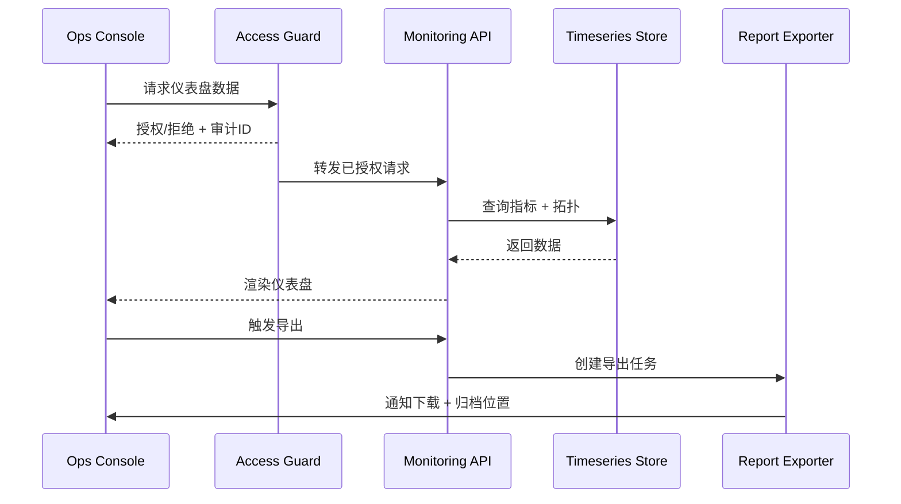

scn_id: SCN-OPS-SYSTEM-MONITORING-DASHBOARD-001
title: 运维仪表盘巡检与可视化
status: Draft
version: v0.1.0
owners:
  - name: Matrix Ops
    role: Platform Ops Lead
    contact: ops@artisan-cloud.com
  - name: Iris Chen
    role: Observability Steward
    contact: observability@artisan-cloud.com
domains: [ops]
layers: [ops, service]
repos:
  - key: powerx
    scope: core-platform
    responsibility: 指标查询 API、拓扑数据、导出管道与权限审计
related_usecases:
  - doc_id: UC-OPS-MONITORING-DASHBOARD-001
    layer: ops
    domain: ops
last_reviewed_at: 2025-11-05

---

# Executive Summary

运维人员需要在统一控制台查看租户插件的健康态势、历史性能与实例拓扑，并在巡检后导出报告留档。本子场景确保仪表盘数据延迟 < 1 分钟，支持租户/插件/实例筛选、拓扑视图、导出文件与巡检记录，同时具备严格的权限与审计治理。

# Scope & Guardrails

- **In Scope**：指标查询 API、拓扑结构渲染、权限隔离、巡检报告导出、巡检结论留档。
- **Out of Scope**：插件自定义可视化组件、跨场景 SLA 赔偿报告、第三方 BI 集成。
- **Environment & Flags**：`ops-console-monitoring`、`monitoring-report-export`、`observability-topology`；依赖时序数据库、拓扑存储、RBAC、审计服务。

# Participants & Responsibilities

| Scope | Repository | Layer | 责任与交付物 | Owners |
|-------|------------|-------|--------------|--------|
| core-platform | powerx | service | 指标查询、拓扑服务、导出任务、API 安全控制 | Matrix Ops（Platform Ops Lead / ops@artisan-cloud.com） |
| ops-tooling | powerx | ops | 控制台 UI、巡检流程、访问审计与报告归档 | Iris Chen（Observability Steward / observability@artisan-cloud.com） |

# End-to-End Flow

1. **Stage 1 – 访问校验**：运维登录控制台，请求通过 RBAC 与租户权限校验，生成审计记录。
2. **Stage 2 – 指标查询**：API 从时序库读取 CPU、内存、响应时间、错误率等指标，应用聚合与缓存。
3. **Stage 3 – 拓扑渲染**：拉取实例拓扑、依赖关系，渲染拓扑视图并展示告警/健康状态。
4. **Stage 4 – 巡检记录**：运维记录巡检结论、异常备注、后续动作，存入巡检记录库。
5. **Stage 5 – 导出归档**：触发导出任务生成 CSV/PNG，通知运维下载并自动归档。

# Key Interactions & Contracts

- **APIs**：`GET /ops/monitoring/dashboard`、`POST /ops/monitoring/export`、`POST /ops/monitoring/inspection-notes`.
- **Configs / Schemas**：`config/monitoring/dashboard_widgets.yaml`、`docs/standards/_shared/downstream-readonly-setup.md`（权限治理要点）。
- **Security / Compliance**：所有访问经 `ops_access_guard` 校验，敏感指标脱敏，导出文件需签名验证与生命周期管理。

# Usecase Links

- `UC-OPS-MONITORING-DASHBOARD-001` — 运维仪表盘巡检与报告归档。

# Acceptance Criteria

1. 仪表盘刷新延迟 < 60 秒，拓扑视图加载 P95 < 3 秒。
2. 导出任务成功率 ≥ 99%，失败自动重试并提示运维。
3. 未授权访问被拒绝并记录审计，违规访问触发安全通知。

# Telemetry & Ops

- 指标：`monitoring.dashboard.latency_p95`、`monitoring.dashboard.render_total`、`monitoring.export.success_total`、`monitoring.audit.denied_total`.
- 告警阈值：接口错误率 >2%/5 分钟触发 P1；导出失败率 >5%/日触发 P2。
- 观测来源：Grafana《Ops Console / Monitoring Dashboard》、审计中心、导出任务报表。

# Open Issues & Follow-ups

| 风险/事项 | 影响范围 | 负责人 | ETA |
|-----------|----------|--------|-----|
| 指标覆盖存在盲区 | 巡检无法发现潜在问题 | Matrix Ops | 2025-11-20 |
| 导出任务高峰积压 | 报告延迟、用户体验差 | Iris Chen | 2025-11-25 |

# Appendix

- `docs/meta/scenarios/powerx/core-platform/runtime-ops/system-monitoring-and-alerting/primary.md`
- `docs/usecases-seeds/SCN-OPS-SYSTEM-MONITORING-001/UC-OPS-MONITORING-DASHBOARD-001.md`
