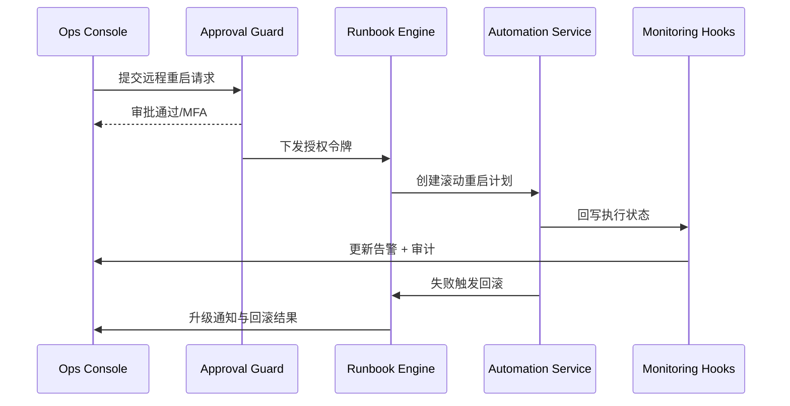

scn_id: SCN-OPS-SYSTEM-MONITORING-REMOTE-RESTART-001
title: 告警驱动远程重启
status: Draft
version: v0.1.0
owners:
  - name: Matrix Ops
    role: Platform Ops Lead
    contact: ops@artisan-cloud.com
  - name: Iris Chen
    role: Observability Steward
    contact: observability@artisan-cloud.com
domains: [ops]
layers: [ops, service]
repos:
  - key: powerx
    scope: core-platform
    responsibility: 审批与 RBAC、Runbook 编排、自动化执行、审计上报
related_usecases:
  - doc_id: UC-OPS-MONITORING-REMOTE-RESTART-001
    layer: ops
    domain: ops
last_reviewed_at: 2025-11-05

---

# Executive Summary

当严重告警出现时，运维或租户管理员需要在告警上下文中一键发起远程重启，系统自动完成审批、滚动重启、健康验证、回滚与审计。本子场景聚焦审批链、Runbook 模板、自动化执行与失败升级，目标是在 5 分钟内完成恢复并保持可追溯。

# Scope & Guardrails

- **In Scope**：告警认领、审批校验、Runbook 生成、滚动重启、健康探针、回滚与升级通知。
- **Out of Scope**：跨区域灾备切换、插件代码修复、手工 SSH 操作流程。
- **Environment & Flags**：`remote-ops-automation`、`monitoring-service`、`ops-approval-center`；依赖审批中心、Runbook 引擎、自动化服务、监控探针。

# Participants & Responsibilities

| Scope | Repository | Layer | 责任与交付物 | Owners |
|-------|------------|-------|--------------|--------|
| core-platform | powerx | service | 审批校验、Runbook 模板、自动化调用、健康探针结果回写 | Matrix Ops（Platform Ops Lead / ops@artisan-cloud.com） |
| ops-tooling | powerx | ops | 告警控制台操作、审批工作流、执行状态展示、审计报表 | Iris Chen（Observability Steward / observability@artisan-cloud.com） |

# End-to-End Flow

1. **Stage 1 – 告警认领与审批**：值班运维在告警详情中发起远程重启，请求通过 RBAC、MFA 与审批中心校验。
2. **Stage 2 – Runbook 生成**：Runbook 引擎加载模板，生成滚动批次、等待窗口、健康验证步骤。
3. **Stage 3 – 执行与监控**：自动化服务依次重启实例，执行健康探针，记录执行状态。
4. **Stage 4 – 状态回写**：执行结果回写告警中心与审计仓；成功时关闭告警并输出恢复时间。
5. **Stage 5 – 回滚与升级**：若健康探针失败，立即执行回滚并将告警升级为 P0，通知人工值班继续处理。

# Key Interactions & Contracts

- **APIs / Events**：`POST /ops/alerts/{alert_id}/remote-restart`、`POST /automation/restart`、`POST /automation/rollback`、`EVENT monitoring.restart.status`.
- **Configs / Schemas**：`config/automation/runbooks/remote_restart.yaml`、`docs/standards/powerx/backend/integration/06_gateway/EventBus_and_Message_Fabric.md`.
- **Security / Compliance**：审批需双人确认与 MFA，操作全程审计；Runbook 执行日志保留 180 天；失败升级强制通知安全值班。

# Usecase Links

- `UC-OPS-MONITORING-REMOTE-RESTART-001` — 告警驱动远程重启与回滚。

# Acceptance Criteria

1. 审批通过后 1 分钟内启动自动化重启，成功率 ≥ 95%，平均恢复时间 ≤ 5 分钟。
2. 失败路径触发回滚并升级告警，P0 通知在 1 分钟内送达所有值班渠道。
3. 审计日志记录审批人、执行人、Runbook ID、实例列表、状态与耗时。

# Telemetry & Ops

- 指标：`monitoring.remote_restart.trigger_total`、`monitoring.remote_restart.success_total`、`monitoring.remote_restart.failure_total`、`monitoring.remote_restart.rollback_total`, `monitoring.remote_restart.mttr`.
- 告警阈值：失败率 >5%/日触发 P0；审批耗时 P95 >2 分钟触发 P1。
- 观测来源：Grafana《Automation / Remote Actions》、审批中心报表、审计日志。

# Open Issues & Follow-ups

| 风险/事项 | 影响范围 | 负责人 | ETA |
|-----------|----------|--------|-----|
| 健康探针覆盖不足 | 回滚触发过晚 | Matrix Ops | 2025-11-24 |
| 审批链冗长导致延迟 | MTTR 超标 | Iris Chen | 2025-11-21 |

# Appendix

- `docs/meta/scenarios/powerx/core-platform/runtime-ops/system-monitoring-and-alerting/primary.md`
- `docs/usecases-seeds/SCN-OPS-SYSTEM-MONITORING-001/UC-OPS-MONITORING-REMOTE-RESTART-001.md`
