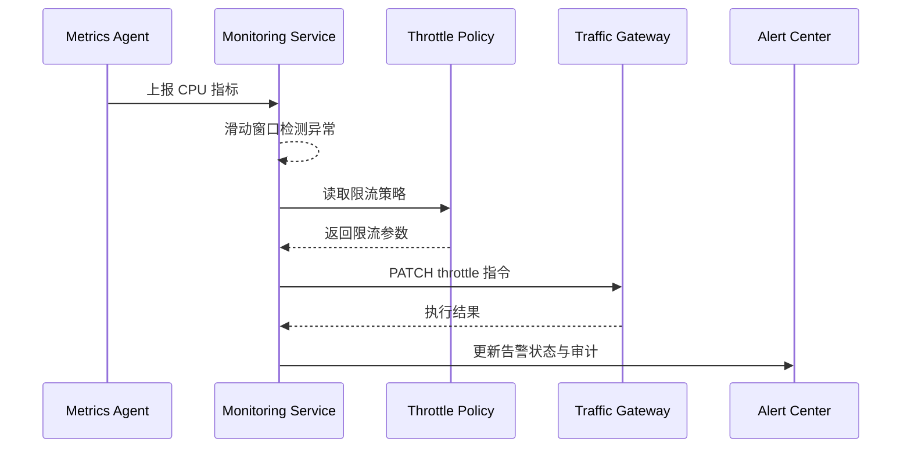

scn_id: SCN-OPS-SYSTEM-MONITORING-THROTTLE-001
title: CPU 异常自动限流
status: Draft
version: v0.1.0
owners:
  - name: Matrix Ops
    role: Platform Ops Lead
    contact: ops@artisan-cloud.com
  - name: Iris Chen
    role: Observability Steward
    contact: observability@artisan-cloud.com
domains: [ops]
layers: [service, ops]
repos:
  - key: powerx
    scope: core-platform
    responsibility: 指标采集、异常检测、限流编排、告警回写
related_usecases:
  - doc_id: UC-OPS-MONITORING-THROTTLE-001
    layer: service
    domain: ops
last_reviewed_at: 2025-11-05

---

# Executive Summary

当插件实例 CPU 持续飙升时，平台需要在 30 秒内触发自动限流，将并发控制在可接受范围，避免异常扩散到整租户。本子场景涵盖指标采集、阈值策略、限流指令执行以及告警回写，确保自动化处置可审计、可回滚，并给运维提供解除或升级的路径。

# Scope & Guardrails

- **In Scope**：CPU 指标聚合、滑动窗口异常检测、租户/插件限流策略、流量网关限流 API、告警状态同步与审计。
- **Out of Scope**：自适应/机器学习阈值训练、插件内自定义 CPU 监控、网络层或 CDN 级别限流。
- **Environment & Flags**：`monitoring-service`、`ops-throttle-automation`、`alert-gateway-v2`；依赖指标代理、策略存储、流量网关、告警中心。

# Participants & Responsibilities

| Scope | Repository | Layer | 责任与交付物 | Owners |
|-------|------------|-------|--------------|--------|
| core-platform | powerx | service | 指标采集、异常检测、限流调度与执行状态回写 | Matrix Ops（Platform Ops Lead / ops@artisan-cloud.com） |
| ops-tooling | powerx | ops | 策略配置治理、告警模板、控制台解除与误判反馈 | Iris Chen（Observability Steward / observability@artisan-cloud.com） |

# End-to-End Flow

1. **Stage 1 – 指标采集**：指标代理按 10 秒间隔上报 CPU、调用量等数据并写入监控服务。
2. **Stage 2 – 异常判定**：监控服务基于滑动窗口检测连续 3 个周期超阈值事件，结合租户策略决定是否限流。
3. **Stage 3 – 限流执行**：调度器调用流量网关设置新的并发上限，确保幂等并监控执行反馈。
4. **Stage 4 – 状态广播**：告警中心更新为“自动处置中”，将限流原因、建议和后续操作告知运维与插件责任人。
5. **Stage 5 – 恢复或升级**：CPU 回落后自动解除限流；若执行失败或误判，运维可手动解除并升级告警。

# Key Interactions & Contracts

- **APIs / Events**：`STREAM monitoring.cpu.sampled`、`GET /internal/monitoring/policy/throttle`、`PATCH /internal/gateway/throttle`、`EVENT monitoring.alert.updated`.
- **Configs / Schemas**：`config/monitoring/thresholds.yaml`、`docs/standards/powerx/backend/integration/06_gateway/EventBus_and_Message_Fabric.md`.
- **Security / Compliance**：限流操作需记录审计、携带租户信息；策略修改需双人审批；告警通知遵循 RBAC。

# Usecase Links

- `UC-OPS-MONITORING-THROTTLE-001` — CPU 异常触发自动限流。

# Acceptance Criteria

1. CPU 超阈值 30 秒内启动限流，执行延迟 ≤ 30 秒，成功率 ≥ 95%。
2. 限流动作写入审计并同步到告警中心，运维可查看原因与解除记录。
3. 限流失败自动触发二次告警并升级为 P1，同时提供手动回滚路径。

# Telemetry & Ops

- 指标：`monitoring.throttle.trigger_total`、`monitoring.throttle.success_total`、`monitoring.throttle.failure_total`、`monitoring.throttle.mttr`.
- 告警阈值：限流失败率 >5%/5 分钟触发 P1；误判反馈 >3 次/日触发治理任务。
- 观测来源：Grafana《Runtime Ops / Auto Throttle》、告警中心限流面板、审计日志。

# Open Issues & Follow-ups

| 风险/事项 | 影响范围 | 负责人 | ETA |
|-----------|----------|--------|-----|
| 阈值敏感度需 A/B 调参 | 误限流导致业务抖动 | Matrix Ops | 2025-11-12 |
| 流量网关限流接口压测不足 | 高峰期响应延迟 | Iris Chen | 2025-11-18 |

# Appendix

- `docs/meta/scenarios/powerx/core-platform/runtime-ops/system-monitoring-and-alerting/primary.md`
- `docs/usecases-seeds/SCN-OPS-SYSTEM-MONITORING-001/UC-OPS-MONITORING-THROTTLE-001.md`
