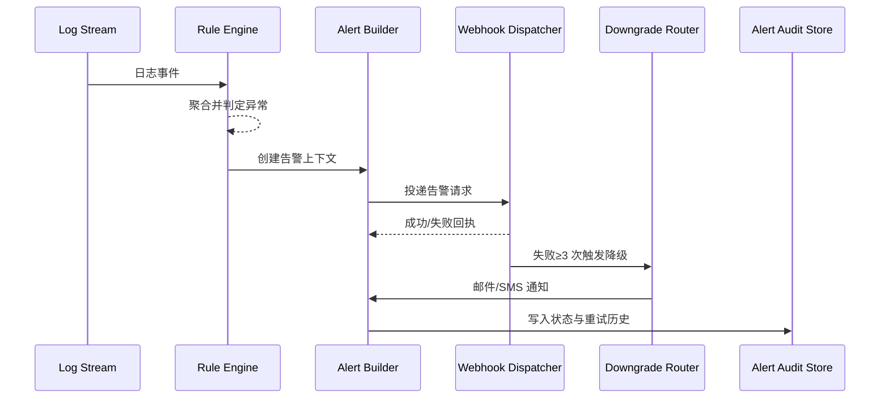

scn_id: SCN-OPS-SYSTEM-MONITORING-WEBHOOK-001
title: 日志异常 Webhook 告警
status: Draft
version: v0.1.0
owners:
  - name: Matrix Ops
    role: Platform Ops Lead
    contact: ops@artisan-cloud.com
  - name: Iris Chen
    role: Observability Steward
    contact: observability@artisan-cloud.com
domains: [ops]
layers: [service, ops]
repos:
  - key: powerx
    scope: core-platform
    responsibility: 日志规则引擎、告警构建、Webhook 投递与降级策略
related_usecases:
  - doc_id: UC-OPS-MONITORING-WEBHOOK-001
    layer: service
    domain: ops
last_reviewed_at: 2025-11-05

---

# Executive Summary

监控服务需在插件日志出现连续错误或安全事件时，于 1 分钟内生成告警并通过 Webhook 推送到外部告警平台，同时支持重试与降级渠道。本子场景围绕规则解析、告警构建、Webhook 投递、降级通知与审计报表，保障告警及时送达并可追踪。

# Scope & Guardrails

- **In Scope**：日志规则管理、滑动窗口检测、Webhook 投递、重试与降级、告警审计。
- **Out of Scope**：规则配置 UI、第三方平台内部工单流程、离线日志批量回放。
- **Environment & Flags**：`monitoring-service`、`alert-gateway-v2`、`webhook-delivery-fallback`；依赖日志采集器、告警中心、邮件/SMS 通道。

# Participants & Responsibilities

| Scope | Repository | Layer | 责任与交付物 | Owners |
|-------|------------|-------|--------------|--------|
| core-platform | powerx | service | 日志规则解析、告警构建、Webhook 投递与重试 | Matrix Ops（Platform Ops Lead / ops@artisan-cloud.com） |
| ops-tooling | powerx | ops | 降级通道治理、告警中心状态、审计报表 | Iris Chen（Observability Steward / observability@artisan-cloud.com） |

# End-to-End Flow

1. **Stage 1 – 日志采集**：日志代理将插件结构化日志写入集中服务。
2. **Stage 2 – 规则检测**：规则引擎按租户聚合，识别 5 分钟内错误/安全关键字突增。
3. **Stage 3 – 告警构建**：生成告警事件，附带租户、插件、摘要、建议操作、Trace 信息。
4. **Stage 4 – Webhook 投递**：调用 Webhook 投递器，执行签名、重试、延迟控制，写入状态。
5. **Stage 5 – 降级与审计**：连续失败 3 次触发降级（邮件/SMS），所有结果写入审计与告警中心。

# Key Interactions & Contracts

- **APIs / Events**：`STREAM logs.plugin.*`、`POST /alerts/webhook`、`EVENT monitoring.alert.updated`、`POST /alerts/fallback/email`.
- **Configs / Schemas**：`config/log_rules/*.yaml`、`docs/standards/powerx/backend/integration/06_gateway/EventBus_and_Message_Fabric.md`.
- **Security / Compliance**：Webhook 需 HMAC 签名与防重放；降级通知需记录审计；敏感日志字段按租户隔离。

# Usecase Links

- `UC-OPS-MONITORING-WEBHOOK-001` — 日志异常触发 Webhook 告警。

# Acceptance Criteria

1. 规则命中后 1 分钟内创建告警并投递 Webhook，成功率 ≥ 97%，累计 ≥ 99%。
2. Webhook 连续失败 3 次自动降级，降级通知成功率 ≥ 99%，状态在告警中心清晰可见。
3. 审计存储包含完整重试历史，可供追踪与报表导出。

# Telemetry & Ops

- 指标：`monitoring.webhook.delivery_success_rate`、`monitoring.webhook.retry_total`、`monitoring.alert.downgrade_total`。
- 告警阈值：Webhook 成功率 <95%/15 分钟触发 P1；降级次数 >20/日触发治理任务。
- 观测来源：Grafana《Alert Delivery》、Ops 告警中心、`reports/_state/ops/monitoring/*.json`。

# Open Issues & Follow-ups

| 风险/事项 | 影响范围 | 负责人 | ETA |
|-----------|----------|--------|-----|
| 规则噪声导致告警风暴 | 值班负荷增加 | Matrix Ops | 2025-11-16 |
| Webhook 配置缺乏自检 | 告警投递失败 | Iris Chen | 2025-11-18 |

# Appendix

- `docs/meta/scenarios/powerx/core-platform/runtime-ops/system-monitoring-and-alerting/primary.md`
- `docs/usecases-seeds/SCN-OPS-SYSTEM-MONITORING-001/UC-OPS-MONITORING-WEBHOOK-001.md`
