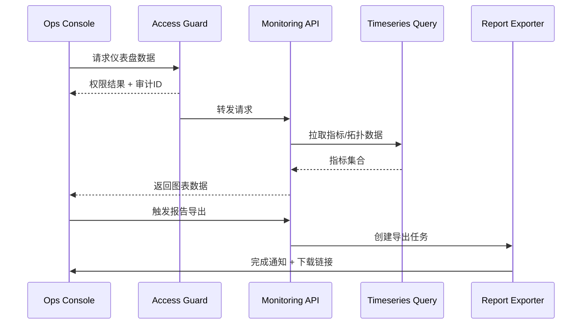

doc_id: UC-OPS-MONITORING-DASHBOARD-001
scn_id: SCN-OPS-SYSTEM-MONITORING-001
title: 运维仪表盘巡检与报告归档
status: Draft
version: v0.1.0
repo_key: powerx
scope: powerx
layer: ops
domain: ops
scenario_title: "PowerX 系统监控与告警"
owners:
  - name: Matrix Ops
    role: Platform Ops Lead
    contact: ops@artisan-cloud.com
  - name: Iris Chen
    role: Observability Steward
    contact: observability@artisan-cloud.com
contributors: []
linked_requirements:
  - SCN-OPS-SYSTEM-MONITORING-001-B
code_refs:
  - repo: powerx
    path: apps/ops-console/pages/monitoring/dashboard.vue
    description: 运维仪表盘视图、指标图表与实例拓扑组件
  - repo: powerx
    path: internal/monitoring/query/timeseries_repository.go
    description: 指标查询、聚合与时间窗口过滤
  - repo: powerx
    path: internal/iam/policy/ops_access_guard.go
    description: 运维权限校验、租户隔离与访问审计
feature_flags:
  - ops-console-monitoring
  - monitoring-report-export
  - observability-topology
optional: false
last_reviewed_at: 2025-11-05

---

# Usecase Overview

- **业务目标**：为运维提供统一的插件健康仪表盘、拓扑视图与巡检报告导出，确保在 1 分钟内获取最新指标并支撑跨租户对比。
- **成功度量**：仪表盘刷新延迟 < 60 秒；巡检报告导出成功率 ≥ 99%；权限拒绝率 100% 命中未授权访问；拓扑视图加载时间 P95 < 3 秒。
- **场景关联**：负责主场景 Stage 4 的可视化、巡检与结论沉淀，为告警处置与领导层汇总提供可追溯证据。

> 通过集中可视化与导出能力，提升巡检效率与SLA透明度，降低重复沟通成本。

# Context & Assumptions

- **前置条件**
  - `ops-console-monitoring`, `monitoring-report-export` Feature Flag 已启用。
  - 指标、日志、事件均写入时序库与日志仓，可按租户/插件/实例维度查询。
  - Ops 控制台接入统一认证与 RBAC，具备租户隔离策略。
  - 导出服务具备异步处理与通知能力，默认导出 CSV/PNG。
- **输入/输出**
  - 输入：指标查询参数、租户与插件筛选条件、时间范围、导出格式。
  - 输出：仪表盘图表、实例拓扑、巡检报告文件、访问审计条目。
- **边界**
  - 不覆盖租户自定义指标小组件；仅提供平台标准指标。
  - 导出格式默认 CSV/PNG，其他格式通过扩展任务实现。
  - 不负责生成 SLA 赔偿报告，另有商务系统处理。

# Solution Blueprint

## 体系分解

| 层 | 模块 | 责任 | 代码入口 |
|----|------|------|---------|
| 查询层 | `internal/monitoring/query/timeseries_repository.go` | 多指标查询、聚合、跨度校验、缓存命中 | `services/monitoring/query` |
| API 层 | `internal/api/ops/monitoring_controller.go` | 暴露仪表盘接口、权限校验、导出任务触发 | `services/api/ops` |
| UI 层 | `apps/ops-console/pages/monitoring/dashboard.vue` | 指标图表、实例拓扑、筛选器、报告导出入口 | `apps/ops-console` |
| 权限层 | `internal/iam/policy/ops_access_guard.go` | 角色/租户校验、敏感指标掩码、审计写入 | `services/iam` |
| 导出层 | `internal/monitoring/export/report_generator.go` | 生成巡检报告、异步队列、通知与归档 | `services/monitoring/export` |

## 流程与时序

1. **Step 1 – 权限校验**：控制台请求先通过 `ops_access_guard` 校验角色、租户权限，生成审计条目。
2. **Step 2 – 指标查询**：API 调用查询层获取 CPU、内存、响应时间、错误率等指标，应用缓存与聚合窗口。
3. **Step 3 – 实例拓扑**：根据部署信息拉取实例列表、依赖关系，渲染拓扑视图。
4. **Step 4 – 导出报告**：用户点击导出触发异步任务，生成报告并推送通知，写入报告归档表。
5. **Step 5 – 巡检记录**：运维填写巡检结论，写回巡检记录表，供后续稽核。

# Contracts & Interfaces

- **REST / GraphQL**
  - `GET /ops/monitoring/dashboard?tenant_id=&plugin_id=&range=` — 返回指标、实例、事件摘要。
  - `POST /ops/monitoring/export` — 创建导出任务，支持 `csv`, `png` 格式。
- **数据源**
  - `timeseries.metrics` 表/Topic（Prometheus/ClickHouse）用于指标聚合。
  - `ops_topology_nodes`、`ops_topology_edges` 存储实例与依赖关系。
- **权限与审计**
  - `ops_access_guard` 读取 `iam_roles`, `tenant_permissions`，写入 `audit_logs`.
- **脚本**
  - `scripts/workflows/monitoring-dashboard-regression.mjs` — 回归巡检脚本。

# Implementation Checklist

| 项目 | 描述 | 完成状态 | 负责人 |
|------|------|----------|--------|
| 权限矩阵 | 定义角色与租户隔离策略、编写访问审计 | [ ] | Matrix Ops |
| 指标查询优化 | 引入缓存、多分辨率查询、防止 N+1 查询 | [ ] | Iris Chen |
| 仪表盘组件 | 构建图表、拓扑视图、指标空状态、加载态 | [ ] | Iris Chen |
| 报告导出 | 实现异步导出、通知、归档存储与清理 | [ ] | Matrix Ops |
| 巡检记录 | 增加巡检结论表单、历史记录列表、过滤器 | [ ] | Iris Chen |

# Testing Strategy

- **单元**：权限守卫、指标查询参数校验、导出任务状态机、拓扑数据转换。
- **集成**：模拟多个租户访问，验证权限隔离、指标缓存命中、导出通知。
- **端到端**：执行 meta 文档用例 B-1 与 B-2，确认巡检流程与权限阻断。
- **性能**：压测仪表盘接口 100 RPS，验证响应延迟与缓存效果；导出 50 份报告并测量处理时间。

# Observability & Ops

- **指标**：`monitoring.dashboard.latency_p95`, `monitoring.dashboard.render_total`, `monitoring.export.success_total`, `monitoring.audit.denied_total`.
- **日志**：记录 `tenant_uuid`, `plugin_id`, `user_id`, `role`, `resource`, `action`, `result`, `latency_ms`。
- **告警**：仪表盘接口错误率 >2%/5 分钟触发 P1；导出失败率 >5% 触发 P2。
- **仪表板**：Grafana《Ops Console / Monitoring Dashboard》、Datadog `ops_console.*`。

# Rollback & Failure Handling

- **回滚策略**：关闭 `ops-console-monitoring` Flag 或退回旧版仪表盘构建；保留导出历史以供回滚对比。
- **补救措施**：当指标缺失时显示占位并提示数据采集状态；通知租户管理员；手动提供巡检模板。
- **数据校验**：执行 `scripts/workflows/monitoring-verify-dashboard.mjs` 对比指标源与 UI 数据。

# Follow-ups & Risks

| 风险/事项 | 影响 | 缓解方案 | 负责人 | ETA |
|-----------|------|----------|--------|-----|
| 指标覆盖不足导致盲区 | 巡检无法发现异常 | 扩充指标目录、引入自定义指标插件 | Matrix Ops | 2025-11-20 |
| 导出任务积压 | 导出耗时长、通知延迟 | 增加队列消费者、按租户限速、提供进度提示 | Iris Chen | 2025-11-25 |

# References & Links

- 主场景：`docs/scenarios/runtime-ops/SCN-OPS-SYSTEM-MONITORING-001.md`
- 背景材料：`docs/meta/scenarios/powerx/core-platform/runtime-ops/system-monitoring-and-alerting/primary.md`
- 权限规范：`docs/standards/_shared/downstream-readonly-setup.md`
