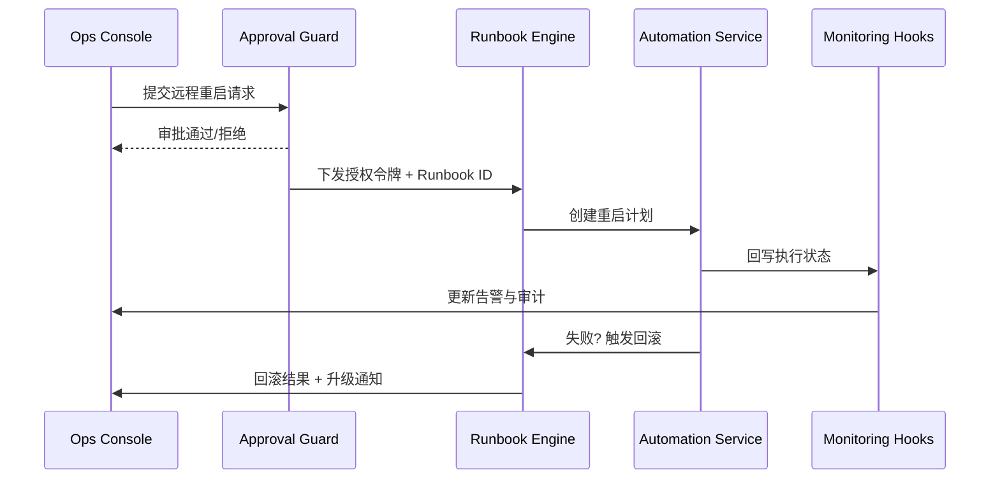

doc_id: UC-OPS-MONITORING-REMOTE-RESTART-001
scn_id: SCN-OPS-SYSTEM-MONITORING-001
title: 告警驱动远程重启与回滚
status: Draft
version: v0.1.0
repo_key: powerx
scope: powerx
layer: ops
domain: ops
scenario_title: "PowerX 系统监控与告警"
owners:
  - name: Matrix Ops
    role: Platform Ops Lead
    contact: ops@artisan-cloud.com
  - name: Iris Chen
    role: Observability Steward
    contact: observability@artisan-cloud.com
contributors: []
linked_requirements:
  - SCN-OPS-SYSTEM-MONITORING-001-D
code_refs:
  - repo: powerx
    path: internal/automation/remote_restart_workflow.go
    description: 远程重启编排、滚动策略与健康探针校验
  - repo: powerx
    path: internal/iam/policy/remote_action_guard.go
    description: 操作审批、RBAC、MFA 校验与审计
  - repo: powerx
    path: pkg/automation/runbook_engine.go
    description: 自动化 Runbook 编排、分支处理与回滚钩子
feature_flags:
  - remote-ops-automation
  - monitoring-service
  - ops-approval-center
optional: false
last_reviewed_at: 2025-11-05

---

# Usecase Overview

- **业务目标**：当严重告警触发时，运维或租户管理员可在告警详情页发起远程重启，系统自动完成审批、滚动重启、健康验证与回滚，目标 MTTR < 5 分钟。
- **成功度量**：远程重启成功率 ≥ 95%；平均恢复时间 ≤ 5 分钟；审批耗时 P95 < 2 分钟；失败回滚率 100%。
- **场景关联**：承担主场景 Stage 3/4 的自动化处置与恢复流程，收敛标准 Runbook 并保障审计追踪。

> 标准化的远程重启流程让值班人员可在统一界面执行恢复动作，避免手工 SSH 与误操作风险。

# Context & Assumptions

- **前置条件**
  - `remote-ops-automation`, `ops-approval-center` Feature Flag 启用。
  - 告警中心支持认领与审批流程，审批链至少包含发起人、审批人、观察者。
  - 插件支持滚动重启策略（优雅下线、实例探测、超时回滚）。
  - 自动化服务具备访问目标实例的凭据与网络通道。
- **输入/输出**
  - 输入：告警上下文、租户/插件信息、审批结果、Runbook 模板。
  - 输出：重启执行计划、实例状态、健康探针结果、审计日志、回滚动作。
- **边界**
  - 不覆盖跨区域灾备切流；多区域回滚另有 Runbook。
  - 不负责插件代码修复，只执行重启与回滚。
  - 审批策略由 Ops 治理团队维护，本用例只消费审批结果。

# Solution Blueprint

## 体系分解

| 层 | 模块 | 责任 | 代码入口 |
|----|------|------|---------|
| 审批层 | `internal/iam/policy/remote_action_guard.go` | 验证 RBAC、MFA、审批票据，输出授权令牌 | `services/iam` |
| 编排层 | `pkg/automation/runbook_engine.go` | 加载 Runbook、处理分支、触发回滚钩子 | `pkg/automation` |
| 执行层 | `internal/automation/remote_restart_workflow.go` | 调用编排服务，按照滚动策略重启实例并监控探针 | `services/automation` |
| 监控层 | `internal/monitoring/hooks/restart_status_sink.go` | 采集重启状态、探针结果、上报监控与审计 | `services/monitoring/hooks` |
| 控制台 | `apps/ops-console/pages/alerts/detail.vue` | 告警详情、审批流、远程重启按钮、状态更新 | `apps/ops-console` |

## 流程与时序

1. **Step 1 – 告警认领与审批**：值班运维在告警详情中点击“远程重启”，审批中心校验权限并触发审批流。
2. **Step 2 – Runbook 编排**：审批通过后，Runbook 引擎加载模板，生成滚动重启计划（批次、等待时间、探针校验）。
3. **Step 3 – 执行重启**：自动化服务按计划停止/启动实例，调用健康探针 API，记录每一步状态。
4. **Step 4 – 状态回写**：执行结果回写告警中心、监控服务与审计仓；成功则关闭告警，失败则进入回滚。
5. **Step 5 – 回滚与升级**：失败时执行回滚策略（恢复旧实例/配置），并将告警升级为 P0，通知人工跟进。

# Contracts & Interfaces

- **Inbound**
  - `POST /ops/alerts/{alert_id}/remote-restart` — 触发重启，携带审批票据、备注。
  - `EVENT monitoring.alert.escalated` — 告警升级触发自动审批与 Runbook。
- **Outbound**
  - `POST /automation/restart` — 参数包含 `tenant_id`, `plugin_id`, `instances`, `batch_size`, `health_check`.
  - `POST /automation/rollback` — 回滚旧实例或配置。
  - `EVENT monitoring.restart.status` — 状态 `PENDING`, `IN_PROGRESS`, `SUCCEEDED`, `FAILED`, `ROLLED_BACK`.
- **脚本/配置**
  - `config/automation/runbooks/remote_restart.yaml` — 标准 Runbook 模板。
  - `scripts/workflows/monitoring-remote-restart-smoke.mjs` — 沙箱演练脚本。

# Implementation Checklist

| 项目 | 描述 | 完成状态 | 负责人 |
|------|------|----------|--------|
| 审批集成 | 接入审批中心、MFA、审计记录 | [ ] | Iris Chen |
| Runbook 模板 | 编写滚动重启与回滚模板、参数化支持 | [ ] | Matrix Ops |
| 自动化执行 | 实现批次控制、健康探针、失败重试 | [ ] | Matrix Ops |
| 控制台体验 | 告警详情页展示状态、审批、执行进度 | [ ] | Iris Chen |
| 报警升级 | 重启失败自动升级 P0，推送通知 | [ ] | Matrix Ops |

# Testing Strategy

- **单元**：审批票据验证、Runbook 分支逻辑、状态机转换、回滚钩子。
- **集成**：沙箱实例执行重启流程，验证审批、执行、健康校验、回滚。
- **端到端**：执行 meta 文档用例 D-1/D-2，确认成功与失败回滚路径。
- **演练**：每季度执行一次灾备演练，记录成功率与平均耗时。

# Observability & Ops

- **指标**：`monitoring.remote_restart.trigger_total`, `monitoring.remote_restart.success_total`, `monitoring.remote_restart.failure_total`, `monitoring.remote_restart.mfa_latency`, `monitoring.remote_restart.rollback_total`.
- **日志**：记录 `alert_id`, `runbook_id`, `instance_id`, `batch`, `status`, `elapsed_ms`, `approver`.
- **告警**：远程重启失败率 >5%/日触发 P0；审批延迟 >3 分钟触发 P1。
- **仪表板**：Grafana《Automation / Remote Actions》、审计中心审批日志。

# Rollback & Failure Handling

- **回滚策略**：自动化引擎执行 `automation/rollback`，恢复旧实例或切换只读模式；告警升级并通知人工值班。
- **补救措施**：触发手动 Runbook、锁定新请求、通知租户管理员；记录问题工单。
- **数据修复**：运行 `scripts/workflows/monitoring-reconcile-remote-actions.mjs` 校对执行记录与审计日志。

# Follow-ups & Risks

| 风险/事项 | 影响 | 缓解方案 | 负责人 | ETA |
|-----------|------|----------|--------|-----|
| 健康探针覆盖不足 | 回滚前难以及时发现问题 | 扩展探针类型、引入自定义检查 | Matrix Ops | 2025-11-24 |
| 审批延迟影响 MTTR | 告警长时间未处理 | 引入值班自动审批、IM 提醒与超时升级 | Iris Chen | 2025-11-21 |

# References & Links

- 主场景：`docs/scenarios/runtime-ops/SCN-OPS-SYSTEM-MONITORING-001.md`
- 背景材料：`docs/meta/scenarios/powerx/core-platform/runtime-ops/system-monitoring-and-alerting/primary.md`
- Runbook 模板：`config/automation/runbooks/remote_restart.yaml`
