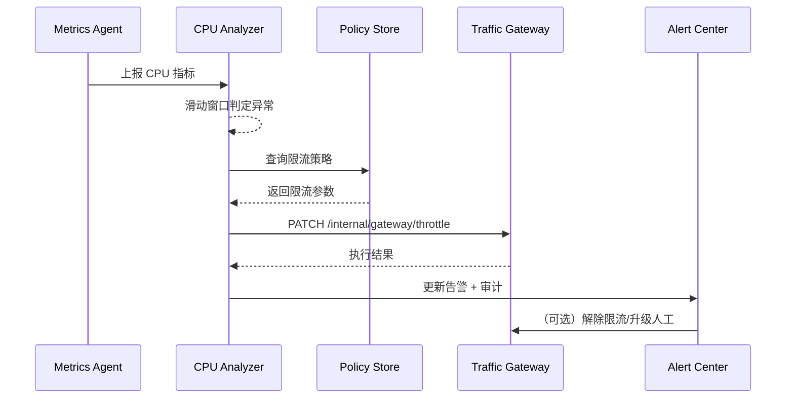

doc_id: UC-OPS-MONITORING-THROTTLE-001
scn_id: SCN-OPS-SYSTEM-MONITORING-001
title: CPU 异常触发自动限流
status: Draft
version: v0.1.0
repo_key: powerx
scope: powerx
layer: service
domain: ops
scenario_title: "PowerX 系统监控与告警"
owners:
  - name: Matrix Ops
    role: Platform Ops Lead
    contact: ops@artisan-cloud.com
  - name: Iris Chen
    role: Observability Steward
    contact: observability@artisan-cloud.com
contributors: []
linked_requirements:
  - SCN-OPS-SYSTEM-MONITORING-001-A
code_refs:
  - repo: powerx
    path: internal/monitoring/analyzer/cpu_anomaly_detector.go
    description: CPU 指标聚合、滑动窗口与阈值评估逻辑
  - repo: powerx
    path: internal/automation/throttle_dispatcher.go
    description: 限流指令生成、并发上限计算与幂等写入
  - repo: powerx
    path: pkg/alerts/notifier.go
    description: 告警通知、状态回写与二次升级策略
feature_flags:
  - monitoring-service
  - ops-throttle-automation
  - alert-gateway-v2
optional: false
last_reviewed_at: 2025-11-05

---

# Usecase Overview

- **业务目标**：在插件 CPU 占用连续 3 个采样周期超阈值时，于 30 秒内触发自动限流，避免异常扩散并向运维/责任人告警。
- **成功度量**：限流执行延迟 ≤ 30 秒；限流后 2 分钟内 CPU 回落至 70% 以下；误限流率 < 1%；限流失败升级告警响应 ≤ 5 分钟。
- **场景关联**：对应主场景 Stage 2/3，承接监控异常检测并驱动自动化处置，保障多租户运行稳定性。

> 自动限流在保持服务可用的同时，减少人工干预频率，为后续远程处置赢得时间。

# Context & Assumptions

- **前置条件**
  - `monitoring-service`、`ops-throttle-automation` Feature Flag 已开启。
  - 指标采集代理以 10 秒频率上报 CPU、内存、调用量等数据，且支持租户/插件维度聚合。
  - 流量网关暴露 `PATCH /internal/gateway/throttle` 接口，支持幂等限流策略。
  - 告警中心配置告警模板《CPU 异常自动限流》，通知运维群与插件责任人。
- **输入/输出**
  - 输入：CPU 指标流、租户与插件元数据、阈值策略、限流策略模板。
  - 输出：限流指令（目标实例、并发上限、持续时长）、告警事件、审计记录、恢复提示。
- **边界**
  - 不负责阈值策略的配置 UI，由 Ops 控制台另行维护。
  - 不覆盖网络层限流（如 CDN、API Gateway），仅限插件实例级别。
  - 当插件无限流能力时，需升级为人工处置，不在本用例范围内自动兜底。

# Solution Blueprint

## 体系分解

| 层 | 模块 | 责任 | 代码入口 |
|----|------|------|---------|
| 采集层 | `internal/monitoring/analyzer/cpu_anomaly_detector.go` | 聚合 CPU 指标、滑动窗口计算、命中阈值后生成告警草案 | `services/monitoring` |
| 策略层 | `internal/monitoring/policy/throttle_policy_store.go` | 按租户/插件加载限流策略、黑白名单、误判容忍阈值 | `services/monitoring/policy` |
| 调度层 | `internal/automation/throttle_dispatcher.go` | 生成限流指令、调用网关 API、记录执行状态 | `services/automation` |
| 通知层 | `pkg/alerts/notifier.go` | 推送告警、检测失败并升级、写入审计 | `pkg/alerts` |
| 控制台 | `ui/ops-console/throttle-history.vue` | 展示限流时间线、手动解除入口、误判反馈 | `apps/ops-console` |

## 流程与时序

1. **Step 1 – 异常检测**：CPU 监控器基于滑动窗口检测连续超阈值事件，构建 Anomaly Payload。
2. **Step 2 – 策略校验**：策略层查询租户/插件的限流策略、黑名单和误判阈值；若命中免限流名单则仅告警不执行。
3. **Step 3 – 自动限流**：调度层调用流量网关 API，设置新的并发上限，并在 5 秒内校验执行结果。
4. **Step 4 – 状态广播**：限流结果写入监控事件总线，告警中心更新状态为“自动处置中”，记录审计。
5. **Step 5 – 恢复/回滚**：若 CPU 回落并达稳态，策略层自动解除限流；误判时运维可在控制台点击“解除限流”。

# Contracts & Interfaces

- **Inbound**
  - `STREAM monitoring.cpu.sampled` — 指标代理推送 CPU 样本，包含租户、插件、实例、使用率。
  - `GET /internal/monitoring/policy/throttle?tenant_uuid=&plugin_id=` — 加载限流策略、容忍阈值。
- **Outbound**
  - `PATCH /internal/gateway/throttle` — 请求体包含 `tenant_uuid`, `plugin_id`, `instance_id`, `max_concurrency`, `ttl_seconds`。
  - `EVENT monitoring.alert.updated` — 状态字段 `AUTO_THROTTLED`、`FAILED`、`RECOVERED`。
- **配置/脚本**
  - `config/monitoring/thresholds.yaml` — 默认阈值与免限流名单。
  - `scripts/workflows/monitoring-throttle-smoke.mjs` — 沙箱压测与限流校验脚本。

# Implementation Checklist

| 项目 | 描述 | 完成状态 | 负责人 |
|------|------|----------|--------|
| 指标采集完善 | 确保采集维度覆盖租户/插件/实例，添加 CPU 上报回放脚本 | [ ] | Matrix Ops |
| 限流策略存储 | 建立策略存储、黑白名单、动态生效机制 | [ ] | Iris Chen |
| 网关接口幂等 | 完成限流接口签名、重试、并发冲突测试 | [ ] | Matrix Ops |
| 告警文案与状态 | 更新告警模板、状态机、误判反馈渠道 | [ ] | Iris Chen |
| 控制台可视化 | 增加限流时间线、手动解除按钮与审计链接 | [ ] | Iris Chen |

# Testing Strategy

- **单元**：滑动窗口算法、阈值配置解析、策略黑名单命中、限流请求幂等。
- **集成**：沙箱环境压测插件实例，验证限流执行、失败重试、解除限流流程。
- **端到端**：执行 meta 文档中用例 A-1、A-2，核对告警升级与恢复流程。
- **非功能**: 压测 500 QPS 指标流，确保检测延迟 < 10 秒；模拟网络超时验证限流接口重试。

# Observability & Ops

- **指标**：`monitoring.throttle.trigger_total`, `monitoring.throttle.success_total`, `monitoring.throttle.failure_total`, `monitoring.throttle.mttr`.
- **日志**：记录 `tenant_uuid`, `plugin_id`, `instance_id`, `max_concurrency`, `decision_reason`, `attempt`.
- **告警**：限流失败连续 2 次触发 P1；误判反馈 >3 次/日触发治理任务。
- **仪表盘**：Grafana《Runtime Ops / Auto Throttle》、告警中心限流面板、审计查询。

# Rollback & Failure Handling

- **回滚策略**：关闭 `ops-throttle-automation` Flag，恢复旧版手动限流；清理自动限流的状态缓存。
- **补救措施**：触发人工 Runbook，手动调整并发上限；发布公告提示租户关注性能。
- **数据修复**：运行 `scripts/workflows/monitoring-reconcile-throttle.mjs` 对账限流事件与审计记录。

# Follow-ups & Risks

| 风险/事项 | 影响 | 缓解方案 | 负责人 | ETA |
|-----------|------|----------|--------|-----|
| 阈值设置过于敏感导致误限流 | 业务抖动、用户体验下降 | 引入自适应阈值、租户自定义权重 | Matrix Ops | 2025-11-12 |
| 网关限流接口响应慢 | 限流延迟超标 | 增加缓存、优化并发调用、预热连接池 | Iris Chen | 2025-11-18 |

# References & Links

- 主场景：`docs/scenarios/runtime-ops/SCN-OPS-SYSTEM-MONITORING-001.md`
- 背景材料：`docs/meta/scenarios/powerx/core-platform/runtime-ops/system-monitoring-and-alerting/primary.md`
- 配置草案：`config/monitoring/thresholds.yaml`
