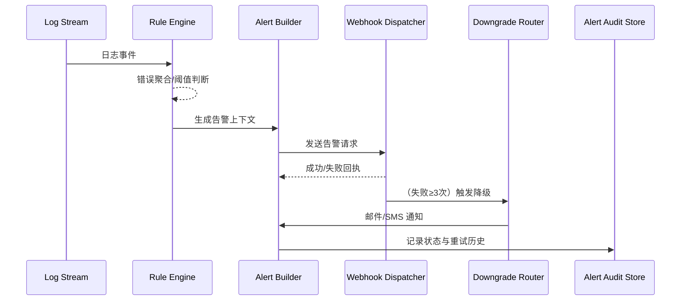

doc_id: UC-OPS-MONITORING-WEBHOOK-001
scn_id: SCN-OPS-SYSTEM-MONITORING-001
title: 日志异常触发 Webhook 告警
status: Draft
version: v0.1.0
repo_key: powerx
scope: powerx
layer: service
domain: ops
scenario_title: "PowerX 系统监控与告警"
owners:
  - name: Matrix Ops
    role: Platform Ops Lead
    contact: ops@artisan-cloud.com
  - name: Iris Chen
    role: Observability Steward
    contact: observability@artisan-cloud.com
contributors: []
linked_requirements:
  - SCN-OPS-SYSTEM-MONITORING-001-C
code_refs:
  - repo: powerx
    path: internal/logs/rules/error_burst_detector.go
    description: 日志规则引擎、滑动窗口与阈值配置解析
  - repo: powerx
    path: internal/alerts/webhook_dispatcher.go
    description: Webhook 投递、重试与签名校验
  - repo: powerx
    path: pkg/alerts/downgrade_router.go
    description: 通道降级策略、通知链路切换与审计
feature_flags:
  - monitoring-service
  - alert-gateway-v2
  - webhook-delivery-fallback
optional: false
last_reviewed_at: 2025-11-05

---

# Usecase Overview

- **业务目标**：检测插件日志中的错误/安全事件，1 分钟内生成告警并通过 Webhook 推送至外部告警平台，保障至少 3 次重试并支持降级通知。
- **成功度量**：Webhook 首次投递成功率 ≥ 97%，累计 ≥ 99%；降级逻辑在 3 次失败内切换到邮件/SMS；告警处理确认率 ≥ 95%。
- **场景关联**：覆盖主场景 Stage 2/3 的异常识别与通知分发，为人工/自动化处置提供上下文。

> 通过规则驱动与降级策略，确保日志异常被及时感知并进入相应的应急流程。

# Context & Assumptions

- **前置条件**
  - `monitoring-service`, `alert-gateway-v2`, `webhook-delivery-fallback` Feature Flag 已启用。
  - 日志采集器写入集中日志服务，支持结构化字段（level、tenant_uuid、plugin_id、trace_id）。
  - 租户配置了 Webhook endpoint、鉴权方式、备用通知通道。
  - 外部告警平台支持 HMAC 验签与重复请求幂等。
- **输入/输出**
  - 输入：日志流、规则配置、租户告警配置、重试策略。
  - 输出：Webhook 请求、失败重试计划、降级邮件/SMS、告警事件状态。
- **边界**
  - 不负责规则配置 UI，由治理团队管理。
  - 不直接落地工单，仅提供 Webhook Payload 以供外部系统创建。
  - 针对离线日志回放的批量生成另有补偿脚本处理。

# Solution Blueprint

## 体系分解

| 层 | 模块 | 责任 | 代码入口 |
|----|------|------|---------|
| 解析层 | `internal/logs/rules/error_burst_detector.go` | 解析规则、滑动窗口、异常聚合 | `services/logs/rules` |
| 告警层 | `internal/alerts/alert_builder.go` | 构建告警事件、设定严重级别、填充上下文 | `services/alerts` |
| 通道路由 | `internal/alerts/webhook_dispatcher.go` | Webhook 投递、重试、签名校验、延迟控制 | `services/alerts` |
| 降级策略 | `pkg/alerts/downgrade_router.go` | 3 次失败后切换邮件/SMS、写入降级状态 | `pkg/alerts` |
| 审计与报表 | `internal/alerts/reporting/alert_audit_repository.go` | 告警状态追踪、审计、报表导出 | `services/alerts/reporting` |

## 流程与时序

1. **Step 1 – 日志解析**：规则引擎订阅日志流，按租户/插件聚合，识别 5 分钟内错误/安全关键字突增。
2. **Step 2 – 告警构建**：生成告警事件，包含租户、插件、摘要、建议操作、关联追踪 ID。
3. **Step 3 – Webhook 投递**：调用 Webhook dispatcher，附带签名头与重试策略，记录尝试次数。
4. **Step 4 – 降级处理**：连续 3 次失败则调用降级路由，切换到邮件/SMS，并标记状态为“降级通知”。
5. **Step 5 – 审计回写**：写入告警审计仓，更新告警中心状态，供运维认领。

# Contracts & Interfaces

- **Inbound**
  - `STREAM logs.plugin.*` — 包含 `level`, `message`, `tenant_uuid`, `plugin_id`, `ts`.
  - `config/log_rules/*.yaml` — 配置规则、关键字、阈值、告警等级。
- **Outbound**
  - `POST <tenant_webhook>` — 带 `X-PowerX-Signature`, `X-PowerX-Alert-ID`, JSON 载荷含租户、插件、错误摘要、建议操作。
  - `POST /alerts/fallback/email`、`POST /alerts/fallback/sms` — 降级通道。
  - `EVENT monitoring.alert.updated` — 状态 `DELIVERED`, `FAILED`, `DOWNGRADED`.
- **脚本**
  - `scripts/workflows/monitoring-webhook-simulator.mjs` — 沙箱 Webhook 模拟器。
  - `scripts/workflows/monitoring-alert-retry.mjs` — 批量重试与修复。

# Implementation Checklist

| 项目 | 描述 | 完成状态 | 负责人 |
|------|------|----------|--------|
| 规则引擎 | 实现错误与安全关键字检测、租户阈值、聚合窗口 | [ ] | Matrix Ops |
| Webhook 投递 | 支持签名生成、指数退避、失败记录 | [ ] | Iris Chen |
| 降级策略 | 邮件/SMS 通道、降级状态、通知模板 | [ ] | Matrix Ops |
| 审计报表 | 建立审计存储、可视化图表、导出脚本 | [ ] | Iris Chen |
| 告警中心集成 | 更新告警 UI 状态、认领流程、备注字段 | [ ] | Iris Chen |

# Testing Strategy

- **单元**：规则解析、滑动窗口计算、签名生成验证、降级切换逻辑。
- **集成**：沙箱日志流触发告警，验证重试、降级、审计写入。
- **端到端**：执行 meta 文档用例 C-1/C-2，确认告警送达与降级流程。
- **可靠性**：模拟 Webhook 超时、HTTP 500、网络抖动，确保重试与降级生效。

# Observability & Ops

- **指标**：`monitoring.webhook.delivery_success_rate`, `monitoring.webhook.retry_total`, `monitoring.alert.downgrade_total`, `monitoring.alert.confirmed_total`.
- **日志**：记录 `alert_id`, `tenant_uuid`, `plugin_id`, `attempt`, `channel`, `status`, `latency_ms`。
- **告警**：Webhook 成功率 <95%/15 分钟触发 P1；降级次数 >20/日触发治理任务。
- **仪表板**：Grafana《Alert Delivery》、Ops 告警中心状态面板。

# Rollback & Failure Handling

- **回滚策略**：关闭 `webhook-delivery-fallback` Flag 恢复旧版告警通道；暂停新规则部署。
- **补救措施**：批量重试失败告警、通知租户检查 Webhook；切换到人工通知流程。
- **数据修复**：运行 `scripts/workflows/monitoring-reconcile-alerts.mjs` 对账告警状态与审计记录。

# Follow-ups & Risks

| 风险/事项 | 影响 | 缓解方案 | 负责人 | ETA |
|-----------|------|----------|--------|-----|
| 规则噪声导致告警风暴 | 值班负荷大、误报 | 引入噪声抑制、动态阈值、聚合策略 | Matrix Ops | 2025-11-16 |
| Webhook 配置不当 | 告警投递失败 | 提供自检脚本、控制台验证、自动提醒 | Iris Chen | 2025-11-18 |

# References & Links

- 主场景：`docs/scenarios/runtime-ops/SCN-OPS-SYSTEM-MONITORING-001.md`
- 背景材料：`docs/meta/scenarios/powerx/core-platform/runtime-ops/system-monitoring-and-alerting/primary.md`
- 事件模型：`docs/standards/powerx/backend/integration/06_gateway/EventBus_and_Message_Fabric.md`
