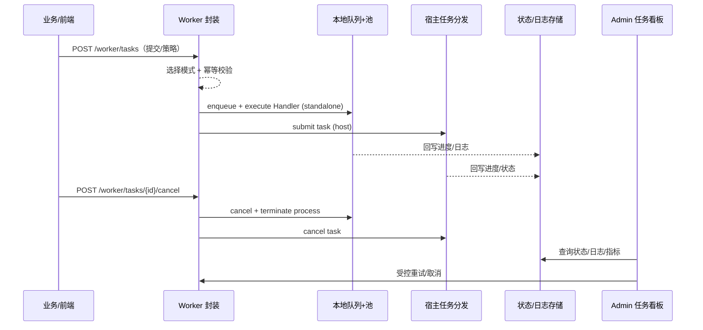

# Positioning & Goals

PowerX 为插件提供统一的异步任务执行层，屏蔽 standalone（本地队列+goroutine 池）与宿主模式（底座任务分发）的差异，确保提交/取消/查询、进度回写、超时/重试、观测与降级一致。面向长耗时任务（下载、转码、数据同步、模型推理等），业务 Handler 仅需实现一次，封装层负责策略与可观测性；PowerX Admin 任务看板则跨租户/插件统一呈现状态、日志与受控的运维操作。
- PowerXPlugin 脚手架生成的插件工程默认内置 Worker 启动模板与 standalone 配置，复用同一 Handler 即可在本地模式跑通异步任务、回写与观测，避免与宿主模式分叉。

# Scope & Guardrails

- **In Scope**：统一 Worker 接口（提交/取消/查询/进度回写）、standalone 队列与池调度、宿主任务分发透传、超时/重试/幂等策略、进程取消、观测/告警、Admin 任务看板、降级/回退策略。
- **Out of Scope**：业务 Handler 内部逻辑、复杂 BPM/长流程建模、宿主底层资源调度实现、计费与商业策略。
- **Environment & Flags**：`worker-facade-v1`、`host-task-dispatcher`、`worker-admin-board`; 依赖配置中心（并发/队列/超时/重试/降级）、任务状态存储、日志与指标管道、审计服务。

# Participants & Responsibilities

| Scope | Repository | Layer | 责任与交付物 | Owners |
|-------|------------|-------|--------------|--------|
| core-platform | powerx | service | Worker 接口与调度器、宿主任务分发适配、任务状态/日志存储、审计 | Michael Hu |
| plugin-ecosystem | powerx-plugin | integration | 插件 Handler/SDK、进度回写实现、子进程/信号管理、模式切换配置 | Michael Hu |

# Core Capabilities

1. 统一 Worker 接口与任务调度：提交/取消/查询、进度回写、超时/重试、幂等策略。
2. 双模式执行抽象：standalone 本地队列+池，与宿主任务分发透传，Handler 复用不分叉。
3. 一致的可观测性与降级：进度/状态/日志/指标、告警、宿主不可用回退或显式失败。
4. Admin 任务看板：跨租户/插件/模式查看状态、日志、告警，并受控执行取消/重试。
5. 脚手架开箱支持：PowerXPlugin 提供双模式启动/配置模板（含 standalone 入口与宿主接入配置），便于本地自验与演示。

# Validation Workflow

1. **Stage 1 – 提交与路由**：业务调用统一接口提交任务，封装层根据运行模式（standalone/宿主）与策略（并发、队列、超时、重试、幂等键）完成校验与路由。
2. **Stage 2 – 执行与回写**：standalone 通过本地队列+goroutine 池执行 Handler；宿主模式透传到底座任务分发；两种模式统一进度/状态回写与日志采集。
3. **Stage 3 – 取消与超时**：收到取消/超时请求后，封装层在两种模式下终止执行（含外部进程），确保幂等回写状态与审计。
4. **Stage 4 – 观测与降级**：指标/日志/告警汇总至观测管道与 Admin 看板；宿主不可用时按策略回退本地或显式失败并记录降级事件。

# Architecture Diagram

# Key Interactions & Contracts

- **APIs / Events**：`POST /worker/tasks`、`GET /worker/tasks/{id}`、`POST /worker/tasks/{id}/cancel`、`PATCH /worker/tasks/{id}/progress`、事件 `worker.task.updated`；宿主任务分发注册/提交/取消接口。
- **Configs / Schemas**：并发/队列/超时/重试/幂等/降级策略配置；任务状态/进度回写 schema；任务看板查询接口与权限模型。
- **Security / Compliance**：租户与插件级 ACL、操作审计（提交/取消/重试/降级）、日志脱敏、回写签名/幂等令牌。

# Related Links

- `UC-OPS-WORKER-UNIFIED-001` — 统一 Worker 提交/取消/查询/回写（service 层，ops 域）
- `SCN-OPS-EVENT-TASKFLOW-001` — 事件与任务流管理（service 层，ops 域）
- `SCN-OPS-SYSTEM-MONITORING-001` — 系统监控与告警（service 层，ops 域）

# Acceptance Criteria

1. 提交/查询/取消接口成功率 ≥99%，请求 p95 延迟 <200ms；任务创建后 2s 内可查询到状态。
2. 进度/状态回写格式在双模式一致；取消/超时在配置 SLA 内终止外部进程并写入审计；重试遵循幂等键与退避策略。
3. Admin 任务看板数据延迟 <1 分钟，支持按租户/插件/模式筛选，受控取消/重试全量审计；降级事件可追溯并可配置策略。

# Telemetry & Ops

- 指标：`worker.queue.depth`、`worker.pool.concurrency_inuse`、`worker.task.success_total`、`worker.task.retry_total`、`worker.task.cancel_latency_ms`、`worker.progress.write_latency_ms`、`worker.degradation.trigger_total`、`worker.admin.query_latency_ms`。
- 告警阈值：队列深度/等待时长超阈；回写失败率 >2%；取消失败/超时；宿主投递失败率 >5% 触发降级告警。
- 观测来源：任务状态存储、日志聚合、Grafana/Datadog 面板、Admin 任务看板。

# Open Issues & Follow-ups

| 风险/事项 | 影响范围 | 负责人 | ETA |
|-----------|----------|--------|-----|
| 宿主降级回退策略对本地资源消耗未设限，可能挤占插件实例 | standalone 资源 | Michael Hu | 2025-10-31 |
| 任务看板日志脱敏策略需与安全组评审 | 安全与合规 | Michael Hu | 2025-11-15 |

# Appendix

- 设计稿：docs/meta/scenarios/powerx/core-platform/runtime-ops/unified-worker-execution/primary.md
- 相关标准：docs/standards/ops/task-sla-matrix.md（若有），配置中心策略文档
