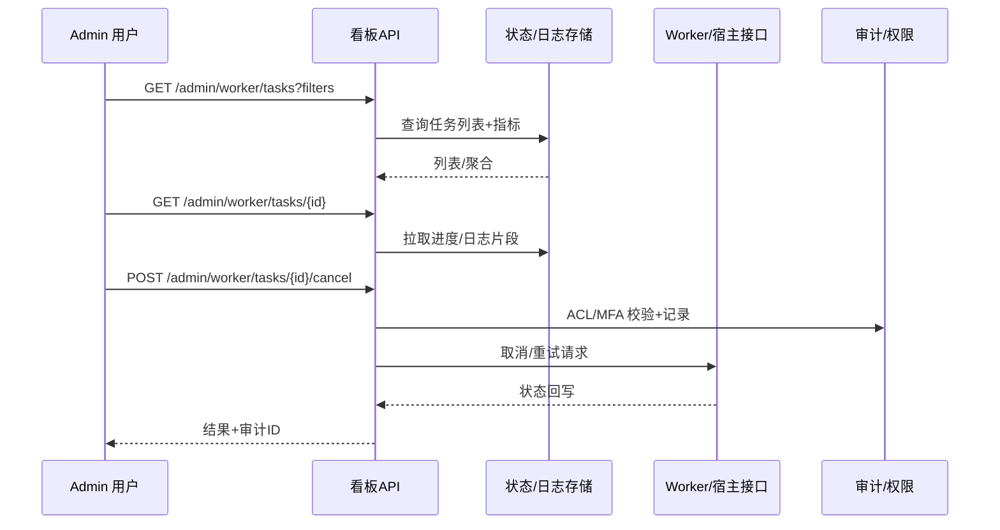

doc_id: UC-OPS-WORKER-ADMIN-BOARD-001
scn_id: SCN-OPS-UNIFIED-WORKER-001
title: PowerX Admin 任务看板（ops/ops）
status: Draft
version: v0.1.0
repo_key: powerx
scope: powerx
layer: ops
domain: ops
scenario_title: "统一 Worker 封装与双模式任务执行"
owners:
  - name: Michael Hu
    role: Product Manager
    contact: matrix-x@artisan-cloud.com
contributors: []
linked_requirements:
  - SCN-OPS-UNIFIED-WORKER-001-E
code_refs:
  - path: internal/worker/admin_board/api               # 计划的看板查询/操作接口
    description: 任务列表、筛选、详情、受控取消/重试入口
  - path: internal/worker/admin_board/aggregator        # 队列/并发/成功率等指标聚合
    description: 任务状态存储读取、模式标识合并、数据延迟提示
  - path: internal/worker/admin_board/audit             # ACL 校验与审计记录
    description: 受控操作写审计、用户/租户上下文校验
feature_flags:
  - worker-admin-board
  - worker-facade-v1
optional: false
last_reviewed_at: 2025-10-19

---

# Usecase Overview

- **业务目标**：在 PowerX Admin 提供统一的异步任务看板，按租户/插件/运行模式（standalone/宿主）展示队列、并发、成功/失败/重试/取消占比、耗时分布、日志片段，并支持受 ACL 与审计保护的取消/重试。
- **成功度量**：查询 p95 < 1s；数据延迟 < 1 分钟；受控操作成功率 ≥99%；审计写入成功率 100%；筛选/分页错误率 <0.5%。
- **场景关联**：支撑主场景 `SCN-OPS-UNIFIED-WORKER-001` 子场景 E（Admin 看板），与取消/观测/宿主透传子用例交叉依赖。

> 目标：让运维/管理员在统一界面查看双模式任务状态与日志，并安全地执行取消/重试。

# Context & Assumptions

- **前置条件**：`worker-admin-board`、`worker-facade-v1` 开启；任务状态/进度、日志、指标已写入存储；租户/插件/模式字段规范化；ACL/MFA 配置完成。
- **输入/输出**：输入为查询条件（租户、插件、模式、状态、时间范围、分页）、受控操作请求（取消/重试）；输出为任务列表、聚合指标、详情/日志片段、操作结果与审计 ID。
- **边界**：不提供插件业务日志深度检索；不包含宿主控制台 UI；不负责计费/额度管理；不改写底层任务执行逻辑。

# Solution Blueprint

## 体系分解

| 层 | 主要组件/模块 | 责任 | 代码入口 |
|----|---------------|------|---------|
| service | Admin 看板 API | 列表/筛选、详情、日志片段、受控取消/重试，校验 ACL/MFA | `internal/worker/admin_board/api` |
| ops | 指标与聚合器 | 队列/并发/成功率/重试/取消/耗时分布聚合，延迟健康检查 | `internal/worker/admin_board/aggregator` |
| ops | 审计与权限 | 受控操作审计、租户/插件/模式字段校验、防越权 | `internal/worker/admin_board/audit` |

## 流程与时序

1. **查询与聚合**：用户携带租户/插件/模式/状态筛选查询；API 从任务状态存储与指标聚合器读取列表与汇总。
2. **详情与日志**：用户点开任务详情，读取进度、回写上下文与日志片段（含运行模式标识、执行节点）。
3. **受控操作**：用户在详情页发起取消/重试，请求通过 ACL/MFA 校验后调用 Worker/宿主接口，并写审计。
4. **回显与健康提示**：操作结果与审计 ID 回显；当数据延迟或采集缺失时在看板显示健康提示。

如需补充图示，可使用 Mermaid：

# Contracts & Interfaces

- **Inbound APIs / Events**
  - `GET /admin/worker/tasks` — 支持租户/插件/模式/状态/时间过滤与分页；鉴权：ACL+租户隔离；超时：500ms。
  - `GET /admin/worker/tasks/{id}` — 返回进度、状态、模式标识、执行节点、日志片段；鉴权同上。
  - `POST /admin/worker/tasks/{id}/cancel`、`POST /admin/worker/tasks/{id}/retry` — 受控操作，要求 MFA/审计；超时：800ms；幂等：操作 token。
- **Outbound 调用**
  - `Worker/宿主接口` — 取消/重试任务；失败重试 3 次并记录审计。
  - `任务状态/日志存储` — 拉取任务列表、详情与日志片段。
- **配置与脚本**
  - `config/worker/admin-board.yaml` — 数据延迟阈值、日志片段大小、受控操作开关。
  - `config/auth/acl.yaml` — 租户/插件/模式级权限配置。

# Implementation Checklist

| 项目 | 描述 | 完成状态 | 负责人 |
|------|------|----------|--------|
| 看板查询 API | 列表/筛选、详情、日志片段、数据延迟提示 | [ ] | Michael Hu |
| 受控操作 | 取消/重试接口、幂等 token、MFA/ACL 校验、审计写入 | [ ] | Michael Hu |
| 观测聚合 | 队列/并发/成功率/重试/取消/耗时聚合，延迟健康检查 | [ ] | Michael Hu |
| 日志脱敏 | 日志片段脱敏策略、字段白名单 | [ ] | Michael Hu |
| 配置与文档 | Feature Flag、默认阈值、README/标准更新 | [ ] | Michael Hu |

# Testing Strategy

- **单元测试**：查询过滤逻辑、分页、数据延迟提示、取消/重试幂等 token、ACL/MFA 校验。
- **集成测试**：对接任务存储/日志存储，模拟 Worker/宿主取消/重试回写，验证审计落库。
- **端到端验证**：沙箱租户提交任务→看板查询→详情→发起取消/重试，检查状态回写与审计 ID。
- **非功能测试**：查询 p95 性能测试、并发取消/重试压测、日志片段大体积场景、数据缺失降级提示。

# Observability & Ops

- **指标**：`worker.admin.query_latency_ms`、`worker.admin.query_success_total`、`worker.admin.data_lag_ms`、`worker.admin.cancel_total`、`worker.admin.retry_total`、`worker.admin.audit_failure_total`。
- **日志**：记录请求过滤条件、租户/插件/模式、操作人、结果、审计 ID、数据延迟状态；日志脱敏并带 trace-id。
- **告警**：查询失败率 >1%；数据延迟超阈；受控操作失败率 >2%；审计写入失败。
- **Dashboards**：Grafana/Datadog `worker.admin.*` 面板；看板内健康提示。

# Rollback & Failure Handling

- **回滚步骤**：关闭 `worker-admin-board` Flag；回滚看板 API/前端部署；恢复配置与 ACL。
- **补救措施**：当受控操作失败时提示人工处理；手动重试审计写入；数据延迟时降级展示缓存并提示。
- **数据修复**：修复错误审计记录或权限配置需通过 DBA/安全审批并留痕。

# Follow-ups & Risks

| 风险/事项 | 影响 | 缓解方案 | 负责人 | ETA |
|-----------|------|----------|--------|-----|
| 日志脱敏策略未与安全组评审 | 可能阻断日志片段展示或泄露敏感 | 拉齐字段白名单、通过安全评审 | Michael Hu | 2025-11-12 |
| 宿主/本地字段对齐存在差异 | 看板筛选/统计偏差 | 定义统一字段映射与校验，回归测试 | Michael Hu | 2025-11-08 |
| 数据延迟超阈无告警 | 影响观测可靠性 | 增加数据延迟告警与健康提示 | Michael Hu | 2025-11-05 |

# References & Links

- 场景文档：`docs/scenarios/runtime-ops/SCN-OPS-UNIFIED-WORKER-001.md`
- 相关规范：`docs/standards/ops/task-sla-matrix.md`（若有）、`config/auth/acl.yaml`、`config/worker/admin-board.yaml`
- 设计材料：docs/meta/scenarios/powerx/core-platform/runtime-ops/unified-worker-execution/primary.md
- 发布指引：`npm run publish:usecases -- --scn-id SCN-OPS-UNIFIED-WORKER-001`
