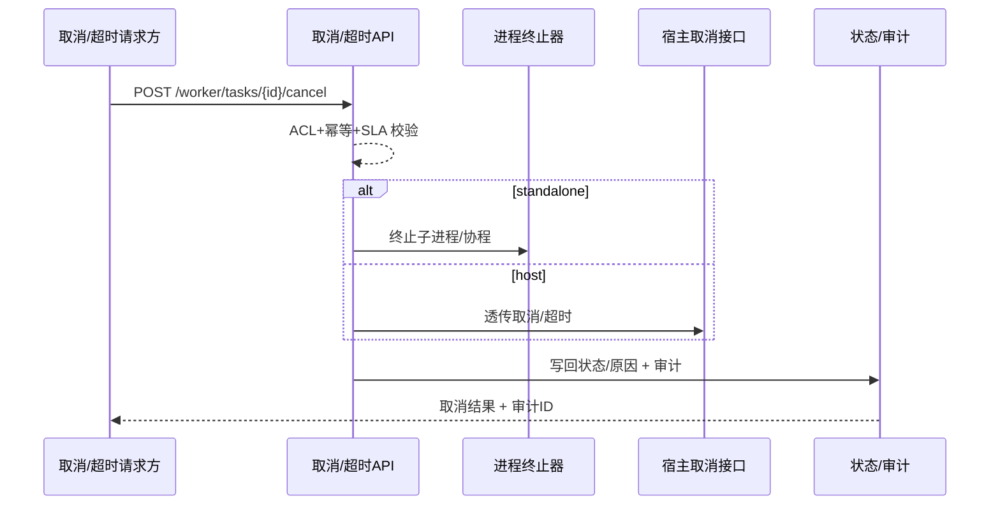

doc_id: UC-OPS-WORKER-CANCEL-001
scn_id: SCN-OPS-UNIFIED-WORKER-001
title: 取消/超时与进程终止（service/ops）
status: Draft
version: v0.1.0
repo_key: powerx
scope: powerx
layer: service
domain: ops
scenario_title: "统一 Worker 封装与双模式任务执行"
owners:
  - name: Michael Hu
    role: Product Manager
    contact: matrix-x@artisan-cloud.com
contributors: []
linked_requirements:
  - SCN-OPS-UNIFIED-WORKER-001-C
code_refs:
  - path: internal/worker/cancel/api               # 取消/超时接口与状态机
    description: 提交取消/超时请求、权限与幂等校验、状态回写
  - path: internal/worker/process/terminator      # 子进程终止（下载/转码/ETL）、信号管理
    description: 独立/宿主模式下的进程终止适配与安全退出
  - path: internal/worker/host_dispatch/cancel    # 宿主取消透传适配
    description: 调用底座任务分发取消/超时接口并处理回写
feature_flags:
  - worker-facade-v1
  - worker-cancel-sla
  - host-task-dispatcher
optional: false
last_reviewed_at: 2025-10-19

---

# Usecase Overview

- **业务目标**：在双模式下提供统一的取消/超时能力，安全终止运行中任务（含外部进程），并一致回写状态/原因与审计，防止僵尸任务与资源占用。
- **成功度量**：取消/超时成功率 ≥99%；取消/超时 p95 < 2s；僵尸进程率为 0；审计写入成功率 100%；宿主取消透传成功率 ≥98%。
- **场景关联**：对应主场景 `SCN-OPS-UNIFIED-WORKER-001` 子场景 C（统一取消/超时与进程终止），与 Admin 看板/观测/宿主透传子用例共享回写格式与指标。

> 目标：统一取消/超时接口，可靠终止任务与外部进程，确保状态与审计一致。

# Context & Assumptions

- **前置条件**：`worker-facade-v1`、`worker-cancel-sla`、`host-task-dispatcher` 已启用；任务状态存储与审计可用；Handler 支持可中断性；宿主取消接口已注册。
- **输入/输出**：输入为取消/超时请求（任务 ID、租户/插件、模式、操作人、原因），或调度器触发的超时事件；输出为取消/超时结果、回写状态/原因、审计 ID、可能的告警。
- **边界**：不处理业务级回滚；不覆盖宿主底层调度实现；不包含超长流程的人工审批链。

# Solution Blueprint

## 体系分解

| 层 | 主要组件/模块 | 责任 | 代码入口 |
|----|---------------|------|---------|
| service | 取消/超时 API & 状态机 | 接收取消/超时、校验、状态回写、幂等 | `internal/worker/cancel/api` |
| service | 子进程终止器 | 发送信号、杀死外部进程、资源清理、防僵尸 | `internal/worker/process/terminator` |
| integration | 宿主取消适配 | 调用宿主任务分发取消/超时接口，处理回写 | `internal/worker/host_dispatch/cancel` |

## 流程与时序

1. **触发**：用户或系统发起取消/超时请求（或调度器触发超时），校验 ACL/MFA 与幂等 token。
2. **执行**：standalone 终止 goroutine + 子进程；宿主透传取消并等待执行反馈。
3. **回写**：统一写入状态/原因/模式/执行节点，生成审计记录，必要时告警。
4. **收敛**：确认无僵尸进程/任务，更新指标与看板呈现。

如需补充图示，可使用 Mermaid：

# Contracts & Interfaces

- **Inbound APIs / Events**
  - `POST /worker/tasks/{id}/cancel` — 鉴权：ACL/MFA；幂等：操作 token；超时：2s。
  - 超时事件：调度器触发，包含任务 ID、开始时间、SLA。
- **Outbound 调用**
  - `Proc terminator` — 终止外部进程，失败重试并告警。
  - `Host cancel API` — 宿主取消/超时接口，失败重试 3 次并记录。
- **配置与脚本**
  - `config/worker/cancel.yaml` — SLA、幂等 token TTL、重试策略。
  - `config/worker/host-dispatcher.yaml` — 宿主端点、超时、重试。

# Implementation Checklist

| 项目 | 描述 | 完成状态 | 负责人 |
|------|------|----------|--------|
| 取消/超时 API 与状态机 | ACL/MFA、幂等 token、状态/原因回写 | [ ] | Michael Hu |
| 进程终止器 | 子进程信号、资源清理、防僵尸检测 | [ ] | Michael Hu |
| 宿主取消适配 | 调用宿主接口、错误码映射、重试与告警 | [ ] | Michael Hu |
| 审计与告警 | 取消/超时审计写入、告警阈值与路由 | [ ] | Michael Hu |
| 配置与文档 | SLA/重试/幂等配置、Flag、README/标准 | [ ] | Michael Hu |

# Testing Strategy

- **单元测试**：取消/超时状态机、幂等 token、SLA 计时、进程终止分支、宿主错误码映射。
- **集成测试**：模拟外部进程运行→取消；宿主接口返回失败/超时→重试与告警；审计写入校验。
- **端到端验证**：沙箱任务执行中→调用取消→验证状态回写、进程终止、审计 ID；超时自动触发路径。
- **非功能测试**：高并发取消压测、故障注入（宿主不可用/终止失败）、僵尸检测回归。

# Observability & Ops

- **指标**：`worker.cancel.success_total`、`worker.cancel.latency_ms`、`worker.timeout.total`、`worker.process.termination_fail_total`、`worker.host.cancel_fail_total`、`worker.cancel.audit_fail_total`。
- **日志**：记录任务 ID、租户/插件、模式、操作人、原因、终止结果、宿主响应、审计 ID；日志脱敏、带 trace-id。
- **告警**：取消/超时失败率 >1%；宿主取消失败率 >2%；终止超时；审计写入失败。
- **Dashboards**：Grafana/Datadog `worker.cancel.*`、僵尸检测面板。

# Rollback & Failure Handling

- **回滚步骤**：关闭 `worker-cancel-sla`/`worker-facade-v1` Flag 或回滚取消接口部署；恢复配置。
- **补救措施**：终止失败时人工 kill 进程；宿主不可用时手动切换为本地取消；补录审计日志。
- **数据修复**：修正错误状态/审计需经审批，执行前备份并记录。

# Follow-ups & Risks

| 风险/事项 | 影响 | 缓解方案 | 负责人 | ETA |
|-----------|------|----------|--------|-----|
| Handler 中断点不足导致取消延迟 | 取消 SLA 违约、资源占用 | 定义可中断约定，增加超时守护与回滚 | Michael Hu | 2025-11-05 |
| 宿主错误码与封装层不一致 | 状态回写不一致/告警噪声 | 制定映射表与回归测试 | Michael Hu | 2025-11-12 |
| 僵尸进程检测缺失 | 资源泄漏 | 增加定期扫描与告警，提供清理脚本 | Michael Hu | 2025-11-08 |

# References & Links

- 场景文档：`docs/scenarios/runtime-ops/SCN-OPS-UNIFIED-WORKER-001.md`
- 相关规范：`docs/standards/ops/task-sla-matrix.md`（若有）、`config/worker/cancel.yaml`、`config/worker/host-dispatcher.yaml`
- 设计材料：docs/meta/scenarios/powerx/core-platform/runtime-ops/unified-worker-execution/primary.md
- 发布指引：`npm run publish:usecases -- --scn-id SCN-OPS-UNIFIED-WORKER-001`
