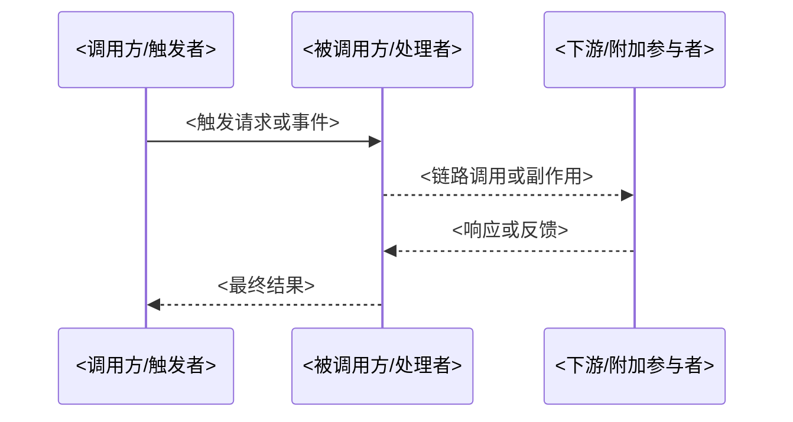

doc_id: UC-OPS-WORKER-HOST-001
scn_id: SCN-OPS-UNIFIED-WORKER-001
title: UC-OPS-WORKER-HOST-001 - service/ops
status: Draft
version: v0.1.0
repo_key: powerx
scope: powerx
layer: service
domain: ops
scenario_title: "统一 Worker 封装与双模式任务执行"
owners:
  - name: Michael Hu
    role: Tech Steward
    contact: tech@artisan-cloud.com
  - name: Matrix-X
    role: Docs Coordinator
    contact: dev@artisan-cloud.com
contributors: []
linked_requirements: []
code_refs: []
feature_flags: []
last_reviewed_at: 2025-11-24

---

# Usecase Overview

- **业务目标**：说明该子用例要交付的结果、价值、触发角色。
- **成功度量**：列出可量化指标（如延迟、吞吐、转化率）。
- **场景关联**：本用例支持的主用例、其它相关子用例或标准。

> 建议在此处补充一段简短摘要，便于 PR 或站点卡片快速传达意图。

# Context & Assumptions

- **前置条件**：所需 Feature Flag、配置项、依赖服务、权限。
- **输入/输出**：关键输入数据（事件、API、消息）、期望输出。
- **边界**：明确不在本用例覆盖范围内的行为或组件。

# Solution Blueprint

## 体系分解

| 层 | 主要组件/模块 | 责任 | 代码入口 |
|----|---------------|------|---------|
| <层名称> | `<pkg/...>` | 说明该层负责的职责 | `<repo/entrypoint>` |
| <层名称> | `<pkg/...>` | 说明该层负责的职责 | `<repo/entrypoint>` |
| <层名称> | `<pkg/...>` | 说明该层负责的职责 | `<repo/entrypoint>` |

> 按需增删行；确保表格与 Frontmatter 的 `layer`、`code_refs` 信息一致。

## 流程与时序

1. **Step 1 – Trigger**：描述触发条件、调用方、关键参数。
2. **Step 2 – Processing**：列出核心业务逻辑、状态变化、写入位置。
3. **Step 3 – Side Effects**：说明通知、缓存刷新、下游调用。
4. **Step 4 – Completion**：输出结果、返回值、终端反馈。

如需补充图示，可使用 Mermaid：

# Contracts & Interfaces

- **Inbound APIs / Events**
  - `METHOD /path` — 请求/事件字段、鉴权与重试策略。
- **Outbound 调用**
  - `<service/component>` — 说明调用目的、超时时间、失败处理。
- **配置与脚本**
  - `<config or script>` — Feature Flag、阈值、调度策略。

> 建议链接到 `docs/standards/**` 的契约文档或下游仓库的接口定义，保持来源单一。

# Implementation Checklist

| 项目 | 描述 | 完成状态 | 负责人 |
|------|------|----------|--------|
| 数据模型 | 新增或调整表结构、索引、迁移脚本 | [ ] | |
| 业务逻辑 | 实现服务/控制器逻辑、错误处理 | [ ] | |
| 权限治理 | 更新鉴权策略、审计日志或租户隔离 | [ ] | |
| 配置发布 | 新增配置项、Feature Flag、默认值 | [ ] | |
| 文档同步 | 更新 `docs/standards/**`、README、变更日志 | [ ] | |

# Testing Strategy

- **单元测试**：覆盖核心业务函数、边界条件、错误处理。
- **集成测试**：模拟关键 API/Event，验证数据库、外部服务交互。
- **端到端验证**：描述 QA/自测脚本、需要的数据准备、预期输出。
- **非功能测试**：性能、容错、回归、容量等。

> 推荐列出测试用例 ID 或链接到自动化用例仓库；如需本地命令可附上 `npm run test -- <suite>` 等指引。

# Observability & Ops

- **指标**：列出关键指标名称、聚合方式、目标阈值。
- **日志**：说明必须记录的字段、log level、落盘/采集方式。
- **告警**：触发条件、通知渠道、值班人或升级路径。
- **Dashboards**：Grafana / Datadog 面板链接或路径。

# Rollback & Failure Handling

- **回滚步骤**：如何撤销代码、配置、数据变更。
- **补救措施**：常见故障应对方案、脚本命令。
- **数据修复**：需要的 SQL/CLI 操作及执行人。

# Follow-ups & Risks

| 风险/事项 | 影响 | 缓解方案 | 负责人 | ETA |
|-----------|------|----------|--------|-----|
| <风险或跟进项> | <潜在影响> | <缓解方案或依赖> | <负责人> | <ETA> |

# References & Links

- 场景文档：`docs/scenarios/<domain>/<SCN_ID>.md`
- 相关规范：`docs/standards/<scope>/<topic>.md`
- 代码 PR：`https: "//github.com/<org>/<repo>/pull/<id>`"
- 设计材料：Figma、白板或 ADR 链接

> 完成后请更新 `docs/_data/docmap.yaml` 映射，并通过 `npm run publish: "usecases -- --scn-id <ID>` 分发到下游仓库。"
