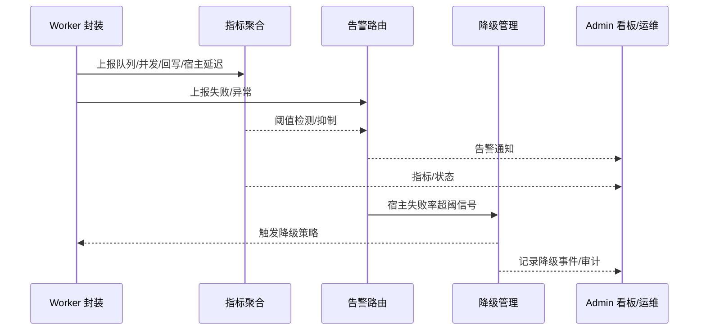

doc_id: UC-OPS-WORKER-OBS-001
scn_id: SCN-OPS-UNIFIED-WORKER-001
title: 观测、告警与降级（ops/ops）
status: Draft
version: v0.1.0
repo_key: powerx
scope: powerx
layer: ops
domain: ops
scenario_title: "统一 Worker 封装与双模式任务执行"
owners:
  - name: Michael Hu
    role: Product Manager
    contact: matrix-x@artisan-cloud.com
contributors: []
linked_requirements:
  - SCN-OPS-UNIFIED-WORKER-001-D
code_refs:
  - path: internal/worker/observability/metrics      # 指标采集与聚合
    description: 队列/并发/回写/重试/取消/降级指标写入与聚合
  - path: internal/worker/observability/logs         # 日志采集与脱敏
    description: 任务/模式/租户/执行节点日志收集与字段标准化
  - path: internal/worker/observability/alerts       # 告警策略与路由
    description: 阈值/抑制/合并、告警发送与审计
  - path: internal/worker/degradation/manager        # 降级策略执行与审计
    description: 宿主不可用回退本地/显式失败、降级事件记录
feature_flags:
  - worker-observability
  - worker-degradation
  - worker-facade-v1
optional: false
last_reviewed_at: 2025-10-19

---

# Usecase Overview

- **业务目标**：为双模式任务执行提供统一的观测、告警与降级能力，覆盖队列/并发、进度/回写、成功/失败/重试/取消、宿主透传与降级事件，确保模式一致、告警可靠、降级可审计。
- **成功度量**：观测数据延迟 < 1 分钟；告警送达率 ≥99%；降级事件 100% 审计；宿主投递失败率超阈自动触发降级；指标字段跨模式一致性缺陷归零。
- **场景关联**：主场景 `SCN-OPS-UNIFIED-WORKER-001` 子场景 D（观测/告警/降级），与 Admin 看板/宿主透传/取消子用例共享指标与回写格式。

> 目标：一套观测/告警/降级机制覆盖 standalone 与宿主模式，确保状态可视、降级可审计。

# Context & Assumptions

- **前置条件**：`worker-observability`、`worker-degradation`、`worker-facade-v1` 开启；日志/指标管道可用；宿主监控接口已接入；任务状态含模式/执行节点/幂等键等字段。
- **输入/输出**：输入为任务状态/回写、队列/并发数据、宿主回写、告警阈值配置、降级策略；输出为指标、日志、告警通知、降级事件与审计记录。
- **边界**：不覆盖业务自定义指标；不负责宿主底层监控实现；不涉及计费/额度观测。

# Solution Blueprint

## 体系分解

| 层 | 主要组件/模块 | 责任 | 代码入口 |
|----|---------------|------|---------|
| ops | 指标采集与聚合 | 队列/并发/成功率/重试/取消/回写延迟、宿主投递/回写、降级触发 | `internal/worker/observability/metrics` |
| ops | 日志采集与脱敏 | 统一字段（租户/插件/模式/执行节点/状态/原因）、脱敏、落盘/采集 | `internal/worker/observability/logs` |
| ops | 告警策略与路由 | 阈值/抑制/合并、告警发送、审计 | `internal/worker/observability/alerts` |
| service | 降级策略管理 | 宿主不可用探测、回退本地或显式失败、事件与审计记录 | `internal/worker/degradation/manager` |

## 流程与时序

1. **采集与聚合**：从状态/日志存储与宿主回写中采集指标、标准化字段并聚合。
2. **告警**：根据阈值触发告警（回写失败、宿主投递失败、队列/延迟超阈），抑制/合并并写审计。
3. **降级**：宿主不可用或失败率超阈时执行降级策略（回退本地或显式失败），记录降级事件。
4. **回显**：将指标/告警/降级状态提供给 Admin 看板与运维查询。

如需补充图示，可使用 Mermaid：

# Contracts & Interfaces

- **Inbound APIs / Events**
  - 观测上报：`POST /internal/worker/metrics`、`POST /internal/worker/logs`（携带模式、租户/插件、执行节点、状态、原因）。
  - 降级事件：`worker.degradation.triggered`（包含原因、策略、结果）。
- **Outbound 调用**
  - 告警通道：Webhook/IM（带签名与抑制标识）。
  - Admin 看板：提供查询接口消费聚合数据与降级事件。
- **配置与脚本**
  - `config/worker/observability.yaml` — 指标/日志字段、采样、延迟阈值。
  - `config/worker/degradation.yaml` — 宿主不可用探测、降级策略（回退本地/失败）、审计选项。

# Implementation Checklist

| 项目 | 描述 | 完成状态 | 负责人 |
|------|------|----------|--------|
| 指标采集与聚合 | 队列/并发/回写/宿主延迟/降级指标实现与聚合 | [ ] | Michael Hu |
| 日志采集与脱敏 | 标准字段、脱敏、采集落盘与查询接口 | [ ] | Michael Hu |
| 告警策略与抑制 | 阈值/抑制/合并、告警路由、审计 | [ ] | Michael Hu |
| 降级策略管理 | 宿主不可用检测、回退本地/失败执行、事件审计 | [ ] | Michael Hu |
| 配置与文档 | 观测/降级配置、Flag、README/标准更新 | [ ] | Michael Hu |

# Testing Strategy

- **单元测试**：指标聚合计算、日志字段/脱敏、告警抑制/合并、降级策略分支。
- **集成测试**：模拟宿主投递失败→告警→降级；模拟回写失败→告警；验证 Admin 看板查询数据一致。
- **端到端验证**：沙箱任务运行→观测数据上报→触发告警→降级回退本地→看板可见降级与日志。
- **非功能测试**：高并发上报压测、延迟超阈告警、故障注入（宿主不可用）验证降级。

# Observability & Ops

- **指标**：`worker.queue.depth`、`worker.progress.write_failure_total`、`worker.host.delivery_failure_total`、`worker.degradation.trigger_total`、`worker.degradation.success_total`、`worker.observability.data_lag_ms`。
- **日志**：记录租户/插件/模式/执行节点/状态/原因/回写耗时/降级策略/告警 ID；脱敏与 trace-id。
- **告警**：回写失败率 >1%；宿主投递失败率 >5%；观测数据延迟超阈；降级触发率异常；告警送达失败。
- **Dashboards**：Grafana/Datadog `worker.*`、降级事件视图；Admin 看板健康提示。

# Rollback & Failure Handling

- **回滚步骤**：关闭 `worker-observability`/`worker-degradation` Flag 或回滚观测/降级组件部署；恢复默认告警阈值。
- **补救措施**：告警/降级异常时启用抑制或降级为最小监控集；手动回退到宿主默认观测；补录降级审计。
- **数据修复**：修正错误的指标/日志/降级记录需审批并带审计。

# Follow-ups & Risks

| 风险/事项 | 影响 | 缓解方案 | 负责人 | ETA |
|-----------|------|----------|--------|-----|
| 宿主与本地观测字段不一致 | 指标/看板显示偏差 | 定义映射与校验，回归测试 | Michael Hu | 2025-11-08 |
| 告警抑制策略不完善 | 告警风暴或漏报 | 完善抑制/合并规则并演练 | Michael Hu | 2025-11-12 |
| 降级回退资源消耗未限流 | standalone 资源风险 | 为降级回退设并发/队列上限与告警 | Michael Hu | 2025-11-05 |

# References & Links

- 场景文档：`docs/scenarios/runtime-ops/SCN-OPS-UNIFIED-WORKER-001.md`
- 相关规范：`docs/standards/ops/task-sla-matrix.md`（若有）、`config/worker/observability.yaml`、`config/worker/degradation.yaml`
- 设计材料：docs/meta/scenarios/powerx/core-platform/runtime-ops/unified-worker-execution/primary.md
- 发布指引：`npm run publish:usecases -- --scn-id SCN-OPS-UNIFIED-WORKER-001`
