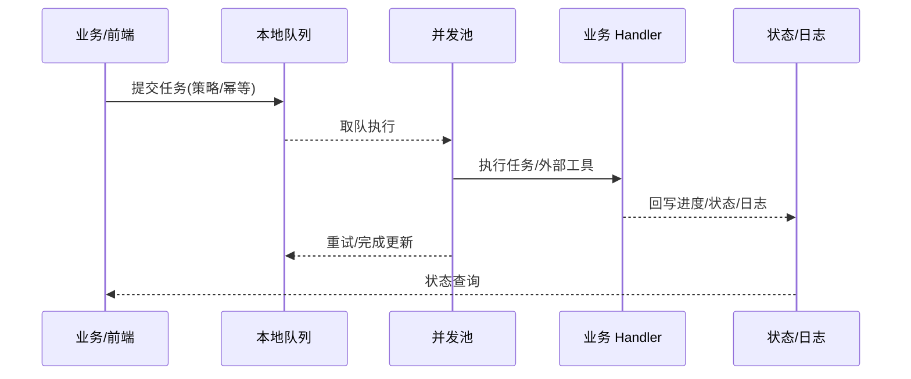

doc_id: UC-OPS-WORKER-STANDALONE-001
scn_id: SCN-OPS-UNIFIED-WORKER-001
title: standalone 队列与并发池执行（service/ops）
status: Draft
version: v0.1.0
repo_key: powerx
scope: powerx
layer: service
domain: ops
scenario_title: "统一 Worker 封装与双模式任务执行"
owners:
  - name: Michael Hu
    role: Product Manager
    contact: matrix-x@artisan-cloud.com
contributors: []
linked_requirements:
  - SCN-OPS-UNIFIED-WORKER-001-A
code_refs:
  - path: internal/worker/queue                 # 本地队列与入队校验
    description: 队列容量/并发/幂等校验、入队与取队
  - path: internal/worker/pool                  # goroutine 池调度
    description: 并发控制、池化执行、超时与隔离
  - path: internal/worker/handler/runner        # Handler 执行与回写
    description: 调用业务 Handler（含外部工具）、进度/状态回写、错误处理
feature_flags:
  - worker-facade-v1
  - worker-standalone-queue
optional: false
last_reviewed_at: 2025-10-19

---

# Usecase Overview

- **业务目标**：在 standalone 模式下，通过本地队列和 goroutine 池调度长耗时任务，遵循统一接口与策略（并发、队列、超时、重试/退避、幂等），保证进度/状态回写一致、资源受控、队列溢出可诊断。
- **成功度量**：任务提交/查询成功率 ≥99%；入队后 2s 内可查询；队列溢出拒绝有清晰错误与告警；重试遵守退避与幂等；执行成功率与回写可靠性达标（回写失败率 <1%）。
- **场景关联**：对应主场景 `SCN-OPS-UNIFIED-WORKER-001` 子场景 A（standalone 队列+池执行），与取消/观测/看板子用例共享回写格式与指标。

> 目标：本地队列+池可靠执行任务，策略一致、回写可查、溢出可控。

# Context & Assumptions

- **前置条件**：`worker-facade-v1`、`worker-standalone-queue` 开启；配置中心提供并发/队列/超时/重试/幂等默认值；任务状态存储可写；日志管道可用；Handler 支持进度回写。
- **输入/输出**：输入为任务提交（含策略与幂等键）、取消/查询请求；输出为进度/状态回写、日志、告警（溢出/重试上限）。
- **边界**：不涵盖宿主任务分发；不处理业务逻辑内部细节；不包含复杂 BPM；不负责宿主监控。

# Solution Blueprint

## 体系分解

| 层 | 主要组件/模块 | 责任 | 代码入口 |
|----|---------------|------|---------|
| service | 队列 | 入队校验（并发/队列/幂等）、排队与取队 | `internal/worker/queue` |
| service | 并发池 | goroutine 池调度、隔离、超时与退避重试 | `internal/worker/pool` |
| service | Handler 运行器 | 执行业务 Handler/外部工具，进度/状态回写、错误处理 | `internal/worker/handler/runner` |

## 流程与时序

1. **提交与校验**：统一接口提交任务，校验并发/队列/幂等后入队。
2. **调度与执行**：池按容量取任务执行 Handler，支持外部工具调用。
3. **回写与重试**：周期回写进度/状态；失败/超时按退避重试，达上限告警。
4. **收敛与告警**：成功/失败写终态，记录日志与指标；溢出/异常触发告警。

如需补充图示，可使用 Mermaid：

# Contracts & Interfaces

- **Inbound APIs / Events**
  - `POST /worker/tasks`（standalone）— 参数含并发/队列/超时/重试/幂等；鉴权：ACL+租户隔离。
  - `GET /worker/tasks/{id}` — 查询进度/状态/模式。
- **Outbound 调用**
  - 业务 Handler / 外部工具调用。
  - 状态/日志存储回写。
- **配置与脚本**
  - `config/worker/standalone.yaml` — 并发、队列长度、超时、重试/退避、幂等策略默认值。

# Implementation Checklist

| 项目 | 描述 | 完成状态 | 负责人 |
|------|------|----------|--------|
| 队列实现 | 入队/取队、并发/队列/幂等校验、溢出处理 | [ ] | Michael Hu |
| 并发池 | goroutine 池、超时与退避重试、资源隔离 | [ ] | Michael Hu |
| Handler 回写 | 进度/状态回写、日志、错误处理 | [ ] | Michael Hu |
| 配置与文档 | 默认策略、Flag、README/标准更新 | [ ] | Michael Hu |
| 告警与观测 | 队列溢出、回写失败、重试上限告警，指标暴露 | [ ] | Michael Hu |

# Testing Strategy

- **单元测试**：队列溢出/幂等校验、池调度、退避重试、回写格式。
- **集成测试**：提交→排队→执行 Handler/外部工具→回写；溢出/失败/重试路径。
- **端到端验证**：沙箱提交多任务，观察队列/并发、进度回写、溢出告警。
- **非功能测试**：并发/队列压测、长耗时任务、故障注入（外部工具失败）验证重试。

# Observability & Ops

- **指标**：`worker.queue.depth`、`worker.queue.wait_ms`、`worker.pool.concurrency_inuse`、`worker.task.success_total`、`worker.task.retry_total`、`worker.task.timeout_total`、`worker.progress.write_failure_total`。
- **日志**：记录租户/插件/任务 ID、策略（并发/队列/超时/重试/幂等）、执行节点、状态/原因、回写耗时；脱敏与 trace-id。
- **告警**：队列溢出、回写失败率、重试上限、超时异常。
- **Dashboards**：Grafana/Datadog `worker.queue.*`、`worker.pool.*`、`worker.task.*`。

# Rollback & Failure Handling

- **回滚步骤**：关闭 `worker-standalone-queue`/`worker-facade-v1` Flag，回滚队列/池组件版本与配置。
- **补救措施**：队列溢出时启用限流/拒绝并提示；外部工具失败手工重试；回写异常时补录状态。
- **数据修复**：修正错误状态需审批并留痕，执行前备份。

# Follow-ups & Risks

| 风险/事项 | 影响 | 缓解方案 | 负责人 | ETA |
|-----------|------|----------|--------|-----|
| 队列溢出与资源竞争基线不足 | 可能导致拒绝或延迟不可控 | 建压测基线与告警阈值 | Michael Hu | 2025-10-31 |
| 外部工具日志格式不统一 | 影响回写与观测一致性 | 定义日志/回写字段标准并校验 | Michael Hu | 2025-11-10 |
| 幂等键误用导致重复执行 | 重复写入或漏执行 | 校验幂等策略、加入检测与告警 | Michael Hu | 2025-11-05 |

# References & Links

- 场景文档：`docs/scenarios/runtime-ops/SCN-OPS-UNIFIED-WORKER-001.md`
- 相关规范：`docs/standards/ops/task-sla-matrix.md`（若有）、`config/worker/standalone.yaml`
- 设计材料：docs/meta/scenarios/powerx/core-platform/runtime-ops/unified-worker-execution/primary.md
- 发布指引：`npm run publish:usecases -- --scn-id SCN-OPS-UNIFIED-WORKER-001`
