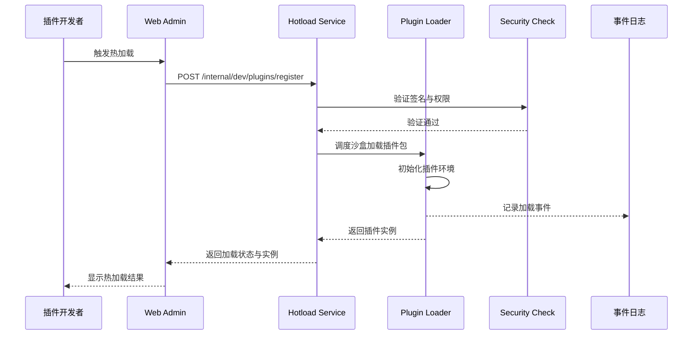

doc_id: PX-DEV-HOTLOAD-001
scn_id: SCN-PUBLISH-HUB-001
title: PX-DEV-HOTLOAD-001 - service/dev
status: Draft
version: v0.1.0
repo_key: powerx
scope: powerx
layer: service
domain: dev
scenario_title: "PowerX 插件开发与分发全链路"
owners:
  - name: Michael Hu
    role: Tech Steward
    contact: tech@artisan-cloud.com
  - name: Matrix-X
    role: Docs Coordinator
    contact: dev@artisan-cloud.com
contributors: []
linked_requirements:
  - type: scenario
    ref: SCN-DEV-HOTLOAD-001
  - type: scenario
    ref: SCN-PUBLISH-HUB-001
code_refs:
  - component: dev_hotload_handler
    path: backend/cmd/app/http/handlers/dev_hotload_handler.go
    description: Dev Hotload REST 接口入口，映射 register/reload/delete
  - component: dev_hotload_service
    path: backend/internal/devhotload/service.go
    description: 会话编排、沙盒调度与回滚逻辑
  - component: dev_hotload_store
    path: backend/internal/devhotload/store/postgres.go
    description: 会话状态、artifact 元数据的持久化实现
feature_flags:
  - name: PX_DEV_PLUGIN_HOTLOAD
    description: 启用 Dev 环境插件热加载流程
    default: true
    environments: [development]
  - name: PX_DEV_SESSION_AUDIT
    description: 打开会话审计与日志透传
    default: true
    environments: [development, testing]
last_reviewed_at: 2025-10-28
last_generated_at: 2025-10-28

---

# Usecase Overview

- **业务目标**：在 PowerX Core 后端服务中提供插件热加载能力，使开发者能够在本地开发环境中快速加载、测试插件，缩短开发迭代周期。
- **成功度量**：
  - 插件热加载响应时间 < 2秒
  - 开发环境插件加载成功率 ≥ 99%
  - 支持实时调试与代码变更检测
- **场景关联**：本用例支持主场景 `SCN-PUBLISH-HUB-001` 的 Stage 1（提交版本候选）环节，与 `PLG-DEV-HOTLOAD-001`（powerx-plugin 仓库）协同工作，实现开发态插件快速验证。

PowerX Core 在插件热加载过程中负责插件运行时加载、权限隔离、事件日志记录，以及为 Web Admin 提供安装与回滚接口，确保插件在开发环境中的安全与可控加载。

# Context & Assumptions

- **前置条件**：
  - Feature Flag `PX_DEV_PLUGIN_HOTLOAD=1`、`PX_DEV_SESSION_AUDIT=1`
  - Dev API Host (`PX_DEV_API_BASE_URL`) 已指向 `https: "//dev-api.powerx.local` 或等价环境"
  - 开发者具备 `plugin: "dev` 权限，已完成 mTLS 证书或 PAT 配置"
  - `dev_hotload` 沙箱镜像、资源配额、Artifact 存储桶已经配置完成
- **输入/输出**：
  - 输入：`register` 请求体（manifest、buildHash、entryPoints、tenantId）、CLI 传入的构建产物 URL 或内联 diff
  - 输出：会话 `sessionId` 与 `reloadToken`、沙盒访问入口、Admin SSE 事件、审计日志记录
- **边界**：
  - 仅覆盖 Dev API 会话治理与沙盒运行，不负责插件业务逻辑或生产发布流程
  - CLI 构建/watch 逻辑在 `PLG-DEV-HOTLOAD-001` 落地，此处不重复实现
  - 身份认证、租户鉴权由统一 IAM 服务提供，本用例只消费结果

# Solution Blueprint

## 体系分解

| 层 | Scope | 组件/模块 | 责任 | 代码入口 / Host |
|----|-------|-----------|------|-----------------|
| service | powerx | DevHotloadHandler | 暴露 `/internal/dev/plugins/*` 接口，处理 register/reload/delete | `backend/cmd/app/http/handlers/dev_hotload_handler.go` |
| service | powerx | DevHotloadService | 调度沙盒、校验 manifest、协调会话生命周期 | `backend/internal/devhotload/service.go` |
| service | powerx | DevSessionRegistry | 维护会话状态、token、回滚钩子 | `backend/internal/devhotload/registry.go` |
| infra | powerx | DevHotloadStore | 会话与 artifact 元数据持久化（Postgres/Redis） | `backend/internal/devhotload/store/postgres.go` |
| infra | powerx | ArtifactStorage | 管理构建产物与静态资源同步（S3/MinIO） | `backend/internal/devhotload/storage/s3.go` |
| infra | powerx | SecurityValidator | 签名验证、权限检查、沙箱隔离策略 | `backend/internal/devhotload/security/policy.go` |
| ops | powerx | Dev Hotload API (Core) | 统一对外 Host，默认 `https: "//dev-api.powerx.local` | `https://dev-api.powerx.local/internal/dev/plugins/*` |"

## 流程与时序

1. **Step 1 – 接收热加载请求**：CLI 调用 `POST https: "//dev-api.powerx.local/internal/dev/plugins/register`，由 `DevHotloadHandler` 校验请求并解析 manifest。"
2. **Step 2 – 元数据解析与安全校验**：`SecurityValidator` 验证签名、权限声明与租户隔离策略，满足后进入构建产物同步。
3. **Step 3 – 插件加载与初始化**：`DevHotloadService` 驱动沙盒启动，`DevSessionRegistry` 分配 sessionId、reloadToken，并初始化插件生命周期钩子。
4. **Step 4 – 事件记录与状态反馈**：`DevHotloadStore` 持久化会话状态，推送 `plugin.hotload.*` 事件至 Admin/Telemetry，向 CLI 返回会话信息。

# Contracts & Interfaces

- **Inbound APIs / Events**
  - `POST https: "//dev-api.powerx.local/internal/dev/plugins/register` — 创建热加载会话；Body 包含 `pluginId`, `buildHash`, `entryPoints`, `tenantId`；mTLS + PAT 双层校验；冲突时返回 409。"
  - `POST https: "//dev-api.powerx.local/internal/dev/plugins/reload` — 推送增量构建结果；Body 包含 `sessionId`, `reloadToken`, `changedFiles`, `artifacts`; 返回 sandbox reload 状态。"
  - `DELETE https: "//dev-api.powerx.local/internal/dev/plugins/register/{sessionId}` — 终止热加载会话；确保清理沙盒、回滚路由。"
  - `GET https: "//dev-api.powerx.local/internal/dev/plugins/{sessionId}` — 查询会话状态、最近一次 reload 结果；供 Admin/CLI 轮询。"
- **Outbound 调用**
  - `WorkflowMetrics: ":dev.hotload.*` — 通过内部遥测队列上报构建、reload 指标；写入 `reports/dev-hotload.ndjson`。"
  - `Admin SSE Gateway` — 推送 `plugin.hotload.{sessionId}` 事件到 Web Admin，驱动前端更新。
  - `Sandbox Orchestrator` — 调度容器/VM，挂载构建产物目录；返回运行地址与健康状态。
- **配置与脚本**
  - `PX_DEV_PLUGIN_HOTLOAD`, `PX_DEV_SESSION_AUDIT` — Feature Flag 控制热加载主流程与审计。
  - `config/dev_hotload.yaml` — 定义沙盒镜像、超时时间、资源配额、artifact 存储桶。
  - `scripts/devhotload/cleanup.sh` — CLI/运维复用的强制清理脚本，调用 DELETE API 与本地缓存清理。

> 建议链接到 `docs/standards/**` 的契约文档或下游仓库的接口定义，保持来源单一。

# Implementation Checklist

| 项目 | 描述 | 完成状态 | 负责人 |
|------|------|----------|--------|
| 数据模型 | 设计 `dev_plugin_sessions`、`dev_plugin_artifacts` 表及迁移脚本 | [ ] | PowerX Core Data Team |
| 业务逻辑 | 实现 `DevHotloadService`、`DevSessionRegistry` 状态机与回滚机制 | [ ] | PowerX Core Runtime Team |
| 权限治理 | 完成 mTLS 验证、租户隔离与沙箱安全策略 | [ ] | PowerX Core Security Team |
| 配置发布 | 配置 `config/dev_hotload.yaml`、Feature Flag、默认资源配额 | [ ] | Platform Ops Team |
| 文档同步 | 更新 `docs/standards/powerx/backend/plugins/dev_hotload_api.md` 与 Admin 指南 | [ ] | Docs Steward Team |

# Testing Strategy

- **单元测试**：覆盖插件加载器、状态机转换、安全验证逻辑；使用 mock 测试签名验证失败场景。
- **集成测试**：模拟完整热加载流程（CLI -> API -> 加载 -> 验证 -> 事件记录），验证数据库交互与外部依赖。
- **端到端验证**：使用测试插件包执行完整加载、调试、卸载流程；使用 `npm run test: "e2e:plugin-hotload` 命令。"
- **非功能测试**：验证热加载响应时间 < 2秒、并发加载 10 个插件无内存泄漏、权限隔离有效性。

# Observability & Ops

- **指标**：
  - `dev.hotload.core_register_latency_ms` — register 调用耗时，目标 P95 ≤ 500ms。
  - `dev.hotload.core_reload_duration_ms` — reload 到沙盒 ready 的总耗时，目标 P95 ≤ 2000ms。
  - `dev.hotload.core_active_sessions` — 当前活跃会话数；高于阈值触发容量预警。
  - `dev.hotload.core_failure_total` — register/reload/delete 失败次数（按错误码分桶）。
- **日志**：输出结构化 JSON，字段含 `sessionId`, `pluginId`, `tenantId`, `event`, `duration`, `errorCode`, `sandboxHost`；写入 Loki/ELK，并同步 `reports/dev-hotload.ndjson`。
- **告警**：`core_failure_total` 在 5 分钟内连续增长 3 次触发 PagerDuty；`core_register_latency_ms` P95 > 800ms 持续 10 分钟触发性能告警。
- **Dashboards**：Grafana `PowerX/Dev Hotload/Core` 看板，展示延迟、成功率、活跃会话、失败分布。

# Rollback & Failure Handling

- **回滚步骤**：
  1. 关闭插件热加载功能（`PX_DEV_PLUGIN_HOTLOAD=0`）
  2. 对所有激活会话执行 `DELETE https: "//dev-api.powerx.local/internal/dev/plugins/register/{sessionId}`"
  3. 清理沙盒临时目录与缓存（`/var/lib/powerx/dev-hotload/*`）
  4. 回滚 `dev_plugin_sessions`、`dev_plugin_artifacts` 相关迁移（如有）
- **补救措施**：
  - 插件加载失败：自动重试 3 次，失败后记录 ERROR 日志并触发告警
  - 权限检查失败：拒绝加载并返回详细错误信息
  - 签名验证失败：立即中断加载流程，隔离插件包
- **数据修复**：执行 `scripts/devhotload/cleanup.sh --force` 清理残留会话与数据库记录；需要 Platform Ops 权限

# Follow-ups & Risks

| 风险/事项 | 影响 | 缓解方案 | 负责人 | ETA |
|-----------|------|----------|--------|-----|
| 插件热加载性能瓶颈 | 影响开发体验，延长迭代周期 | 引入增量缓存、异步 reload pipeline、持续压测 | PowerX Core Runtime Team | 2025-02-15 |
| 权限隔离机制不完善 | 安全风险，可能导致越权访问 | 强化沙箱策略、周期性证书轮换、审计报表 | PowerX Core Security Team | 2025-01-31 |
| 与 powerx-plugin 协同机制 | 版本兼容性问题、集成失败 | 建立协议版本控制、CI 合流测试矩阵 | PowerX Plugin CLI Team | 2025-02-28 |

# References & Links

- 场景文档：`docs/scenarios/publish/SCN-PUBLISH-HUB-001.md`
- 相关规范：`docs/standards/powerx/backend/plugins/dev_hotload_api.md`、`docs/standards/powerx/security/plugin-security.md`
- 代码 PR：`https: "//github.com/ArtisanCloud/PowerX/pull/TBD`"
- 设计材料：Figma 白板文档链接待补充

> 完成后请更新 `docs/_data/docmap.yaml` 映射，并运行 `npm run publish: "usecases -- --scn-id SCN-PUBLISH-HUB-001 --validate-only`。"
