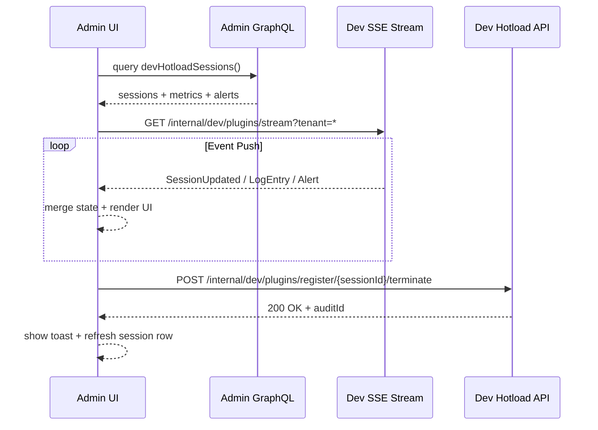

doc_id: PX-DEV-HOTLOAD-UI-001
scn_id: SCN-PUBLISH-HUB-001
title: PX-DEV-HOTLOAD-UI-001 - ui/dev
status: Draft
version: v0.1.0
repo_key: powerx
scope: powerx
layer: ui
domain: dev
scenario_title: "PowerX 插件开发与分发全链路"
owners:
  - name: Michael Hu
    role: Tech Steward
    contact: tech@artisan-cloud.com
  - name: Matrix-X
    role: Docs Coordinator
    contact: dev@artisan-cloud.com
contributors: []
linked_requirements:
  - type: scenario
    ref: SCN-DEV-HOTLOAD-001
  - type: scenario
    ref: SCN-PUBLISH-HUB-001
code_refs:
  - component: session_dashboard
    path: web-admin/src/pages/dev-hotload/SessionDashboard.vue
    description: Session 仪表盘主页面，承载实时列表与操作入口
  - component: log_stream_panel
    path: web-admin/src/components/dev-hotload/SessionLogs.vue
    description: SSE 日志流渲染与过滤组件
  - component: dev_hotload_api_client
    path: web-admin/src/services/devHotloadApi.ts
    description: 调用 Dev API Gateway 的 GraphQL/SSE/REST 客户端
feature_flags:
  - name: PX_ADMIN_DEV_MODE
    description: 控制 Admin Dev 面板显隐
    default: false
    environments: [development, testing]
  - name: PX_DEV_PLUGIN_HOTLOAD
    description: Backend Dev API 总开关，需与 Admin 面板联动
    default: true
    environments: [development]
last_reviewed_at: 2025-10-28

---

# Usecase Overview

- **业务目标**：在 PowerX Admin 提供 Dev Hotload 控制中心，帮助插件研发与平台运维实时监控 session 生命周期、日志与告警，并可一键终止或重载，缩短定位故障与回滚时间。
- **成功度量**：SSE 日志渲染延迟 ≤ 1s；终止/刷新操作成功率 ≥ 99%；面板交互响应 ≤ 200ms；关键告警推送 ≤ 5s。
- **场景关联**：与 `PX-DEV-HOTLOAD-001`（Dev API）形成闭环，为 `PLG-DEV-HOTLOAD-001` CLI 提供可视反馈，并在 `SCN-PUBLISH-HUB-001` Stage 1 中支撑插件候选版本校验。

PowerX Admin Dev Hotload 面板作为运维与研发的统一入口，基于 Dev API 的会话事件、指标与日志构建可视化管理能力，确保热加载期间的安全、透明、可控。

# Context & Assumptions

- **前置条件**：
  - Feature Flag `PX_ADMIN_DEV_MODE=1` 与 Backend `PX_DEV_PLUGIN_HOTLOAD=1` 已启用。
  - Admin 用户具备 `admin.devHotload.manage` 权限，可访问调试面板并执行终止操作。
  - `PX_DEV_API_BASE_URL` 指向 `https://dev-api.powerx.local` 或对应环境，支持 SSE/GraphQL/REST。
  - Web Admin 已配置 `dev-hotload` 路由守卫与 Nuxt runtime 环境变量（SSE endpoint、Grafana base URL 等）。
- **输入/输出**：
  - 输入：Dev API GraphQL 查询结果、SSE `dev.session.*` 事件流、Workflow Metrics 聚合指标、用户触发的终止/刷新命令。
  - 输出：实时 Session 表格、日志/指标面板、操作反馈（Toast、Modal）、自动生成的审计记录 ID。
- **边界**：
  - 不负责 CLI 构建或沙盒调度逻辑；仅透出 Backend 提供的状态与操作能力。
  - 不影响 Marketplace 发布或生产环境插件管理；本面板仅限定 Dev 环境。
  - 认证/鉴权交由统一 IAM 与 Backend API 处理，前端仅消费授权结果。

# Solution Blueprint

## 体系分解

| 层 | Scope | 组件/模块 | 责任 | 代码入口 / Host |
|----|-------|-----------|------|-----------------|
| ui | powerx | SessionDashboardPage | 渲染 Dev Hotload 总览页、协调各类面板与操作 | `web-admin/src/pages/dev-hotload/SessionDashboard.vue` |
| ui | powerx | LogStreamPanel | 展示 SSE 日志、支持过滤/虚拟滚动/导出 | `web-admin/src/components/dev-hotload/SessionLogs.vue` |
| ui | powerx | MetricsWidgets | 显示核心指标、趋势图与告警状态 | `web-admin/src/components/dev-hotload/HotloadMetrics.vue` |
| ui | powerx | DevHotloadApiClient | 封装 GraphQL/SSE/REST 调用与重试逻辑 | `web-admin/src/services/devHotloadApi.ts` |
| ui | powerx | DevHotloadRouterGuard | 基于权限与 Feature Flag 决定面板访问与跳转 | `web-admin/src/router/guards/devHotloadGuard.ts` |
| service | powerx | Admin GraphQL Gateway | 暴露 `devHotloadSessions` 查询与 Mutation | `https://dev-api.powerx.local/internal/admin/graphql` |
| service | powerx | Dev Hotload API (Core) | 推送 SSE、处理终止请求、同步 CLI 状态 | `https://dev-api.powerx.local/internal/dev/plugins/*` |

## 流程与时序

1. **Step 1 – 面板加载**：用户访问 `/dev-hotload`，`DevHotloadRouterGuard` 校验权限/flag，通过后加载页面并发起 GraphQL 查询。
2. **Step 2 – 数据初始化**：`DevHotloadApiClient` 调用 `devHotloadSessions` 获取会话、指标与最近告警，SessionDashboard 渲染列表及指标卡片。
3. **Step 3 – 订阅事件**：页面建立 SSE 连接 `GET https://dev-api.powerx.local/internal/dev/plugins/stream`，实时接收 `SessionUpdated`、日志条目、告警事件。
4. **Step 4 – 用户操作**：用户在 UI 点击终止/刷新，前端调用 `POST https://dev-api.powerx.local/internal/dev/plugins/register/{sessionId}/terminate`（或对应 GraphQL Mutation），更新状态并展示 Toast。
5. **Step 5 – 审计反馈**：操作返回 `auditId`，UI 在操作日志侧栏展示，并允许复制，若操作失败则弹出告警 Modal。

# Contracts & Interfaces

- **GraphQL（Admin Gateway）**
  - `query devHotloadSessions($tenantId)`：返回会话列表、`lastReloadAt`、`status`, `metrics`（buildTime、reloadLatency、errorCount）。
  - `mutation terminateDevSession($sessionId!, $reason)`：触发终止动作，返回 `auditId` 与最新 `status`。
- **SSE / WebSocket**
  - `GET https://dev-api.powerx.local/internal/dev/plugins/stream`：事件类型包括 `SessionStarted`, `SessionReloaded`, `SessionTerminated`, `LogEntry`, `AlertRaised`；需携带 `Authorization` 与 `X-Tenant-ID`。
  - 支持 `Last-Event-ID`，断线后由客户端补发 `since` 参数重放。
- **REST**
  - `POST https://dev-api.powerx.local/internal/dev/plugins/register/{sessionId}/terminate` — 终止指定会话；返回 `auditId`, `terminatedAt`。
  - `POST https://dev-api.powerx.local/internal/dev/plugins/register/{sessionId}/refresh-metrics` — 手动刷新指标快照。
- **配置与脚本**
  - `web-admin/.env.dev`：`VITE_DEV_HOTLOAD_GRAPHQL_URL`, `VITE_DEV_HOTLOAD_SSE_URL`, `VITE_DEV_HOTLOAD_GRAFANA_URL`。
  - `scripts/devhotload/mock-server.ts`：本地开发 stub，模拟 SSE/GraphQL 响应。

# Implementation Checklist

| 项目 | 描述 | 完成状态 | 负责人 |
|------|------|----------|--------|
| UI 布局 | 设计 Session 列表、日志、指标组件布局与响应式方案 | [ ] | PowerX Admin UX Team |
| SSE 客户端 | 实现断线重连、批量渲染、日志持久化（IndexedDB） | [ ] | PowerX Admin Frontend Team |
| 操作权限 | 接入角色策略、按钮显隐、操作确认与审计日志 | [ ] | PowerX Admin Frontend Team |
| 指标集成 | 嵌入 Grafana 图表或 ECharts，支持阈值告警 badge | [ ] | Workflow Telemetry Steward |
| 文档同步 | 更新 `docs/standards/powerx/web-admin/plugins/dev_hotload_panel.md` 与运维指南 | [ ] | Docs Steward Team |

# Testing Strategy

- **单元测试**：`SessionDashboard.spec.ts` 验证状态渲染与分页；`SessionLogs.spec.ts` 模拟高频日志；`devHotloadApi.spec.ts` 覆盖 SSE 重连与错误处理。
- **集成测试**：`pnpm test:integration --filter admin-dev-hotload` 启动 mock server 验证 GraphQL + SSE 协作。
- **端到端验证**：Cypress 场景 `admin-dev-hotload.cy.ts`，脚本模拟 CLI 触发 register/reload/terminate 并校验 UI 反馈。
- **非功能测试**：SSE 每秒 100 条日志情况下 FPS ≥ 55；内存占用 < 250MB；操作按钮 99% 成功率。

# Observability & Ops

- **指标**：`admin.dev_hotload.active_sessions`, `admin.dev_hotload.log_throughput`, `admin.dev_hotload.terminate_latency_ms`。
- **日志**：前端记录 `action`, `sessionId`, `result`, `duration`, `errorCode` 到 Sentry breadcrumb；Backend 侧写入 `admin_dev_hotload_audit`。
- **告警**：SSE 断线 > 60s 触发告警卡片并通知 `#powerx-admin-alerts`；终止操作失败连续 3 次触发 PagerDuty L2。
- **Dashboards**：Grafana `PowerX/Admin Dev Hotload`；Sentry release health + 前端性能指标。

# Rollback & Failure Handling

- **回滚步骤**：通过 `PX_ADMIN_DEV_MODE=0` 暂停面板；回滚 Web Admin release tag；清除浏览器缓存并刷新。
- **补救措施**：提供 `scripts/devhotload/export-logs.ts` 导出最近会话日志；若 UI 无法连接 SSE，引导运维直接调用 Dev API；自动生成说明文档链接。
- **数据修复**：执行 `scripts/devhotload/cleanup-local-cache.ts` 清理 IndexedDB/LocalStorage；必要时刷新 GraphQL cache。

# Follow-ups & Risks

| 风险/事项 | 影响 | 缓解方案 | 负责人 | ETA |
|-----------|------|----------|--------|-----|
| 日志量大导致浏览器卡顿 | 开发者体验差、UI 无响应 | 引入日志虚拟列表、按 session 分页、默认限速 | PowerX Admin Frontend Team | 2025-02-05 |
| 权限配置不当泄露敏感信息 | 安全风险、合规问题 | 审核角色策略、日志脱敏、增加下载审计 | PowerX IAM & Security Team | 2025-01-31 |
| SSE 断线后状态不一致 | 运维无法判断真实状态 | last-event-id 重放 + 手动刷新入口 + 断线提示 | PowerX Admin Frontend Team | 2025-02-08 |

# References & Links

- 场景文档：`docs/scenarios/publish/SCN-PUBLISH-HUB-001.md`
- 相关规范：`docs/standards/powerx/web-admin/plugins/dev_hotload_panel.md`、`docs/standards/powerx/backend/plugins/dev_hotload_api.md`
- 设计材料：Figma 《Admin Dev Hotload Dashboard》
- 代码参考 PR：`https://github.com/ArtisanCloud/PowerX/pulls?q=dev+hotload+admin`

> Seed 完成后请同步 `docs/_data/docmap.yaml`（如字段调整）并执行 `npm run publish:usecases -- --scn-id SCN-PUBLISH-HUB-001 --validate-only` 校验结构。
