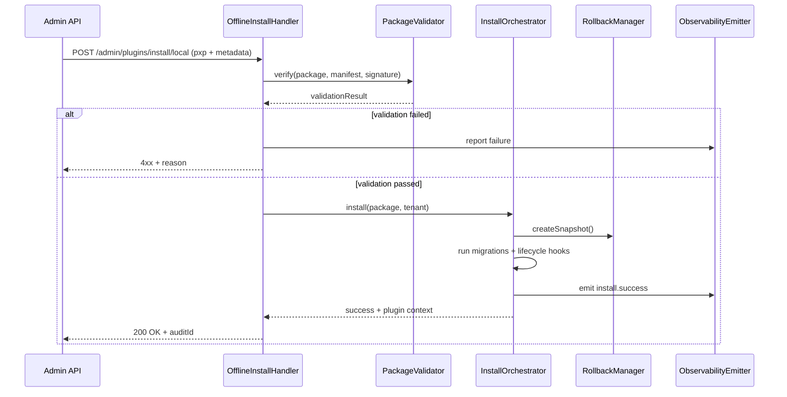

doc_id: PX-PUBLISH-OFFLINE-001
scn_id: SCN-PUBLISH-HUB-001
title: PX-PUBLISH-OFFLINE-001 - service/publish
status: Draft
version: v0.1.0
repo_key: powerx
scope: powerx
layer: service
domain: publish
scenario_title: "PowerX 插件开发与分发全链路"
owners:
  - name: Michael Hu
    role: Tech Steward
    contact: tech@artisan-cloud.com
  - name: Matrix-X
    role: Docs Coordinator
    contact: dev@artisan-cloud.com
contributors: []
linked_requirements:
  - type: scenario
    ref: SCN-PUBLISH-HUB-001
  - type: scenario
    ref: SCN-PUBLISH-OFFLINE-001
code_refs:
  - component: distribution_service
    path: backend/internal/service/plugin_release/distribution/service.go
    description: 负责离线包入库、Marketplace listing、租户导入状态机
  - component: distribution_validator
    path: backend/internal/service/plugin_release/distribution/validator.go
    description: 校验签名、许可证与 checksum
  - component: admin_distribution_handler
    path: backend/internal/transport/http/admin/plugin_release/distribution_handler.go
    description: 暴露 `/api/admin/plugin-release/offline-packages`、`/marketplace/listings` 等 API
  - component: tenant_offline_import_handler
    path: backend/internal/transport/http/openapi/plugin_release/offline_import_handler.go
    description: 租户侧导入入口，调用 Distribution Service 的 import job
feature_flags:
  - name: PLUGIN_RELEASE_ENABLE_LOCAL_INSTALL
    description: 控制 px-plugin dev --watch 与租户本地安装能力
    default: true
    environments: [dev, staging]
  - name: PLUGIN_RELEASE_ENABLE_OFFLINE_DISTRIBUTION
    description: 打开离线包入库、Marketplace Review 与租户导入工作流
    default: true
    environments: [staging, production]
last_reviewed_at: 2025-10-28

---

# Positioning & Goals

- **业务目标**：为离线环境的管理员提供安全、可回滚的插件安装流程，确保 `.pxp` 包在无公网访问时也能快速部署并记录完整审计链。
- **场景关联**：承接 `SCN-PUBLISH-OFFLINE-001` Stage 4，与 `PLG-PUBLISH-OFFLINE-001` 的包体产出、`MKP-PUBLISH-OFFLINE-001` 的审核入库形成闭环。
- **成功度量**：离线安装成功率 ≥ 98%；回滚耗时 ≤ 5 分钟；日志/审计写入成功率 100%；离线依赖缓存命中率 ≥ 90%。

PowerX Core 服务负责验证离线包完整性、执行插件解压与生命周期动作、同步状态给 Admin 与监控系统，保障在受限网络下同样具备合规和快速恢复能力。

# Core Capabilities

- **Package Intake & Validation**：读取 `.pxp` 包体、验证签名与哈希、校验 manifest 与依赖版本。
- **Installation Engine**：将插件部署到隔离沙箱，执行数据库迁移、注册路由、刷新缓存。
- **Rollback Mechanism**：提供自动化回滚与快照机制，确保失败时迅速恢复旧版本。
- **Observability Hooks**：产出安装流程指标、日志与审计事件，供运营与领导层追踪。
- **Offline Asset Cache**：管理离线仓库/对象存储缓存，避免重复上传大文件。
- **CLI & Admin Hand-off**：借助 `powerx publish package --offline`、`powerx plugin import --offline` 以及 `/api/admin/plugin-release/offline-packages` ，将开发者上传、运营审核、租户导入串成统一闭环。

# Target Roles & Responsibilities

- **Ops/Platform Engineer**：执行离线安装命令、监控进度、处理失败回滚。
- **Security/Compliance**：审核签名、证书、审计记录，确保离线包符合安全基线。
- **Product Owner**：确认离线版本上线窗口、协调多租户的推广节奏。

# Concept & Scope

- **前置条件**
  - `PLUGIN_RELEASE_ENABLE_OFFLINE_DISTRIBUTION=1` 并已配置对象存储凭据。
  - 离线包由 Marketplace 审核通过，具备 `manifest.json`、`integrity.txt`、`manifest.signature`。
  - PowerX Core 具备可写的离线缓存目录，与 Admin API 保持连通。
  - 已配置审计日志通道与对象存储租户凭据。
- **输入**
  - 上传的 `.pxp` 包体（本地文件或已缓存路径）。
  - 管理员提交的安装请求（目标租户、版本、备注）。
  - manifest 中定义的生命周期钩子、依赖检查、迁移脚本列表。
- **输出**
  - 安装结果（成功/失败 + 详细信息）。
  - 插件运行时注册状态、事件日志、审计记录。
  - 回滚点快照与状态报告。
- **边界**
  - 不负责离线包产出与审核（由 PLG/MKP Usecase 处理）。
  - 不覆盖 Admin UI 控件（由 `PX-PUBLISH-OFFLINE-UI-001` 管理）。

# Architecture & Workflow

## 模块分解

| 模块 | 职责 | 实现要点 |
|------|------|----------|
| OfflineInstallHandler | 接收 Admin 请求、解析包体和参数、触发安装流程 | 验证权限与 Feature Flag，写入审计起点 |
| PackageValidator | 验签 `manifest.signature`、核对 `integrity.txt`、检测恶意脚本 | 调用安全沙箱/外部服务进行静态扫描 |
| InstallOrchestrator | 控制安装阶段：解包、校验依赖、执行迁移、注册插件 | 支持幂等/重试，维护安装状态机 |
| RollbackManager | 生成快照、处理失败回滚、恢复前一版本 | 保留回滚日志与手动触发入口 |
| ObservabilityEmitter | 输出指标、结构化日志、事件通知 | 对接 Prometheus、Audit Trail、Publish Hub |

## 安装流程

# Interface & Configuration Contracts

- **Inbound API**
  - `POST /api/admin/plugins/install/local`
    - Body：`multipart/form-data`（`file` 为 `.pxp`、`metadata` JSON：`tenantId`, `version`, `notes`）。
    - Header：`X-Audit-Reason`, `X-Request-Id`，需要管理员权限。
    - 响应：`200` 返回 `auditId`, `installId`, `status`；失败返回错误码与 remediation。
- **Internal Hooks**
  - `InstallOrchestrator.install()`：参数包括 `tenantId`, `packagePath`, `manifest`, `options`。
  - `RollbackManager.rollback(installId, reason)`：供失败时或手动触发使用。
- **配置项**
  - `PX_OFFLINE_STORAGE_ROOT`：离线包临时缓存目录。
  - `PX_OFFLINE_MAX_SIZE_MB`：包体大小阈值。
  - `PX_OFFLINE_TRUSTED_CERTS`：签名证书列表。
  - `PX_OFFLINE_TIMEOUTS`：安装、回滚、扫描的超时设定。

# Implementation Checklist

| 项目 | 描述 | 完成状态 | 负责人 |
|------|------|----------|--------|
| 包验签 | 接入 `manifest.signature` 验签与哈希校验 | [ ] | Security Team |
| 解包与解压 | 支持多平台压缩格式、校验路径穿越 | [ ] | PowerX Core Team |
| 迁移执行 | 集成迁移引擎（数据库、缓存、配置）并支持回滚 | [ ] | PowerX Core Team |
| 状态机实现 | 安装状态跟踪、失败重试、超时处理 | [ ] | PowerX Core Team |
| 回滚流程 | 快照存储、回滚命令、审计记录 | [ ] | Ops Team |
| 监控与审计 | 指标、日志、Audit Trail、告警配置 | [ ] | Observability Team |
| 文档与 SOP | 更新离线安装操作指南、支持手册、FAQ | [ ] | Docs Steward |

# Quality Assurance Strategy

- **单元测试**：`package_validator_test.go` 验签与 hash；`install_orchestrator_test.go` 覆盖成功/失败/重试；`rollback_manager_test.go` 验证快照与回滚。
- **集成测试**：使用 Mock `.pxp` 包模拟完整安装流程，覆盖大文件、缺失依赖、超时场景。
- **端到端**：与 Marketplace/CLI 联合演练 “打包 → 审核 → 安装 → 回滚”。
- **非功能**：测试大包解压性能、安装时间 SLA、并发安装、故障恢复。

# Observability & Ops

- **指标**：`offline.install.success_rate`, `offline.install.duration_ms`, `offline.rollback.count`, `offline.validation.failure_rate`。
- **日志**：记录 `tenantId`, `packageDigest`, `installId`, `phase`, `duration`, `result`, `errorCode`；敏感字段脱敏。
- **告警**：安装/回滚失败阈值、验签失败、迁移超时触发 PagerDuty 与 Slack 告警。
- **Dashboards**：离线安装总览、失败趋势、回滚监控、审计事件列表。

# Rollback & Recovery

- **回滚步骤**：调用 `PX_OFFLINE_ROLLBACK_GUARD` 自动触发快照恢复；如失败，执行手动 rollback 命令并恢复配置。
- **补救措施**：生成 incident 报告，保留失败包体与日志；通知相关团队复检；根据需要重新请求 Marketplace 下发新包。
- **数据修复**：修正迁移后的数据不一致、恢复旧版本依赖、更新缓存；必要时执行手动 SQL 脚本。

# Risks & Mitigations

| 风险/事项 | 影响 | 缓解方案 | 负责人 | ETA |
|-----------|------|----------|--------|-----|
| 包体受损或被篡改 | 安装失败/安全风险 | 强制验签、HASH 校验、保留原始包供审计 | Security Team | 2025-01-15 |
| 迁移失败导致数据不一致 | 业务可用性下降 | 迁移幂等、失败自动回滚、提供人工兜底脚本 | PowerX Core Team | 2025-02-05 |
| 多租户并发安装冲突 | 阻塞/脏数据 | 队列化执行、租户隔离、冲突检测 | Ops Team | 2025-01-30 |
| 离线缓存占用空间 | 磁盘压力 | 定期清理策略、空间告警、增量缓存 | Infra Team | 2025-02-20 |

# References & Links

- 场景文档：`docs/scenarios/publish/SCN-PUBLISH-OFFLINE-001.md`
- 相关规范：`docs/standards/powerx/backend/plugins/admin_plugins_user_guide.md`
- 运行手册：`docs/guides/offline/install-runbook.md`
- 校验命令：`npm run publish:usecases -- --scn-id SCN-PUBLISH-HUB-001 --validate-only`

> 安装流程上线后，请与 Marketplace、Admin 团队安排离线发布演练，带上安装、回滚、审计的端到端验证。
