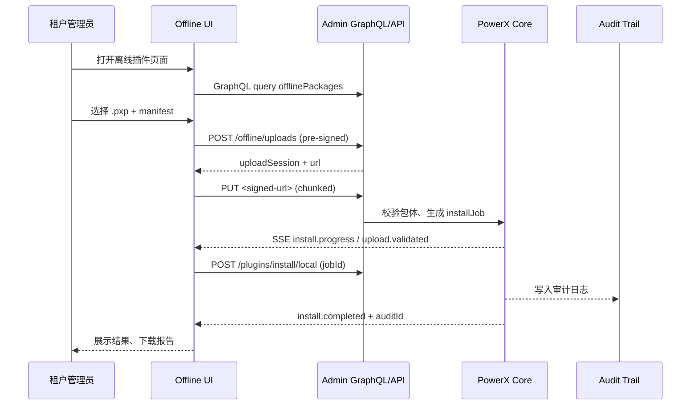

doc_id: PX-PUBLISH-OFFLINE-UI-001
scn_id: SCN-PUBLISH-HUB-001
title: PX-PUBLISH-OFFLINE-UI-001 - ui/publish
status: Draft
version: v0.1.0
repo_key: powerx
scope: powerx
layer: ui
domain: publish
scenario_title: "PowerX 插件开发与分发全链路"
owners:
  - name: Michael Hu
    role: Tech Steward
    contact: tech@artisan-cloud.com
  - name: Matrix-X
    role: Docs Coordinator
    contact: dev@artisan-cloud.com
contributors: []
linked_requirements:
  - type: scenario
    ref: SCN-PUBLISH-HUB-001
  - type: scenario
    ref: SCN-PUBLISH-OFFLINE-001
code_refs:
  - component: offline_install_wizard
    path: web-admin/src/pages/plugins/offline/OfflineInstallWizard.vue
    description: 离线上传与校验多步向导，承载核心交互流
  - component: offline_package_table
    path: web-admin/src/components/plugins/offline/OfflinePackageTable.vue
    description: 展示离线版本列表、状态与安装/回滚动作
  - component: offline_audit_timeline
    path: web-admin/src/components/plugins/offline/OfflineAuditTimeline.vue
    description: 呈现上传、审核、安装事件与审批轨迹
feature_flags:
  - name: PX_OFFLINE_INSTALL
    description: 控制后台离线安装 API 是否开放
    default: false
    environments: [staging, production]
  - name: PX_ADMIN_PLUGIN_OFFLINE
    description: 控制 Web Admin 离线插件页面显隐
    default: false
    environments: [staging, production]
last_reviewed_at: 2025-10-28

---

# Usecase Overview

- **业务目标**：为租户管理员提供可信赖的离线插件上传与版本管理界面，使 `.pxp` 包在断网或内网环境中也能高效导入、校验、安装与回滚。
- **成功度量**：离线包上传成功率 ≥ 99%；安装向导平均完成耗时 ≤ 4 分钟；失败提示准确率 100%；审计事件与后台记录匹配率 100%。
- **场景关联**：承接 `SCN-PUBLISH-OFFLINE-001` Stage 4，与 `PLG-PUBLISH-OFFLINE-001` 的包体交付、`MKP-PUBLISH-OFFLINE-001` 的审核入库及 `PX-PUBLISH-OFFLINE-001` 的安装引擎协同。

PowerX Web Admin Offline Install UI 将 Marketplace 审核后的离线包以可操作的方式呈现给租户管理员，覆盖上传、校验、安装、回滚与审计回查全流程，确保在无公网依赖的企业环境中也可遵循统一发布体验。

# Context & Assumptions

- **前置条件**：
  - Feature Flags `PX_ADMIN_PLUGIN_OFFLINE=1` 与 `PX_OFFLINE_INSTALL=1` 已启用，并经发布流程审批。
  - 管理员具备 `admin.plugins.offline` 与 `admin.plugins.install` 权限，且所在租户通过合规审计。
  - Marketplace 已将 `.pxp` 包、`manifest.json`、`integrity.txt`、`manifest.signature` 同步至 Publish Hub，可通过 API 查询。
  - Admin Web 前端配置了离线上传允许的最大包体（`PX_OFFLINE_UPLOAD_SIZE_MB`）与受信 CA 列表，浏览器需支持 File Streams API。
- **输入/输出**：
  - 输入：管理员上传的 `.pxp` 包、版本元数据、审批备注、回滚策略选项；Publish Hub 返回的版本清单、安装作业进度事件、审计 ID。
  - 输出：安装/回滚执行结果、离线包校验报告、审计时间线、可下载的执行日志与离线报告。
- **边界**：
  - UI 不生成或修改 `.pxp` 包体，不负责 Marketplace 审核工作流。
  - 不覆盖在线发布路径与远程仓库同步；如需远程安装由 `PX-PUBLISH-ONLINE-UI-001` 负责。
  - 安全扫描与签名验证在服务端执行，前端仅展示结果与故障引导。

# Solution Blueprint

## 体系分解

| 层 | Scope | 组件/模块 | 责任 | 代码入口 / Host |
|----|-------|-----------|------|-----------------|
| ui | powerx | OfflineInstallWizardPage | 承载离线安装多步向导、驱动上传/校验/确认流程 | `web-admin/src/pages/plugins/offline/OfflineInstallWizard.vue` |
| ui | powerx | OfflinePackageTable | 展示离线版本列表、状态标签与操作按钮 | `web-admin/src/components/plugins/offline/OfflinePackageTable.vue` |
| ui | powerx | OfflineAuditTimeline | 显示上传、审批、安装、回滚的审计事件 | `web-admin/src/components/plugins/offline/OfflineAuditTimeline.vue` |
| ui | powerx | OfflinePluginStore | 管理 UI 状态、缓存版本清单、协调 SSE 事件 | `web-admin/src/stores/plugins/offlinePluginStore.ts` |
| ui | powerx | OfflinePluginApiClient | 封装 GraphQL/REST/SSE 请求与重试策略 | `web-admin/src/services/plugins/offlinePluginApi.ts` |
| service | powerx | Admin GraphQL Gateway | 暴露离线包列表、审批状态、安装作业查询接口 | `https: "//admin-api.powerx.local/graphql` |"
| service | powerx | Offline Install API | 执行包校验、安装/回滚、产出审计日志与指标 | `POST /api/admin/plugins/install/local` |

## 流程与时序

1. **面板访问**：管理员访问 `/admin/plugins/offline`，`RouteGuard` 校验 Feature Flag 与权限，加载版本清单与最近审计记录。
2. **选择包体**：用户将 `.pxp` 包拖拽至向导，前端执行文件头校验、大小限制提示、展示 manifest 元数据预览。
3. **上传与校验**：UI 调用 `POST /api/admin/plugins/offline/uploads` 获取预签名 URL，Chunk 上传后触发 Publish Hub 进行签名/哈希校验，SSE 返回 `upload.validated` 事件。
4. **安装确认**：管理员选定目标租户、版本与回滚策略，提交 `POST /api/admin/plugins/install/local`，UI 创建作业卡片并进入进度页。
5. **监控执行**：通过 `GET /api/admin/plugins/install/stream` 订阅 `install.progress`、`install.completed`、`install.failed` 事件，实时更新状态、展示日志与告警。
6. **完成与回查**：成功后向导生成审计 ID、提供下载报告与回滚入口；失败则展示失败阶段、推荐动作，并允许重新上传或触发回滚。

# Contracts & Interfaces

- **Inbound APIs / Events**
  - `GET /api/admin/plugins/offline/packages` — 获取离线包清单、审批状态与最新审计事件，支持分页与租户过滤。
  - `POST /api/admin/plugins/offline/uploads` — 创建上传会话并返回预签名 URL，校验 Feature Flag 与权限。
  - `POST /api/admin/plugins/install/local` — 触发离线安装作业，提交租户、版本、回滚策略与上传会话 ID。
  - `POST /api/admin/plugins/offline/rollback` — 手动触发回滚或恢复至快照。
  - `GET /api/admin/plugins/install/stream` — SSE 推送上传、安装、回滚阶段事件（含进度百分比、错误码、auditId）。
- **Outbound 调用**
  - `PUT <pre-signed-url>` — 浏览器直接向对象存储上传 `.pxp` 包；失败时重试 3 次并回滚上传会话。
  - `POST /internal/audit/events` — 安装完成后由后台写入审计系统，UI 使用 auditId 查询详情并渲染。
- **配置与脚本**
  - `PX_OFFLINE_UPLOAD_SIZE_MB` — 限制单个包体大小，超过时阻止提交。
  - `PX_OFFLINE_ALLOWED_EXTENSIONS` — 白名单扩展名（默认为 `.pxp`）。
  - `PX_ADMIN_SSE_RETRY_MS` — SSE 重连退避策略；建议 1000~5000ms。
  - `scripts/plugins/offline/generate-report.ts` — 生成离线安装报告并推送到对象存储。

# Implementation Checklist

| 项目 | 描述 | 完成状态 | 负责人 |
|------|------|----------|--------|
| 离线安装向导 | 设计多步表单、状态同步、失败重试与审计提示 | [ ] | PowerX Admin Frontend Team |
| 包体校验与断点续传 | 前端执行签名/大小预检、Chunk 上传、失败恢复 | [ ] | PowerX Admin Frontend Team |
| 进度可视化 | 实现 SSE 订阅、进度条、阶段日志与错误映射 | [ ] | PowerX Admin Frontend Team |
| 权限与 Flag 守卫 | 添加路由守卫、按钮显隐、全局提示与审计追踪 | [ ] | IAM & Security Team |
| 指标与审计集成 | 发送埋点、曝光 auditId、联动 Workflow Metrics | [ ] | Workflow Telemetry Steward |
| 文档与 SOP | 更新 `docs/guides/admin/offline-install.md`、FAQ、培训材料 | [ ] | Docs Steward Team |

# Testing Strategy

- **单元测试**：`OfflineInstallWizard.spec.ts` 覆盖状态机与表单校验；`OfflineAuditTimeline.spec.ts` 验证事件渲染；`offlinePluginStore.spec.ts` 覆盖 SSE 重连与缓存。
- **集成测试**：使用 MSW/Cypress Component Test 模拟上传会话与 SSE 事件，脚本 `pnpm test: "integration --filter offline-plugin`."
- **端到端验证**：Cypress 场景 `admin-offline-install.cy.ts`，串联上传、安装、失败回滚；结合 `px-plugin pack` 生成测试包。
- **非功能测试**：大文件（>1GB）上传性能、断网重试体验、低性能终端性能基线（FPS ≥ 50）、可访问性（WCAG AA）。

# Observability & Ops

- **指标**：`admin.offline_upload.success_rate`, `admin.offline_install.duration_ms`, `admin.offline_install.error_count`, `admin.offline_install.rollback_rate`.
- **日志**：前端发送 `offline_install_action` 事件（包含 `tenantId`, `packageDigest`, `phase`, `result`）；Sentry 捕获前端异常；后端记录对应 auditId。
- **告警**：连续 3 次安装失败触发 PagerDuty L2；SSE 断线 60s 触发 Admin UI 内提醒并写入 `workflow-metrics`；上传成功率 < 95% 时通知 `#powerx-ops`.
- **Dashboards**：Grafana `PowerX/Admin Offline Publish`、Data Studio 审计报表、Sentry Release Health。

# Rollback & Failure Handling

- **回滚步骤**：通过 Feature Flag 降级（`PX_ADMIN_PLUGIN_OFFLINE=0`）、回滚 Web Admin release tag、刷新 CDN 缓存。
- **补救措施**：提供离线导入 CLI 手册链接；在 UI 中暴露失败阶段、支持下载诊断包；必要时手动调用 `POST /api/admin/plugins/offline/rollback` 并通知租户管理员。
- **数据修复**：执行 `scripts/plugins/offline/cleanup-upload-session.ts` 清理残留会话；协调 Core 团队恢复审计记录与 installJob 状态。

# Follow-ups & Risks

| 风险/事项 | 影响 | 缓解方案 | 负责人 | ETA |
|-----------|------|----------|--------|-----|
| 大容量包体导致浏览器内存飙升 | 导致上传失败或 UI 崩溃 | 引入流式读取、Chunk 上传、内存阈值告警 | PowerX Admin Frontend Team | 2025-02-05 |
| 审计时间线与后台记录不一致 | 合规审计无法溯源 | 对齐 auditId 映射、增加后台和前端双向校验 | Workflow Telemetry Steward | 2025-01-25 |
| 多租户权限配置错误 | 造成越权或者阻断安装 | 强化权限策略测试、发布前执行 IAM 自动化验证 | IAM & Security Team | 2025-02-10 |

# References & Links

- 场景文档：`docs/scenarios/publish/SCN-PUBLISH-OFFLINE-001.md`
- 后端 Usecase：`docs/usecases-seeds/SCN-PUBLISH-HUB-001/PX-PUBLISH-OFFLINE-001.md`
- Docmap 配置：`docs/_data/docmap.yaml`
- 设计材料：Figma 《Admin Offline Plugin Install Wizard》

> Seed 更新后，请运行 `npm run publish: "usecases -- --scn-id SCN-PUBLISH-HUB-001 --validate-only` 校验结构与字段一致性。"
